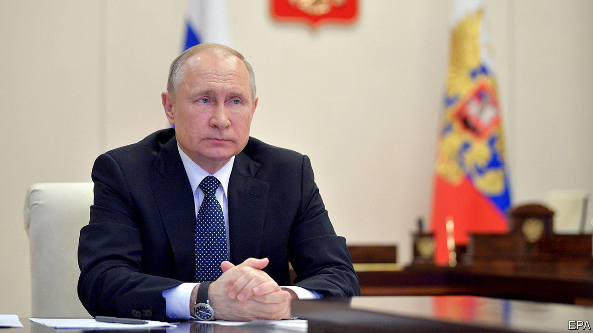

## Washing his hands of it

# As covid-19 spreads, Vladimir Putin is invisible

> Russia’s indispensable leader is strangely absent from the fight against the pandemic

> Apr 8th 2020

FOR THE past 20 years Russians have been told they could not survive without their superhero president, Vladimir Putin. Only a month ago, a Soviet-era cosmonaut-turned-politician urged parliament to lift constitutional restrictions that require him to step down as president in 2024. He was the only one who could save the country from crisis, she said, and should be allowed to run again and again.

The public was also told over the past few months that the threat of the new coronavirus was greatly exaggerated, that the Americans had invented it to harm China, and that Russia was well protected. Now, Moscow and many other cities are in lockdown, while the number of cases is rising exponentially. Yet Mr Putin has all but vanished from public view, hunkered down in his residence. If there is blame in the air, he does not want to catch it.

To be sure, Mr Putin did perform one of his trademark publicity stunts for the television cameras, donning a bright yellow hazmat suit and a respirator and visiting a hospital treating covid-19 patients. But such stunts have only made the absence of empathy and leadership he has exhibited all the more apparent.

Mr Putin has avoided personally imposing or even mentioning such words as “quarantine” or “lockdown”. Nor has he announced a state of emergency, fearing that this would hurt his approval ratings, which have been sliding for months. He did, however, extend “non-working days” until the end of April.

Conspicuously, he has said nothing about how the government plans to support the economy. Public-sector employees, who are 40% of Russia’s labour force, will continue to get paid. But private firms have been left high and dry. Mr Putin has not spelled out a national plan for fighting the epidemic. (Some Russian commentators recall how Stalin retreated to his distant dacha in the first few days after Germany attacked the Soviet Union in 1941.)

Unpopular measures will no doubt have to be taken. Mr Putin has pushed the responsibility for them down to the regional governors. This might have made sense had he not spent the past 20 years dismantling Russian federalism, centralising power and depriving the regions of political autonomy and financial resources.

One notable exception is Moscow, whose mayor, Sergei Sobyanin, sits on top of one of the largest municipal budgets in the world. Mr Sobyanin has emerged as a tough, decisive leader not only fighting the crisis hands-on in Moscow but also co-ordinating the work of other regions. Mr Putin, meanwhile, seems preoccupied with propaganda. He has sent Russian military planes loaded with medical kit to America and Italy, perhaps to remind domestic voters that Russia is a superpower.

The crisis has presented a new opportunity for Alexei Navalny, Russia’s best-known opposition leader. His regular YouTube broadcasts about “Putin’s betrayal of his people” are getting about 2m views, as people search for alternatives to official “news”. A close ally, Anastasia Vasilyeva, the formidable leader of an independent doctors’ union, has waged her own campaign against the inadequacy of Russia’s medical system. She has gained enough attention to make her a target of Russia’s repressive state. On April 2nd, as she tried to deliver masks and gloves to a small hospital outside Moscow, the police roughly detained her. Amnesty International, a watchdog, commented that “It is staggering that the Russian authorities appear to fear criticism more than the deadly covid-19 pandemic.” ■