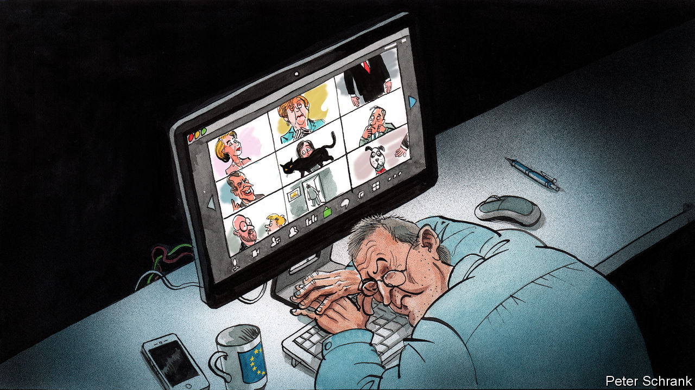

## Charlemagne

# How to run a continent via videolink

> Covid-19 torpedoes the EU’s surprisingly personal way of doing politics

> Apr 11th 2020

Editor’s note: The Economist is making some of its most important coverage of the covid-19 pandemic freely available to readers of The Economist Today, our daily newsletter. To receive it, register [here](https://www.economist.com//newslettersignup). For our coronavirus tracker and more coverage, see our [hub](https://www.economist.com//coronavirus)

“PLEASE, MUTE your microphone,” begged the message splashed across the video-conference screen. That the meeting contained the French president and the German chancellor, along with the other 25 heads of government in the EU, proved no shield against the banal horrors of remote working. Dodgy connections, muttering off-mic and unflattering camera angles are now a fact of life at the top of European politics just as they are in any office grappling with life in a time of coronavirus. A Europe-wide lockdown has wrecked the EU’s way of working, at precisely the moment the continent is struggling to grapple with a pandemic and stave off economic depression.

If you were to design a body to spread the new coronavirus, then you would come up with something akin to the EU. A constant stream of diplomats heads into Brussels, where they lock themselves in airless rooms to hammer out agreements, before flying back home. Every month, thousands make the absurd trip between Brussels and Strasbourg—about 270 miles (430km)—for the European Parliament’s plenary sessions. Lobbyists and hangers-on from across the globe visit to pay fealty to whichever commission official or parliamentary committee chair dictates the regulatory fate of their industry. Covid-19 has jolted this carousel to a halt, throwing into confusion the social mores and practicalities of life in the Brussels bubble.

Nowhere is this more true than at the head of the organisation. The European Council is where the EU’s 27 leaders gather to solve the continent’s trickiest political questions. Originally envisaged as an opportunity for a fireside chat between the men (it was the 1970s) who ran Europe, it still retains the features of a cosy dining club, argues Luuk van Middelaar, author of “Alarums and Excursions”, which looks at how the EU operates in a crisis. In normal times, leaders use summits to speak frankly in near-total privacy, with just a handful of civil servants for company. In person, European summits are a cross between a psychiatrist’s couch, where leaders pour out their political angst to the few people qualified to empathise, and a bullring, where they try to gore each other.

All this has changed. Now the regular meetings resemble the interminable results section of the Eurovision Song Contest, with national leaders rather than D-list celebrities, grumbles one observer. Monologues have replaced dialogues. Compromise is tricky on a conference call. Normally, retreats and U-turns happen outside the main room, in even greater seclusion. It is in these smaller meetings that texts are fiddled with and egos stroked. (Meanwhile any leaders who care little about the outcome catch up on reading or sleep.) These side meetings have witnessed the most dramatic recent moments in the EU. At the height of the Greek crisis, in the summer of 2015, Donald Tusk refused to let Angela Merkel and the then Greek prime minister Alexis Tsipras leave such a meeting without an agreement. In an era of “Zoom diplomacy”—named after the video-conferencing software—such breakouts are now much harder, moan diplomats, making progress slower.

Now is obviously a terrible time for sluggish diplomacy. In the coming weeks, European leaders must compose an economic rescue package, sifting through a soup of acronyms with billions of euros at stake. This cocktail of high politics and tiny details is dangerous. A leader’s mistake could foreshadow the break-up of the euro zone. Even a smaller error could swiftly guillotine a politician’s career. Such negotiations are difficult enough in person, never mind sat opposite a disembodied face on a screen, with—in the case of Luxembourg’s prime minister—a large painting of a can of Pringles behind his head.

Proximity is a weapon in Brussels, where meetings run on until the early hours in the hope of a breakthrough. Such late finishes are a feature rather than a bug of European gatherings, with lack of sleep acting as a form of benign torture. Even bog-standard legislation is signed off in this way, with officials from member states and MEPs scrapping over every line in the final stage of the lawmaking process well into the night in so-called “trilogue” meetings. A windowless meeting room can feel like a temporary prison cell in a way a video conference never will. Likewise, national concerns appear distant when meeting face-to-face in Brussels, argues Mr van Middelaar. European leaders have the space to think of a world beyond their home country. It is hard to lose oneself on a video call.

At the lower altitude of power, a form of Potemkin politics has taken over Brussels. Daily press conferences at the European Commission still take place, with its chief spokesperson on stage in an otherwise empty auditorium. Journalists email in questions, giving it the air of a peculiar call-in television show for people obsessed with state-aid rules. A nearly empty European Parliament plays host to a handful of MEPs and visiting dignitaries. Daily business is logistically tricky. Getting hold of interpreters, who translate meetings into the 24 official languages of the EU, has proved difficult. The language of Europe may still be translation, as Umberto Eco argued, but in a video conference it tends to be English. If arranging a meeting featuring 27 leaders is tricky, try doing the same for 705 MEPs.

Yet the legislative gears still turn, albeit with the occasional grinding noise. The European Parliament has held the first remote vote in its 62-year history, with MEPs emailing in their ballots. The restaurants surrounding the EU’s institution may sit empty, but mischievous ambassadors and officials from the institutions still gossip with journalists, offering the same mix of accurate analysis and blatant spin, over Zoom rather than over lunch. Few relish the thought of keeping the new way of doing things. A reliance on the personal side of politics belies Brussels’ technocratic reputation. But the EU can still function. As long as people remember to mute their microphones. ■

Dig deeper:For our latest coverage of the covid-19 pandemic, register for The Economist Today, our daily [newsletter](https://www.economist.com//newslettersignup), or visit our [coronavirus tracker and story hub](https://www.economist.com//coronavirus)