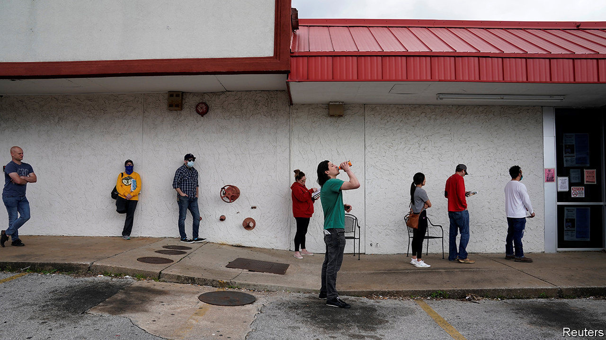
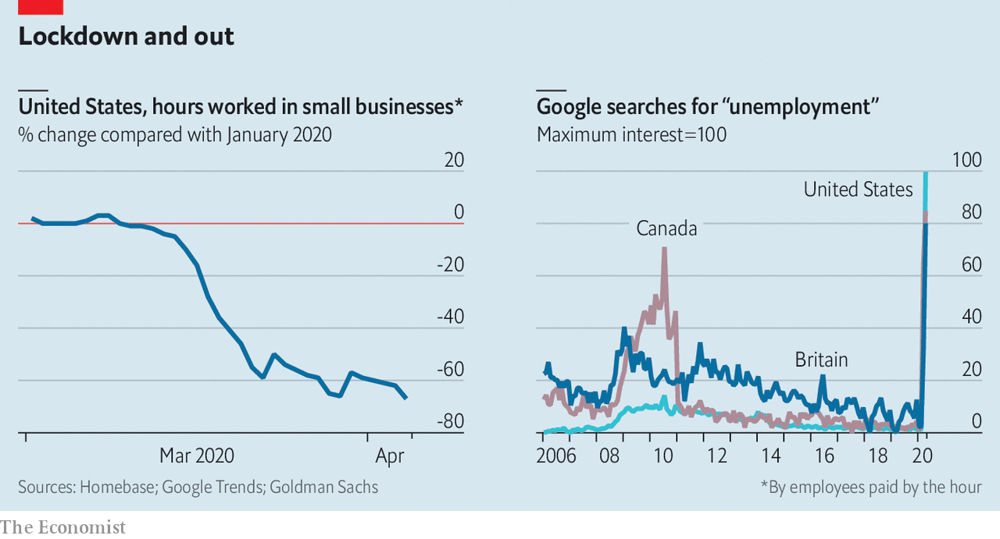

## Lockdown and out

# Labour markets take a dramatic turn for the worse

> America’s unemployment rate could rise to 15% this year

> Apr 8th 2020

AFTER YEARS of robust health, labour markets have taken a dramatic turn for the worse. With the pandemic forcing shutdowns, many people are working fewer hours, if at all. Internet searches for “unemployment”, often a timely indicator of joblessness, are at record highs. Economists at Goldman Sachs expect the unemployment rate to reach 15% in America later this year. That is the highest for the best part of a century.

## URL

https://www.economist.com/finance-and-economics/2020/04/08/labour-markets-take-a-dramatic-turn-for-the-worse
