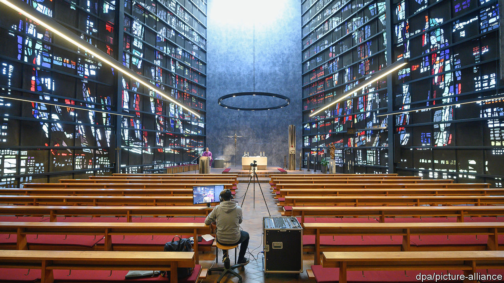

## Our father, who art in cyberspace

# Churches turn to the internet to reach their flocks

> Digital worship goes beyond just broadcasting sermons

> Apr 11th 2020NEW YORK

Editor’s note: The Economist is making some of its most important coverage of the covid-19 pandemic freely available to readers of The Economist Today, our daily newsletter. To receive it, register [here](https://www.economist.com//newslettersignup). For our coronavirus tracker and more coverage, see our [hub](https://www.economist.com//coronavirus)

ENTER THE Reverend Albert Bogle’s coffee shop and you might see a menu listing espressos, enticing cakes and a bell waiting to be rung. It never will be. Mr Bogle resides in Scotland, but his coffee shop exists only online. A parishioner can “enter” the virtual café by clicking a link to that day’s Zoom meeting. Mr Bogle started the virtual coffee shop as a way for people to connect while observing social distancing. But his Sanctuary First church started offering digital worship resources long before covid-19 confined people to their homes—and it is not the only one. 

Streaming church services is actually rather old hat. American preachers began experimenting with radio in the 1920s and televangelism was in full swing as early as the 1950s. African Pentecostal churches, among the most successful of Christian brands, stream services to migrant diasporas. Nowadays pastors do not just broadcast to their quarantined flocks, says Heidi Campbell, a scholar of religion and digital media at Texas A&M University. They expect them to participate too, using apps and social media to make virtual services interactive.

Religions whose declared aims include the preservation of ancient revelations have always had an ambivalent but ultimately pragmatic attitude to technology. When printing transformed communication in the 15th century, the Catholic clergy saw both opportunities and dangers. In the end it was the Protestant Reformers who benefited.

When the coronavirus retreats, will digital worship go with it? Not likely. Life.Church, a mega-church based in Oklahoma that helps other parishes navigate the online world, says the number of communities using its Church Online Platform surged from 25,000 to 47,000 in March alone. Other outfits, such as Virtual Reality Church and Sanctuary First, expect to grow. In the meantime, Mr Bogle hopes to start running his virtual coffee shop 24 hours a day. He is considering starting one for Spanish-speakers: “I think that could be real fun.” 

Dig deeper:For our latest coverage of the covid-19 pandemic, register for The Economist Today, our daily [newsletter](https://www.economist.com//newslettersignup), or visit our [coronavirus tracker and story hub](https://www.economist.com//coronavirus)

## URL

https://www.economist.com/international/2020/04/11/churches-turn-to-the-internet-to-reach-their-flocks
