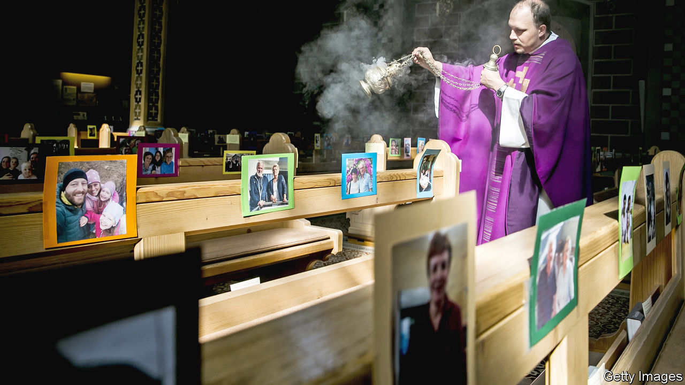

## Living on a prayer

# The coronavirus pandemic has exposed fissures within religions

> Worshippers are suspending rites hitherto regarded as vital

> Apr 11th 2020CAIRO AND ROME

Editor’s note: The Economist is making some of its most important coverage of the covid-19 pandemic freely available to readers of The Economist Today, our daily newsletter. To receive it, register [here](https://www.economist.com//newslettersignup). For our coronavirus tracker and more coverage, see our [hub](https://www.economist.com//coronavirus)

IN THE 2,000 years since the story of Jesus was first told in Rome, his followers have never seen an Easter like this. In Catholicism’s home, the most poignant moment in the Paschal drama comes on Good Friday when the pope leads worshippers on a walk, with 14 stops, enacting the progress of Jesus towards his execution.

This year that has proved impossible. It was announced that instead, Pope Francis would move about in an empty St Peter’s square. Two days later, on April 12th, instead of proclaiming the resurrection of Jesus to a multitude, he would officiate almost alone in its vast basilica. Millions could observe, but only electronically.

Past emergencies, from recessions to wars, have galvanised people to find new meaning in old rituals. But nothing prepared believers for the world of covid-19, in which those rituals, the gestures and gatherings at the heart of their identity, have become a public danger. For innovative religious types who already use technology with confidence (see [article](https://www.economist.com//international/2020/04/11/churches-turn-to-the-internet-to-reach-their-flocks)), the crisis will accelerate a trend. But for more established faiths, reactions have ranged from meek compliance to truculent defiance.

Covid-19 has not generally widened fissures between faiths. Rather, it has widened those within the ranks of all great religions. They were already squabbling over how far old beliefs could live with modern views of Earth’s origin. The pandemic exacerbates the rift between science-defiers and those who respect the laboratory.

For some, the bafflement is palpable. Russian Orthodoxy’s Patriarch Kirill declared on March 29th: “I have been preaching for 51 years...I hope you understand how difficult it is for me to say today, refrain from visiting churches.” Among eastern Christianity’s followers, many will not: clerics in Georgia, for example, continued to offer the faithful consecrated bread and wine, by which it is impossible, they insist, to be harmed.

Pope Francis has sounded surer: “Thick darkness has gathered over our squares, our streets and our cities; it has taken over our lives, filling everything with a deafening silence and a distressing void.” But the broader response of Western faith has been unimpressive, argues Marco Ventura of Siena University. “Even for many believers, medical officers are the new prophets.”

Not all Christians agree. Some American evangelicals, including vocal supporters of Donald Trump, have been reckless denialists of covid-19. A preacher in Florida, Rodney Howard-Browne, was briefly arrested on March 30th after busing people to worship, insisting he could neutralise the virus. Some politicians seem half-sympathetic. Two days later the state’s governor, Ron DeSantis, listed religious activities among “essential services” that could continue (without crowds) despite a lockdown. In at least a dozen other states, such activities were left unimpeded.

Secularist rage has been rising since early surges in the epidemic were traced to religious recklessness. In South Korea hundreds of members of the secretive Shincheonji Church of Jesus contracted the virus at packed services and spread it. The government complained that the church was not co-operating in tracing them. Its leader later apologised. An Islamic gathering in Malaysia in February helped spread the virus to neighbouring countries.

Elsewhere, liberal clergymen, rabbis and imams have heeded calls to suspend gatherings. But among ordinary people, the order to stop their cherished rituals feels like a dark conspiracy. “Not even the communists completely forbade Easter services” is a refrain in eastern Europe.

Within Judaism, many have reacted creatively, accepting, for instance, that a minyan, the ten-strong quorum for worship, might assemble electronically. The ultra-Orthodox, or Haredim, however, have dug their heels in. In Israel the Haredi stronghold of Bnei Brak has been a covid-19 hotspot. People have insisted on gathering for prayers, weddings and funerals, defying a lockdown and exacerbating chronic tensions between the Haredim and the state.

Elsewhere zealots already at odds with the state or with established religious powers have found in the virus a fresh battleground. In Iraq Muqtada al-Sadr, a fiery cleric, has challenged Grand Ayatollah Ali al-Sistani, a Shia leader who has denounced those who spread the virus as murderers. On March 5th Mr Sadr prayed at the entrance to the Imam Ali shrine in Najaf until caretakers opened the teak doors. It remained open, and mourners carry their dead around the shrine in coffins. The radical preacher has called coronavirus a punishment for gay marriage, as have some fundamentalist Christians.

Where the state broadly controls Islam, as it does in the Gulf monarchies, orders to suspend Friday prayers have been obeyed. The Saudis have told pilgrims to defer any plans to make the haj in July. But when Ramadan begins around April 23rd, authorities in all Islamic lands will struggle to restrain communal meals to break the fast.

In Iran, one of the first- and worst-hit countries, the religious authorities wield ultimate power. Their decision on March 16th to suspend pilgrimages to holy places, including those in the city of Qom from which infection had spread to other countries, was criticised as too late by secular liberals, too harsh by the ultra-devout.

India is one of many places where politicians must collaborate with religious forces. In Ayodhya, claimed as the birthplace of Rama, officials tried with mixed results to limit celebrations of the Hindu god. It was left up to the Hindu organisers to encourage restraint; they obeyed reluctantly.

On the spectrum of reactions, the Catholic one stands out as respectful of science. Today’s Holy See differs from the one which in centuries past persecuted astronomers. But some critics, including conservative American Catholics, see in its meek response the church’s broader weakness.

The contrast between cautious Catholics and gung-ho evangelicals has been sharp in Brazil. Catholic bishops and politicians have co-operated with the suspension of services, while President Jair Bolsonaro, an evangelical who has called the virus “just a sniffle”, has joined co-religionists in legal battles to keep churches open.

In the end, the survival of religions may depend on their finding a way of explaining to followers, in their own terms, why their spiritual duty now lies in suspending rites hitherto regarded as vital. As Shadi Hamid of the Brookings Institution, a think-tank, notes, Muslim jurisprudence has accepted that human survival can trump other norms: a Muslim can eat forbidden pork rather than starve. For liberal-minded Jews, the ideal of tikkun olam, or repairing the world, is higher than rules governing prayer or diet.

Communion, during which Christians consume bread and wine which some believe to have been transformed into the body and blood of Jesus, throws up particular challenges. Rule-minded Christians find an electronic Eucharist untenable: the ritual has to be physical.

And yet traditional Christian teaching may also have hygienically helpful things to say. It affirms that the entire world is mysteriously blessed every time bread and wine are sanctified, regardless of how many are present. That helps explain the determination of Greece’s bishops to celebrate “behind closed doors” this month the services leading to Orthodox Easter.

James Alison, a radical Catholic priest, proposes a solution both revolutionary and traditionalist. He is encouraging households to practise “Eucharistic worship” at home: to bless bread and wine and invoke the presence of Jesus. His approach, he says, affirms the intimacy and mystery of classical worship but challenges the idea of a caste of celebrants. As he points out, a lack of manpower in some parts of Christendom is already prompting a rethink of the role of priests: the virus could be the coup de grâce. Pope Francis has called the pandemic “a time to separate that which is necessary from that which is not”. Some may take him at his word. ■

Dig deeper:For our latest coverage of the covid-19 pandemic, register for The Economist Today, our daily [newsletter](https://www.economist.com//newslettersignup), or visit our [coronavirus tracker and story hub](https://www.economist.com//coronavirus)