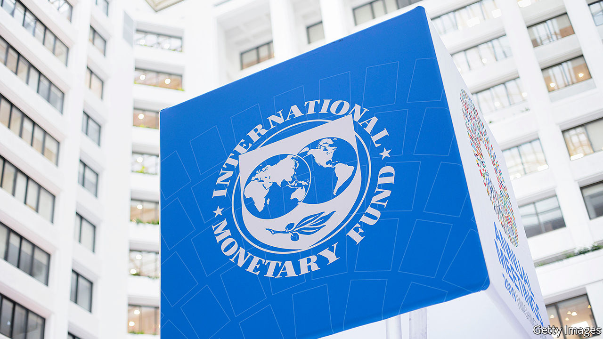
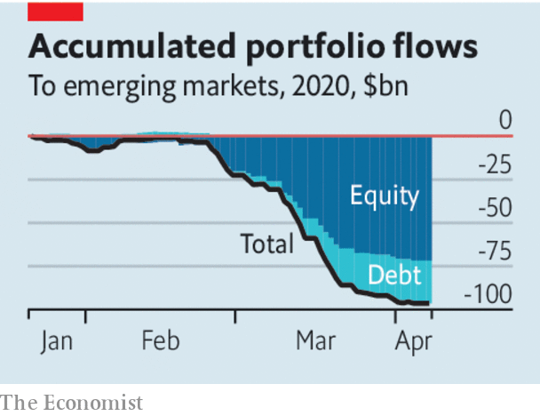

## Break the glass

# Emerging markets are in turmoil. The IMF must step in to help. Here’s how

> The fund must lend unprecedented amounts. But many poor countries need debt relief

> Apr 11th 2020

Editor’s note: The Economist is making some of its most important coverage of the covid-19 pandemic freely available to readers of The Economist Today, our daily newsletter. To receive it, register [here](https://www.economist.com//newslettersignup). For our coronavirus tracker and more coverage, see our [hub](https://www.economist.com//coronavirus)

EMERGING MARKETS are battling a financial crisis as well as a public-health emergency. Since late January foreign investors, desperate to shed risk, have been withdrawing their cash from poor countries. At the same time falling global trade, depressed commodities prices and vanishing tourists have put export revenues, and hence the supply of foreign currency, into free fall. This has left many countries struggling to pay for imports and to service their dollar-denominated debts, let alone fund emergency health or economic programmes. Over 90 countries have approached the IMF, the lender of last resort for governments, to ask for help.

The fund will need to respond on an unprecedented scale. The $96bn investors have already withdrawn from emerging-market stocks and bonds dwarfs past capital outflows, according to the Institute of International Finance, an industry group. So far this year the Brazilian real, the Mexican peso and the South African rand have lost nearly a quarter of their value against the dollar. Though few countries have sounded the alarm in public, the fund estimates that emerging markets will need at least $2.5trn over the course of the pandemic.

Some of that help is coming from America’s Federal Reserve. It is running “swap lines” with a select few central banks, which have so far borrowed about $400bn while posting their own currencies as collateral. The Fed is also allowing most central banks to temporarily exchange any Treasuries that they hold for dollars. But among emerging-market central banks only Brazil, Mexico, Singapore and South Korea are included in the swap lines, and few poor countries have a ready supply of Treasuries. So most of the burden will fall on the IMF which, unlike the Fed, cannot create dollars at will. The fund says it has about $1trn on tap, about a fifth of which is already committed. Even this may not be enough for the job if large economies like Nigeria, South Africa or Turkey join the legions of small countries seeking help. Another problem is that a big chunk of the fund’s resources is borrowing from its members that must be reauthorised this year, creating uncertainty.

These funds must be secured. America, to its credit, has already approved its share, but the biggest, richest members need to provide still more. The IMF should then follow a three-pronged approach to fighting the crisis.

First, it ought to create new special drawing rights (SDRs), a currency of sorts which is convertible into dollars but whose quantity the fund controls (see [article](https://www.economist.com//finance-and-economics/2020/04/11/should-the-imf-dole-out-more-special-drawing-rights)). This is a bit like printing money to finance a cheap perpetual credit line for every IMF member. In 2009, after the global financial crisis, the fund created $250bn in new SDRs; today it could create more than twice that amount before having to ask America’s Congress for permission to continue. Creating SDRs would provide indiscriminate, unconditional aid without draining the IMF’S reserves. However, it is controversial. The fund’s core mission is making conditional loans that are repaid, not printing money. It could take time to build the necessary support. In the meantime, rich countries should lend their SDRs to countries that are short of reserves. This may be more politically palatable than lending dollars.

Second, the IMF must alleviate the dollar liquidity shortage in solvent countries that have good institutions but which cannot borrow from the Fed. In 2017 the fund’s board rejected a proposal to provide its own swap-like funding to countries with strong institutions. It should revisit that decision. It should also explore ways of getting existing dollar reserves, which are ample at the global level, to where they are needed. For example, the fund could act as a clearing house for currency swaps, guaranteeing participating central banks against losses by graduating any debts that turn sour into a conventional IMF programme.

Third, the fund must persuade the world that many of the poorest countries, especially in Africa, are insolvent and need debt relief (see [article](https://www.economist.com//middle-east-and-africa/2020/04/11/africas-debt-crisis-hampers-its-fight-against-covid-19)). Researchers at the fund and the World Bank judged in February that half of low-income countries had shaky finances even before the pandemic. In these countries there is a danger that emergency loans are used to pay off existing creditors, leaving the IMF holding the bag. (This is awkward given that, by one estimate, China lent $146bn to African governments and state-owned enterprises between 2000 and 2017.) Better to write down debts collectively. Doing this in an orderly manner takes time, but public-sector creditors should immediately suspend both principal and interest payments. And if possible, the world should co-operate to shield the poorest countries from payments to private creditors, too.

These actions will be needed in addition to the IMF’s regular lending programmes, which will be called upon at a scale hitherto unseen. The fund has not faced a crisis like this before. It must fight it with every available tool.■

Dig deeper:For our latest coverage of the covid-19 pandemic, register for The Economist Today, our daily [newsletter](https://www.economist.com//newslettersignup), or visit our [coronavirus tracker and story hub](https://www.economist.com//coronavirus)