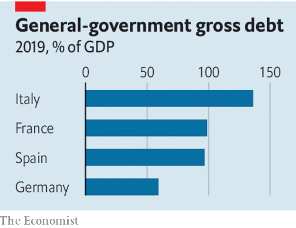

## The euro area faces a new test

# Making Europe’s economy work better

> Time to integrate further or break-up

> Apr 11th 2020

Editor’s note: The Economist is making some of its most important coverage of the covid-19 pandemic freely available to readers of The Economist Today, our daily newsletter. To receive it, register [here](https://www.economist.com//newslettersignup). For our coronavirus tracker and more coverage, see our [hub](https://www.economist.com//coronavirus)

THE EURO area is set for its deepest downturn and its sternest economic test yet. Some forecasters expect GDP to shrink by nearly a tenth in 2020. But as history is being made, it is also being repeated. Talks between Europe’s politicians about the covid-19 crisis have descended into yet another ugly row over which countries gain and lose from a common currency. The acrimony has its roots in Europe’s sovereign-debt crisis in 2010-12, when stricken southerners pleaded for solidarity and northerners refused to bail out what they saw as bad behaviour.

Back then the euro area avoided collapse largely thanks to action by the European Central Bank (ECB). The euro zone has since had a chance to pass deep reforms in order to deal with its fragility once and for all, but the time was ill-used. Having given up their monetary independence long ago and failed to cut public debt, some countries cannot deal with the crisis on their own. They need help from stronger economies in the north.

To avoid a deep and enduring slump, the southern countries need government spending that will shore up their economies today and relaunch them when the pandemic has abated. Yet this spending will sharply increase their debts. In Italy public borrowings are already worth 135% of GDP, and that figure could easily rise to well over 150% with even a modest stimulus. If its government spends freely, investors could panic about an eventual default or debt restructuring. Greece, Spain—and even France—face the same hard choices.

The temptation is to dither. Southern borrowing costs are higher than the north’s but not near panic levels. Italy’s ten-year bonds yield about two percentage points more than Germany’s. After fumbling, the ECB has tried to limit the damage by acquiring bonds and relaxing rules about what it buys.

Those actions will buy time, but no more than that. There are still limits on how much the ECB can help the south and extra bond purchases are likely to end before southern economies recover. The bank may feel it lacks the mandate to extend its scheme. A legal challenge in Germany is an ever-present threat. And, aware that they are pushing their luck, southern countries may opt for smaller stimulus packages than they really need. That could still mean they face a doom loop as a shrinking economy makes it harder to service existing debts.

Politically the euro faces a dilemma. In the south millions more might conclude that membership of the single currency brings no benefits, fuelling support for Eurosceptic parties such as Italy’s Northern League and the National Rally of Marine Le Pen in France (see [article](https://www.economist.com//europe/2020/04/09/european-finance-ministers-ponder-coronabonds)). In the north bail-outs would bolster the likes of the hard-right Alternative for Germany.

What to do? As The Economist went to press euro-area finance ministers were still struggling to agree on measures, including common funding for unemployment insurance and easier access to credit lines from a common bail-out fund. But the resources available are puny. A proposal, backed by nine member states, for “coronabonds”, or jointly issued debt, is likely to founder. This would have let the south take advantage of the north’s cheap borrowing costs.

Northerners have long resisted mutualisation for fear of underwriting laxity in the south. But without it Italy and Spain will face either a savage crisis now or a lengthy debt crisis in the future. With lockdowns in place from Saxony to Sicily, debt issued today is a result not of bad behaviour but of the pandemic. Mutualisation should be a compromise, signalling that north and south have to live together in their common interest. Even some past opponents of Eurobonds, such as Klaas Knot, head of the Dutch central bank, now see a case for them. Northern leaders must follow. For two decades they have shied away from the fact that the currency union cannot succeed unless its members share more risk. If they do not face up to that today, the euro, and perhaps the European Union itself, will not survive. ■

Dig deeper:For our latest coverage of the covid-19 pandemic, register for The Economist Today, our daily [newsletter](https://www.economist.com//newslettersignup), or visit our [coronavirus tracker and story hub](https://www.economist.com//coronavirus)

## URL

https://www.economist.com/leaders/2020/04/11/making-europes-economy-work-better
