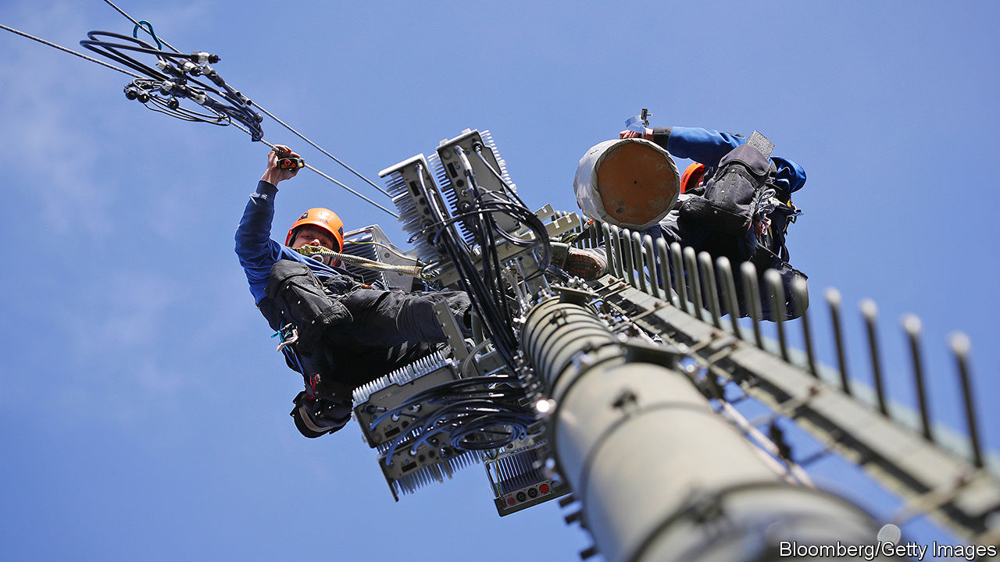

## 5Geopolitics

# Open standards, not sanctions, are America’s best weapon against Huawei

> America needs a new way to deal with the Chinese telecoms giant. Its own tech industry points the way

> Apr 8th 2020

TECHNOLOGY IS POWER. Whoever controls the global digital infrastructure controls the world. That is why America is so worried about China’s rise as a technological superpower. It also explains why it is going to such lengths, even using European-style industrial policy, to rein in Huawei, China’s leading maker of telecoms equipment. The company leads the world in 5G, the next generation of mobile networks, which are expected to become the central nervous system of the global economy.

Yet by any measure America is losing the fight against Huawei, along with what President Donald Trump, steeped in zero-sum thinking, calls the “race to 5G”. The Chinese firm keeps on growing; the rollout of 5G in China continues apace; and most of America’s allies have so far ignored its entreaties to ban Huawei gear entirely from their national 5G networks on security grounds. Even so, the Trump administration seems intent on doubling down on its strategy. If hawks have their way, any chipmaker that uses American technology, which nearly all do, will soon have to ask for permission in Washington, DC, to sell its wares to Huawei.

The problem with America’s strategy is that it is trying to win today’s “tech cold war”, as some call it, with yesterday’s arsenal. In effect it is trying to build an impenetrable wall around Huawei by any means necessary. This is a fool’s errand in a hyper-connected world in which technology and talent can flow freely. It only provides extra incentives for Huawei—and China—to become technologically self-sufficient. If America wants to win the race to 5G and, more generally, the battle for digital supremacy, it needs a new approach. Happily, the country’s own technology industry points the way: it has thrived on openness, software and a healthy balance of competition and co-operation. And that approach is at last now being applied in telecoms.

Mobile networks, long dominated by specialised hardware, are becoming defined by software. On April 8th Rakuten, a Japanese online giant, launched the world’s first fully “virtualised” mobile network, built using general-purpose hardware and lots of software (see [article](https://www.economist.com//node/21783476)). Other mobile carriers will follow suit. Such networks would go a long way towards dealing with America’s concern about Huawei: that using the firm’s gear in 5G networks could let the Chinese government intercept data or sabotage rival economies.

Virtualised networks need not rely on one vendor, but can be built with components from many, allowing carriers to pick and choose—and, if necessary, to steer clear of those made in China. They also create an opening for American tech firms, which play only a small role in the mobile-telecoms networks of today. (Many of the components of Rakuten’s network are made in America.) Moreover, such networks are cheaper to develop, make and maintain than conventional ones, because they are made mostly from off-the-shelf hardware, controlled by software—doing away with the argument of many mobile operators, that banning Huawei would force them to buy more expensive kit from Ericsson and Nokia, its main competitors.

Admittedly, virtualised networks will not solve all security problems, and the underlying standard, called OpenRAN, is not yet mature. But it is early days for all 5G networks. It will take years to roll them out fully and the covid-19 crisis has done nothing to speed up the process. So there is time.

The Trump administration and other governments should do all they can to accelerate the development of virtualised networks by subsidising research and perhaps even mandating the use of technical standards that allow mobile networks to be virtualised. All this may sound far-fetched at a time when America’s government appears stuck in the past and incapable of coming up with a coherent strategy. But as in many other domains, covid-19 creates room for new thinking. America will either pursue a tech cold war with an uncertain outcome, or help create an industry of the kind that American tech firms understand and have thrived in—letting Chinese companies join in only if they follow the rules. Sometimes establishing a robust, safe technology is not about concentrating power so much as diffusing it. ■