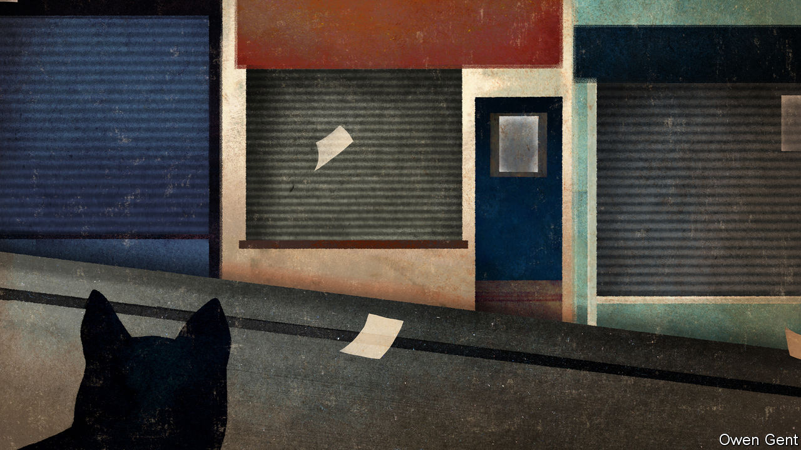
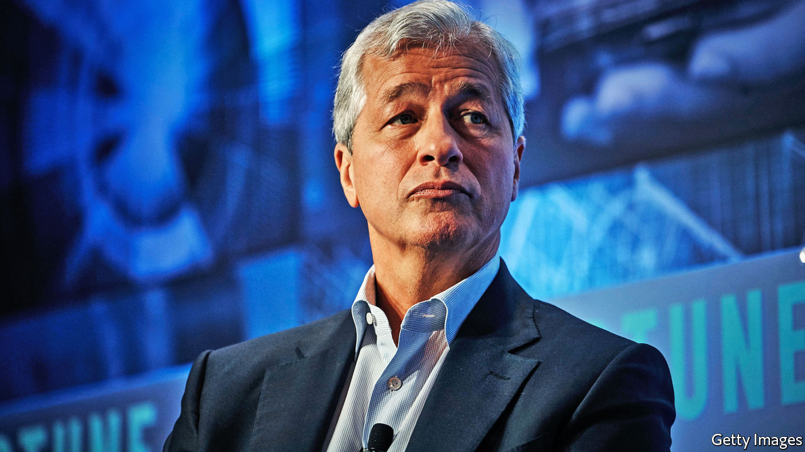
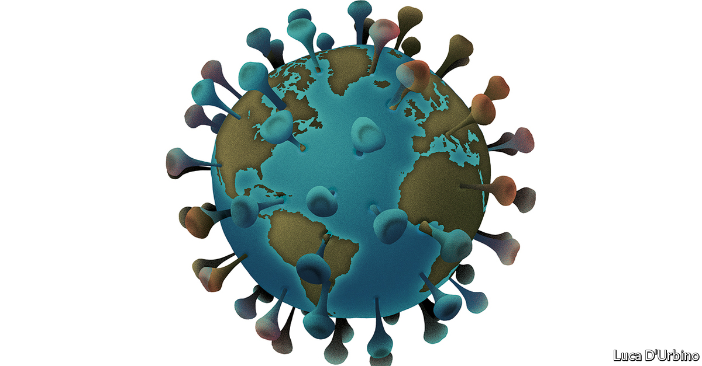

## On covid-19, China, digital payments, cats, Sinn Fein, Jamie Dimon, Tahiti

# Letters to the editor

> A selection of correspondence

> Apr 8th 2020

Regarding the letter from Taiwan’s representative about the response to covid-19 ([March 28th](https://www.economist.com//letters/2020/03/26/letters-to-the-editor)), no one cares more about the health of our compatriots in Taiwan than China’s government. The National Health Commission promptly notified the Taiwan region about the outbreak in Wuhan. In mid-January, as requested by the relevant authorities on the island, experts from Taiwan visited Wuhan for first-hand experience of disease prevention and control, medical treatment and pathogen detection. They also held discussions with experts on the mainland and expressed heartfelt appreciation for their reception and the information obtained during their visit.

Membership of the World Health Organisation is based on sovereign statehood. The participation of Taiwan in the activities of international organisations is and must be arranged properly under the one-China principle. Based on the arrangement agreed between China and the WHO, medical experts from Taiwan can attend technical meetings at the WHO, and the WHO can send experts to the island for inspection or assistance. Such arrangements ensure that the island’s response to public health emergencies is effective regardless of wherever they may take place.

Since the outbreak of covid-19, China has been open, swift and responsible in sharing information and the latest progress with the WHO and the wider international community, and is co-operating with other countries and regions. By taking swift and decisive measures to slow down the spread of the virus, China has done its utmost to protect not only its own people but also people beyond its borders. These important facts, and China’s efforts and sacrifice, need to be understood and appreciated.

ZENG RONGSpokesperson of the Chinese EmbassyLondon

For all its high-mindedness, your leader dishing out equal blame to America and China in their dispute over journalists was wrong (“[Stop deporting reporters](https://www.economist.com//leaders/2020/03/21/expelling-journalists-is-no-way-to-fight-a-pandemic)”, March 21st). Would you run a similar line if it was not China that had thrown American journalists out of the country, but apartheid South Africa or fascist Italy instead? Your position is not how the West prevailed in two world wars or the cold war. And if you imagine that China’s party bosses see the present contest with the West in any other way, I invite you to read what they say to each other in their public literature in their own language.

For Stalin, weakness was a provocation. The Chinese Communist Party sees the West’s willingness to indulge it—to hope economic development strengthens the case for liberalisation and co-operation—as just that, weakness. Whatever pragmatic and liberalising voices were left in China fell silent with the triumph of Xi Jinping.

The West will prevail only by showing strength. China should be welcome to develop and grow rich, but on the terms that have served the world best over the past two centuries, on a rules-based, open and transparent basis. Enforcing reciprocity is a peaceful means to work towards that end. China’s party leaders gain much more from having their propaganda agents overseas than the West gains from having journalists in China. America was right to enforce tit-for-tat expulsions.

PETER ROWEAustralian ambassador to South and North Korea, 2006-09Sydney

Past experience has indeed shown us that one problem with mailing cheques to workers, as is happening in America under the emergency covid-19 measures, is that most people will save this cash rather than spend it (“[Experimental treatment](https://www.economist.com//briefing/2020/03/19/governments-are-spending-big-to-keep-the-world-economy-from-getting-dangerously-sick)”, March 21st). Hopefully, America can catch up with the rest of the world and deliver these payments digitally in future. There are already digital MasterCard and Visa solutions that are, in effect, a virtual pre-paid card that must be spent: there is no way to save the money. Digital funding also provides us with a wealth of data on spending habits that are traceable with a pre-paid card. This data can be mined non-intrusively to ensure supply chains run efficiently.

J.P. CARROLLPayment InnovationsBlackhawk NetworkSan Diego

I would like to give [Bartleby ](https://www.economist.com//business/2020/03/26/diary-of-a-home-worker)a most sincere “thank you” for making me laugh out loud, something I have not done in weeks, after reading his diary of a home worker (March 28th). I, too, have a cat and am now tutoring students online instead of in person. My tuxedo cat, Wicked, has made some interesting alterations to my teaching documents, some of which I found only after emailing said documents to my charges.

FRANKIE STRACCIAAmherst, New Hampshire

It is a common misconception to think that the Sinn Fein of today is the same as the Sinn Fein of 1905 (“[Shape-shifters](https://www.economist.com//europe/2020/03/05/is-sinn-fein-now-a-normal-political-party)”, March 7th). The two large centre-right parties that have dominated Irish politics since independence, the pro-treaty Fine Gael and the anti-treaty Fianna Fail, both claim to be the descendants of the old Sinn Fein. The fact that they have espoused peaceful political means since the end of the Irish civil war certainly gives them a right to say they follow in the footsteps of Arthur Griffith, Sinn Fein’s founder.

On its party website, Sinn Fein’s take on its past simply states that it emerged “as a party of resistance of the nationalist people” in 1969 without laying claim to Griffith’s Sinn Fein of 1905. If this story tells us anything it is that no one party has a claim on Ireland’s history.

JAMES GREENWicklow, Ireland

Your briefing on JPMorgan Chase (“[The house that Jamie built](https://www.economist.com//briefing/2020/03/12/is-dimons-work-done-at-jpmorgan-chase)”, March 14th) reminded me of a quote from Ralph Waldo Emerson: “An institution is the lengthened shadow of one man.” Jamie Dimon has certainly cast a long and illustrious shadow over JPMorgan Chase and the global financial industry.

JAMES MCSHERRYCreemore, Canada

Thank you for the email update to subscribers about your [covid-19 coverage](https://www.economist.com//news/2020/03/11/the-economists-coverage-of-the-coronavirus). As you say, to be well informed is particularly important during these strange times. I spend most of my time in Tahiti. Although we are not, as yet, struck too badly by the pandemic, we are confined, like most of humanity. For a small territory, far from the rest of the world, that imports a lot of food, equipment and fuel, there is a feeling of going backwards, to a time when there were few ships docking here (regular flights have been suspended). We don’t know whether shipping lines in the Pacific will return as normal, so maybe we should resume planting sweet potatoes or taro.

MICHEL PAOLETTITahiti

Editor’s note: We invite our readers to share their experiences of covid-19, by writing to letters@economist.com. We will choose a selection of the most interesting for publication in print and online.

## URL

https://www.economist.com/letters/2020/04/08/letters-to-the-editor
