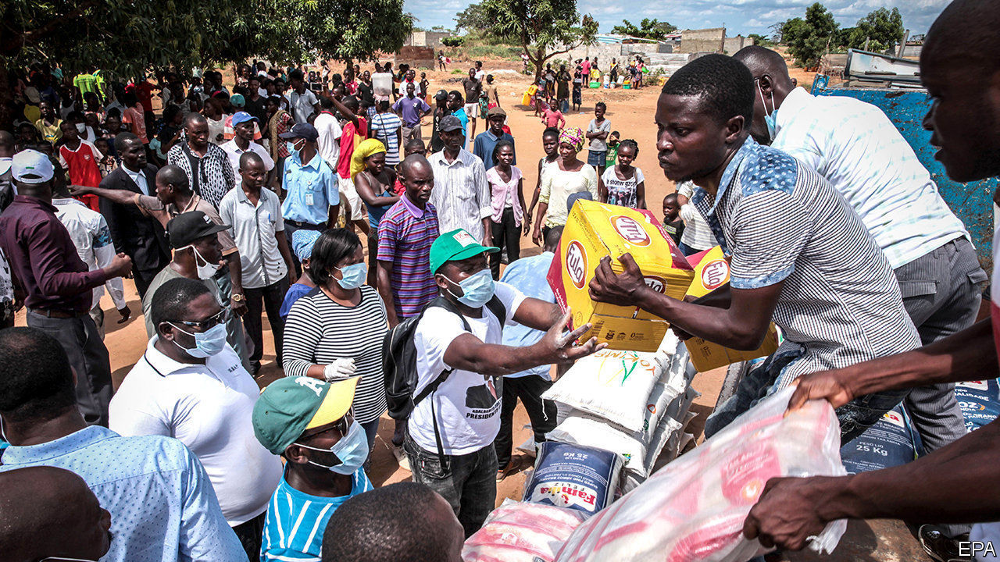
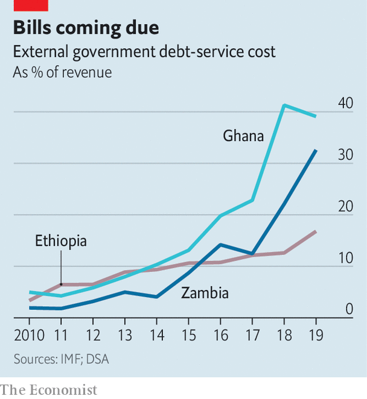

## Double burden

# Africa’s debt crisis hampers its fight against covid-19

> Governments must choose between paying creditors or saving lives

> Apr 11th 2020

Editor’s note: The Economist is making some of its most important coverage of the covid-19 pandemic freely available to readers of The Economist Today, our daily newsletter. To receive it, register [here](https://www.economist.com//newslettersignup). For our coronavirus tracker and more coverage, see our [hub](https://www.economist.com//coronavirus)

ECONOMIC CRISIS and covid-19 are forcing hard choices on most of the world. But the dilemma facing indebted poor countries is particularly acute. They can either pay foreign creditors or allow more of their citizens to die, say experts.

This dilemma is not new. In 2016 Angola spent nearly six times as much servicing its external debt as it did on public health care. Fifteen countries in sub-Saharan Africa spent more money paying creditors abroad than they did on doctors and clinics at home. But now, faced with a slump in revenues and skyrocketing borrowing costs as investors seek relative safety, many African governments are struggling to find the money to fight the pandemic and shore up their economies. Whereas rich countries are borrowing to spend about 8% of GDP on stimulus measures, African ones are spending just 0.8% of GDP.

This is because the virus has thrown petrol onto a slow-burning debt crisis. The countries most at risk of default—and, by definition, the least able to borrow affordably—are those with limited domestic savings and large external debts, such as Angola, Ethiopia, Ghana and Zambia. But they are not the only ones in trouble. Since 2010 average public debt in sub-Saharan Africa has risen faster than in any other developing region, from 40% to 59% of GDP in 2018. Most African countries have borrowed more than is prudent, said the IMF last year; 18 were classed as being in debt distress, or at high risk of it.

Many homeowners in Western countries are getting a mortgage holiday because of the pandemic. Might governments in Africa get the equivalent? The previous big round of debt relief for the continent came via the Heavily Indebted Poor Countries Initiative, which reduced foreign public debt of recipient countries from about 100% of GDP in 2005 to 40% by 2012. At the time Western governments and multilateral organisations, such as the IMF and World Bank, were the biggest lenders to Africa. Now, though, China is the continent’s biggest bilateral creditor. Having signed loans worth more than $146bn to African governments since 2000, it may not be as forgiving.

Africa’s debt burden does more than divert spending from health care and stimulus to loan payments. It also discourages rich countries from helping out. Europe and America, in particular, worry that any aid they provide to African countries would eventually end up in the pockets of Chinese lenders.

The World Bank and IMF have asked bilateral lenders to suspend debt payments from the world’s 76 poorest countries. That would be a start, but would cover only a quarter of sub-Saharan Africa’s total debt-service costs. Nevertheless, the appeal seems to have fallen on deaf ears in China, where officials say they will deal with African debt on a case-by-case basis. Analysts think China is loth to give up the political leverage that comes with being owed so much money. But, like other creditors, it may have to choose between orderly debt relief or chaotic defaults.

Even if China and other government lenders agreed to a pause on payments, states in sub-Saharan Africa might still use emergency funds to pay private creditors. The states owe bond investors $115bn. (Commodity traders and domestic investors are owed, too.) Few commercial bonds are due for repayment before 2022, but interest must still be paid. If it is not, bondholders could demand full repayment. African finance ministers, hoping to protect their countries’ creditworthiness, want donors to help pay the interest while negotiations take place.

More than 100 international NGOs have called for a cancellation of all debt payments in 2020. But multilateral banks are reluctant to risk their own credit ratings and private bondholders are hard to corral. Lee Buchheit, a law professor at the University of Edinburgh, suggests changing American and British codes to stop lawsuits by angry bondholders against countries hit hard by covid-19.

Even if lenders listen to the NGOs and suspend all debt payments this year, there is still trouble ahead for African countries. Most collect relatively little tax. Low commodity prices have led to decreased revenues. And the countries that borrow the most also tend to be irresponsible spenders. Once this crisis is over, a wall of payments awaits them. ■

Dig deeper:For our latest coverage of the covid-19 pandemic, register for The Economist Today, our daily [newsletter](https://www.economist.com//newslettersignup), or visit our [coronavirus tracker and story hub](https://www.economist.com//coronavirus)

## URL

https://www.economist.com/middle-east-and-africa/2020/04/11/africas-debt-crisis-hampers-its-fight-against-covid-19
