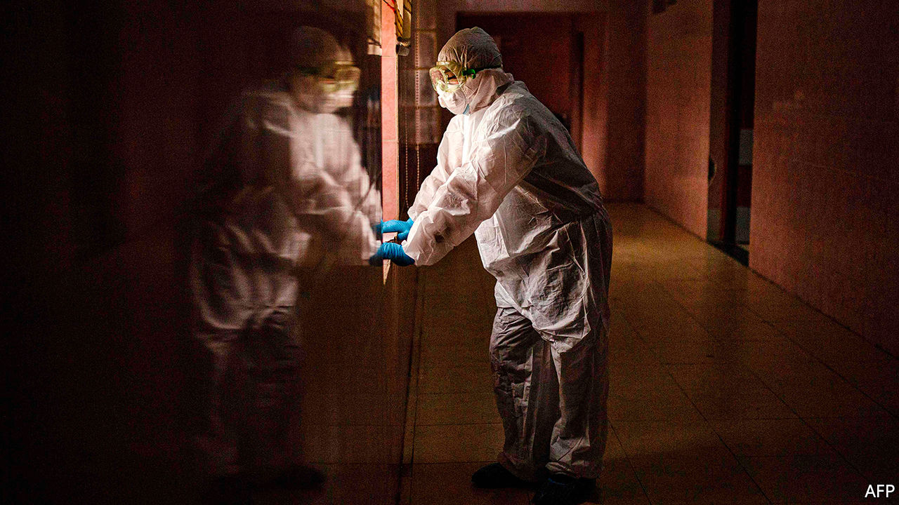
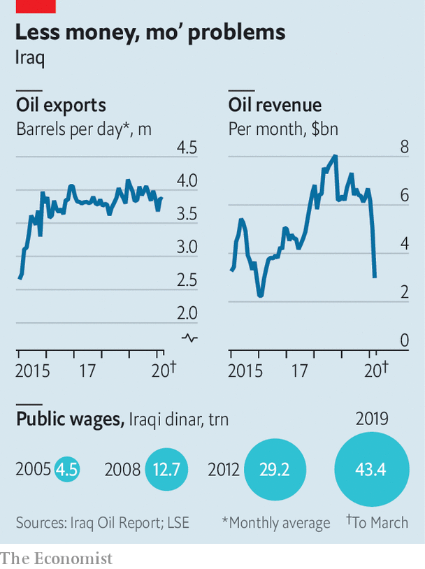

## Dark times ahead

# The risk that Iraq might fall apart

> Covid-19, militias and a cratering economy all threaten the central state

> Apr 11th 2020

Editor’s note: The Economist is making some of its most important coverage of the covid-19 pandemic freely available to readers of The Economist Today, our daily newsletter. To receive it, register [here](https://www.economist.com//newslettersignup). For our coronavirus tracker and more coverage, see our [hub](https://www.economist.com//coronavirus)

IN SADR CITY, the vast shantytown east of Baghdad, cars still pack the roads, pilgrims still pray at shrines and people still gather in shops. Many see covid-19 as either a Zionist hoax or a fast track to paradise, so they feel no obligation to comply with the government’s order to stay inside. The government itself seems unprepared. Iraq claims to have just 1,122 cases of the virus, but it is accused of minimising the number. Its public hospitals are not equipped to handle a big outbreak.

If the virus were Iraq’s only problem, that would be enough. Alas, the country is nearly bankrupt—the result of a precipitous decline in the price of oil, which supplies more than 90% of government revenue. Its politics are also a mess, with parties unable to agree on a new prime minister. Iraq’s militias are running amok, while the jihadists of Islamic State (IS) regroup. America and Iran, which helped Iraq muddle through past crises, are focused on fighting each other. Fears are growing that the state will collapse, says an Iraqi official.

Saudi Arabia and Russia are in talks over oil-production cuts, which would provide some relief to Iraq by raising prices. But even if the price of oil jumps by half, Iraq would still be looking at a sizeable budget deficit. As it is, the government cannot afford to pay salaries in the ever-expanding public sector (see chart). It has around $60bn in cash reserves, but that could run out by the end of the year, leaving it dependent on a loan from the IMF, which may not be forthcoming. The state’s 7m employees and pensioners are worried. “Without salaries, that’s the end of Iraq,” says Mowaffak al-Rubaie, a former national-security chief.

That may sound alarmist, but Iraq does not have much of a private sector to fall back on. Many firms rely on government contracts. Much of the sector is informal. With a curfew in place, travel restricted and the borders closed, commerce has slowed considerably. Even before the virus, many Iraqis struggled to get by. Such hardship, along with blatant corruption, sparked big protests, beginning last year.

Those have largely subsided as people keep their distance from each other. But Iraq’s politicians are not taking advantage of the calm. Since the prime minister, Adel Abdul-Mahdi, resigned in November, two men have been put forward to take his place. The first, Muhammad Allawi, failed to gain the backing of important Shia parties and their associated militias. The second, Adnan Zurfi, is trying to win over parliament, but he is opposed by Iran and is also unpopular with Shia politicians, who cannot agree on a successor. Many are happy to leave the pliable Mr Abdul-Mahdi in office as a caretaker.

Meanwhile, the militias that once fought against IS as part of the Hashd al-Shaabi, or popular mobilisation forces (PMF), are fragmenting. Two men who held them together—Abu Mahdi al-Mohandis, the PMF’s commander, and Qassem Suleimani, the head of Iran’s Quds Force, its foreign legion—were killed by America in January. Now some militias want to integrate with the army. More militant ones are going their own way. There are also signs of trouble within the militias, with splinter groups acting like criminal gangs.

Iran continues to use militias to wield influence in Iraq and try to push out America. A rocket attack by militia forces on March 11th killed two American soldiers and a British medic at an Iraqi military base. America responded with strikes on an Iranian-backed militia, Kataib Hizbullah. On March 16th militia forces attacked another Iraqi base used by American soldiers (causing no casualties). An unknown group called Usbat al-Thayireen claimed both attacks and issued threats against America, “suggesting that the [Quds Force] had assembled its proxy militias into a new coalition,” says the Soufan Centre, a New York-based research body.

President Donald Trump says Iran “will pay a very heavy price” if its proxies keep up their attacks. He has been consolidating America’s position in Iraq. Of the 5,200 American soldiers who were in the country at the start of the year, most have been gathered into a few large bases, mainly in Kurdish and Sunni areas. Some have been withdrawn. European and Canadian soldiers, part of the anti-IS coalition, have left, citing the outbreak of covid-19. IS, meanwhile, is active again. “It has a bit of a free pass right now,” says Michael Knights of the Washington Institute, a think-tank. “They’re better prepared for the virus than any fighting force. They’re doomsday preppers.”

With no leader and outside powers preoccupied with their own interests, it is not clear who will hold Iraq together. Grand Ayatollah Ali al-Sistani, Iraq’s spiritual arbiter, has receded from politics. The Kurds, who have sought independence before, may do so again if the central government cannot produce the cash promised to their region. Sunni leaders are discussing carving out their own state, too. And the protests are likely to resume once the outbreak subsides. Politicians and analysts differ over how Iraq might collapse, but many think it is only a matter of time. ■

Dig deeper:For our latest coverage of the covid-19 pandemic, register for The Economist Today, our daily [newsletter](https://www.economist.com//newslettersignup), or visit our [coronavirus tracker and story hub](https://www.economist.com//coronavirus)

## URL

https://www.economist.com/middle-east-and-africa/2020/04/11/the-risk-that-iraq-might-fall-apart
