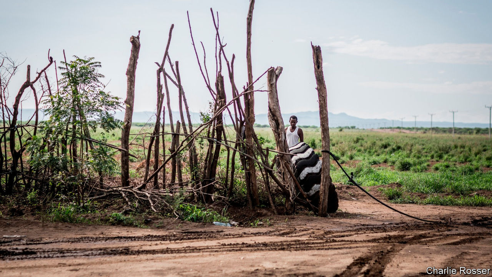

## Bucolic botch

# Why big farms flopped in Ethiopia

> Too few investors knew the land; too many deals were crooked

> Apr 8th 2020OMORATE

THE PLAN was to transform farming in southern Ethiopia. Twelve years ago Fri-El, an Italian conglomerate, signed a lease with the state government for 30,000 hectares of farmland in South Omo to make palm oil. But the palms needed more water than the copper-coloured Omo river could supply and production was so disappointing that in 2011 its lease was cut by a third in size. Even a switch to cotton production did not help. Many bolls are left unpicked owing to labour shortages. A ginnery lies idle for want of electricity.

A decade ago rising food prices spurred investors to get land across Africa. In Ethiopia, where the government offered tax breaks, low rents and vast tracts of allegedly empty farmland, more was leased than almost anywhere else. One study calculated that around 1m hectares were allocated between 2005 and 2012; others suggested two or even three times that. The idea was that poor, remote places like South Omo, near Ethiopia’s south-western border, would become paragons of development. Mechanised cotton estates would feed Ethiopia’s burgeoning textile factories. Nomads would ditch their cattle for jobs as labourers on commercial farms.

Instead South Omo has become a cautionary tale. No cotton farm in the local area is operating anywhere near capacity, reckons Benedikt Kamski, who studies such matters for the Arnold-Bergstraesser Institute, a German think-tank. In 2018 less than 3% of the 90,000 hectares leased to investors in three of South Omo’s districts was being farmed, he found.

Many of the farms created in Ethiopia’s sparsely populated lowlands were simply too big, and those leasing them lacked the capital to develop them. Karuturi Global, an Indian firm, signed a deal for 100,000 hectares in 2010, only for it to be cancelled five years later. By that point less than 2% of its tract had been developed. In 2015, the last year for which estimated data are available, less than a fifth of the total land leased in Ethiopia by local and international companies was being farmed.

Some investors were incompetent. “We didn’t know what to do, we’re not farmers,” admits an estate manager in South Omo. Others were crooked. In the region of Gambella 335 out of 420 land deals were signed in just three years after 2008, according to a paper from 2016 by Fana Gebresenbet, an Ethiopian academic. Most involved individuals linked to the ruling party. Many such ventures may be what Mr Kamski calls “dummy farms”: idle assets acquired to get generous government loans.

The neglect of Ethiopia’s lowland areas by those living in its highlands, long the country’s power centre, worsened the situation. Bigwigs dismissed the concerns of local people. The government often deems rangelands “unused”, ignoring the claims of nomads who use them for grazing and light agriculture. This brings farmers and cattle herders into conflict in South Omo and areas like it.

South Omo has also been deprived of resources it needs for development, which makes farming even more difficult. The valley did not contain a sizeable bridge until 2010. Shoddy construction meant it collapsed before it was finished the following year. Scant infrastructure is a headache for companies such as Fri-El. The lack of local petrol stations means it must transport the tens of thousands of litres of diesel it needs each month more than 350km to its farm.

In recent years the government has tried to improve matters. Since 2013 it has cancelled several big contracts, drawn up stricter requirements for investors and introduced maximum landholdings. In 2016 the state development bank temporarily suspended lending to commercial agriculture, after years of handing out questionable loans. The following year some responsibility for leasing land was returned from the federal government to the states to give locals more say.

Yet officials have hinted that the government wants to promote huge farms once more, this time by expanding wheat production to boost food security. The lesson they should remember is that the details matter more than scale or haste. ■