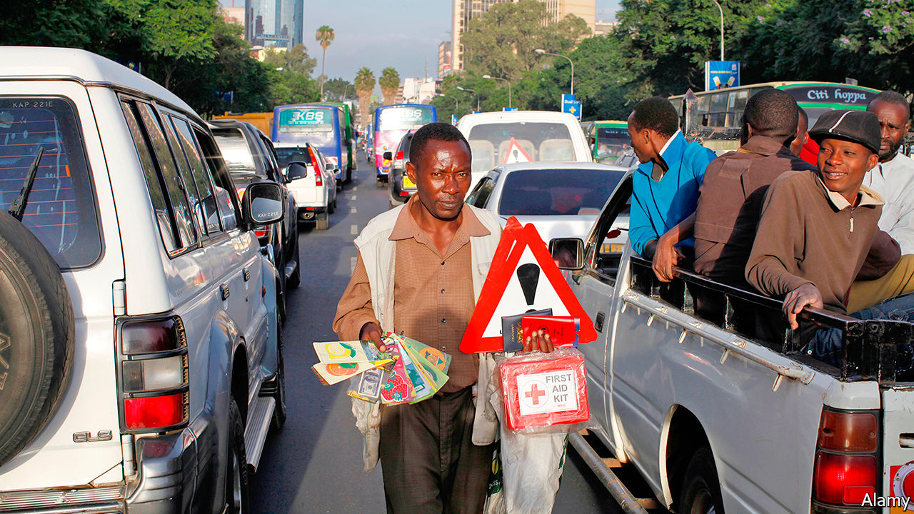

## Tall tales of the city

# Why urban migrants understate how much they earn

> And why this harms rural folk

> Apr 8th 2020KAMPALA

SOME COUNTRY folk do not understand what life is like in town, says Roda Radido, who lives in Nairobi, the Kenyan capital. She is right. Rural Kenyans typically have no idea how much better off they would be if they moved to a city. A survey by Travis Baseler of the University of Rochester found that people in western Kenya guessed that the average worker in Nairobi earns about twice as much as the average worker in Bungoma, a small town near the border with Uganda. In fact, the Nairobian makes four times as much. Urban Kenyan incomes are higher even after accounting for costlier rent and rood, and even when comparing wages in similar jobs.

Why do rural folk underestimate the rewards of working in a city? Many respondents had relatives who had worked in Nairobi, who could easily have told them. Yet for some reason they did not. When Mr Baseler surveyed migrants in the capital, nine out of ten said their loved ones back home did not know how much they were earning.

Ms Radido understands why. She and her husband moved to Nairobi when he found work on a poultry farm on the city’s outskirts. Now the relatives she left behind in western Kenya pester her whenever they need a bit of cash. It is a common problem, and makes urban migrants cagey about their wages. “People in the city do not want to expose the kind of money they have,” she says, for fear they will be overwhelmed by requests for help.

In Mr Baseler’s survey, 61% of urban migrants strongly agreed that they would be asked to send back more money if their real incomes were known. Mr Baseler also spoke to the family and friends of migrants. Parents thought that their children in the city were only making half as much as they actually were.

In a working paper Mr Baseler suggests ways in which this economy with the truth is harmful. Because villagers never hear the true benefits of migration, they stay at home and forgo a big pay rise. In an experiment to test this idea, he presented rural households with true information about the average income in cities, food prices and wages in typical jobs. Two years later migration to Nairobi from these households was 33% higher than from a control group, which was told nothing.

City streets are not paved with gold, of course. Newcomers often huddle in overcrowded slums. Linda Adhiambo Oucho of the African Migration and Development Policy Centre, a think-tank in Nairobi, says that many migrants are surprised by the hardships of urban life, including the high costs of rent, transport and electricity. Some families even send food from the village to struggling relatives in town.

However, only a quarter of the migrants whom Mr Baseler surveyed said that their quality of life was lower in the city than at home. Over half said that it had improved. Moving to the city brings fresh opportunities, as well as guilt-inducing phone calls from needy relatives.■