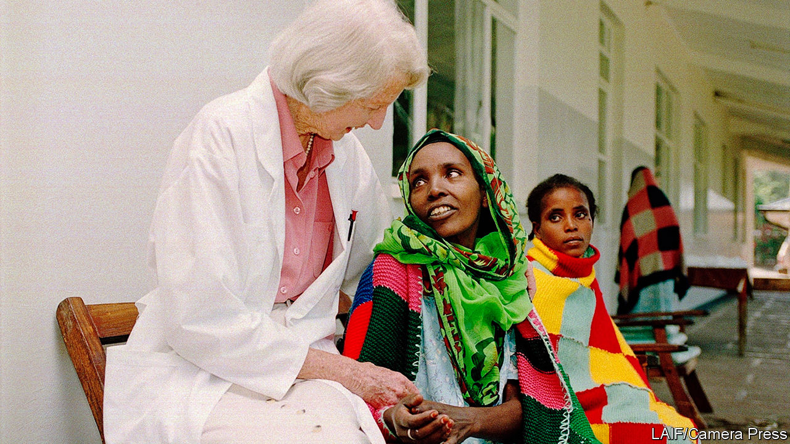

## Healing hands

# Catherine Hamlin died on March 18th

> The obstetric surgeon who brought relief to thousands of poor Ethiopian women was 96

> Apr 8th 2020

THE AD IN the Lancet called for a gynecologist to set up a midwifery school for nurses in Ethiopia. In the end they got two for the price of one—Catherine, who had grown up in a wealthy Sydney family, and her husband, Reg, from New Zealand. She was reminded of her homeland as soon as she saw the rugged, biblical landscape. It looked a bit like New South Wales, with its armies of gum trees arrayed along steep hillsides as in the Blue Mountains. She liked the lemony light of early morning when she would start the day with a cup of tea on her veranda and a passage from the Bible. But in other ways it wasn’t like home at all.

No one was there to meet the couple when, with their six-year-old son, Richard, they stepped off the dusty flight from Djibouti, where their ship had docked. The telegram announcing their arrival in Addis Ababa was not delivered until two weeks after they got there. Ethiopia had more pressing needs too, it turned out, than either midwifery or teaching.

Each day, when the hospital gates swung open, she found them there, the young women who believed she might be their last hope. Some had been carried for hundreds of kilometres on the back of their fathers or mothers, others had spent years saving for the bus fare. One arrived at night and, finding the gate shut, tried to hang herself. In the morning the guards cut her down; Dr Hamlin operated, and cured her.

They all had terrible internal injuries, such as had not been seen in Europe, America or Australia since the 19th century. Here these were endemic, owing to the malnutrition that meant the bodies of Ethiopian girls remained small. The attitude of the Ethiopian Orthodox church which encouraged child marriage—to keep girls virtuous, they insisted—only made things worse, as did the lack of obstetric care, especially in rural areas. Betrothed at eight or nine, girls would find themselves pregnant in their early teens. When they went into labour, sometimes with no one to help but a wogesha, a village doctor offering a potion made of herbs, it went on and on. There was nothing to do but squat and push, often for five or six days. If the fetus did not survive, the only reason the mother could eventually deliver was because babies get smaller when they are dead.

But then, as she discovered, the mother wakes up to an even greater horror: her bed is soaked and stinks. Her protracted labour has left her so badly injured that her vagina has ruptured, her bladder is shredded, her rectum torn. Urine and faeces leak out of her without cease. Soon, her husband leaves her. Her family and her village community turn their backs on her. She lies on her bed, her legs drawn up to her chin to try to stem the flow; shame is her only company.

The Hamlins would sit up late into the night in their little mud-built house in the hospital grounds, studying the history of obstetric fistula, as these injuries were known, which was first written about in 1550BC. They went over the evolution of the treatment, rereading the autobiography of Marion Sims, who, in the 1850s had treated similar injuries among American slave women. Of the two of them, he was the conventional one, doing things the way they had always been done. She was the more flexible, ever prepared to experiment, radically cutting away scar tissue, for example, or trying out a technique known as the Martius fat-pad graft in which a piece of fat partly cut from the side of the vagina was used to repair the bladder—and create a reinforcement between the bladder muscle and the skin of the vagina, offering protection in a future pregnancy. When she wrote to Heinrich Martius of her success after doing the surgery hundreds of times, he replied: “I’m glad you’re curing these women with my operation. I’ve only done 26.” Her small hands, wearing surgical scrubs during the week and white gloves for church on Sundays, were perfect for suturing within the small confined spaces of women’s bodies.

Some patients were too far gone, and died. But many recovered and went home—always in a new dress that she gave them for the journey. Others made a life in the hospital as assistants to the nurses, like Enatanesh Demisse whose urethra Dr Hamlin rebuilt using muscle taken from her leg, or Lete Birhan, who was not only incontinent when she arrived, but also paralysed from the waist down having been knocked over by a car. Once treated by the doctor, Lete, in her wheelchair, became a stalwart of the hospital’s physiotherapy department.

Soon the hospital was curing more than 90% of its patients. Surgeons came from around the world to see her work. Having delivered several of the imperial princesses, she asked the emperor for land so the hospital could expand. In 1993, when Reg died, she found herself, at almost 70, taking on yet more tasks. The hospital had survived the Derg, which overthrew the emperor in 1974, and the famine that stalked the country. By then she had treated more than 25,000 fistula cases. To help it grow she taught herself to speak to crowds of people and to ask for money. She told Oprah Winfrey, whom she’d never heard of before flying to Chicago to appear on her television show in 2004, that she was a professional beggar. Oprah signed her a personal cheque for $450,000, a year’s running expenses for the hospital.

She was still operating when she was 92, stopping only when she could no longer stand without her sticks to make that first incision. She even built the midwifery school the original Lancet ad had called for. She did all this, she told Oprah, because she believed that was what God wanted her to do. She was not a missionary doctor, but a doctor who was a Christian. She loved the spirituality of the Ethiopians and was not rigid about where she herself worshipped, moving from church to church wherever she liked the message or the minister. She thought of herself as an ordinary woman. The Ethiopians called her Emaye, Amharic for mother. They thought of her as a saint. ■