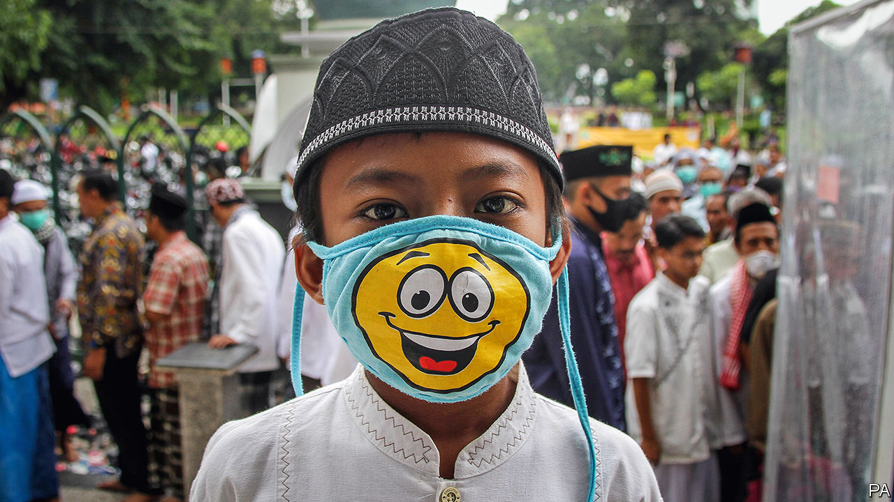
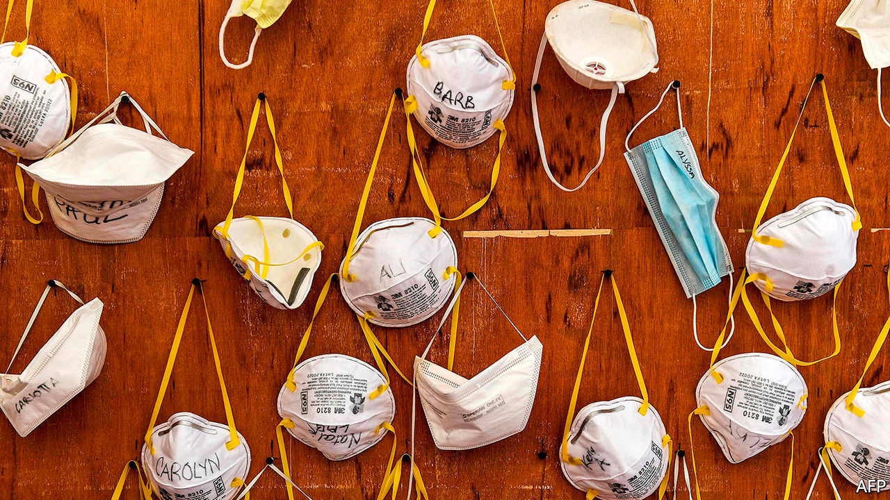

## Disease transmission

# Should the public wear masks to slow the spread of SARS-CoV-2?

> Yes, but not at the expense of those worn by medical staff

> Apr 11th 2020

Editor’s note: The Economist is making some of its most important coverage of the covid-19 pandemic freely available to readers of The Economist Today, our daily newsletter. To receive it, register [here](https://www.economist.com//newslettersignup). For our coronavirus tracker and more coverage, see our [hub](https://www.economist.com//coronavirus)

THE WORLD HEALTH ORGANISATION (WHO) says don’t bother. The British government agrees. America’s Centres for Disease Control and Prevention (CDC) initially discouraged it but by the beginning of April had reversed course. In parts of Asia, including China, it is baked into public behaviour and encouraged by health agencies, even when there is no ongoing public-health crisis. The issue? Whether or not members of the public should wear face-masks in a bid to slow the spread of SARS-CoV-2, the virus responsible for the covid-19 pandemic.

Understanding all the ways that SARS-CoV-2 is transmitted is a matter of active scientific discussion. In the main, though, the virus hitches a ride on droplets of mucus or saliva that come out of the respiratory tracts of infected individuals. These may be expelled during normal breathing or, more commonly, as a cough that propels them a few metres into the air. Thus propelled, they may reach another person’s eyes, mouth or nose directly, and go on to infect cells in that individual’s airways. Or they may land on a surface, on which the virus particles they contain could survive for hours, or even days, and from which those particles may eventually be transferred to others who touch the surface and then touch their own face or mouth.

There is no doubt that masks form a barrier to transmission, by stopping droplets passing from infected to uninfected people close by. The WHO recommends standard surgical masks as part of the personal protective equipment to be worn by doctors and nurses who are caring for covid-19 patients in clinics and hospitals. The same goes for anyone caring for a patient at home. In most instances this is good enough, according to a meta-analysis of four randomised controlled trials that was published this month in Influenza by Mark Loeb of McMaster University, in Canada. Indeed, Dr Loeb found no significant differences between surgical masks and their more sophisticated cousins, N95 respirators, when it came to protecting health-care workers from viral infections transmitted by droplets—including those caused by coronaviruses.

This suggests that N95 respirators (which are thicker, more rigid, and designed to form a close seal around the nose and mouth) should be reserved for riskier situations. “N95” means they block at least 95% of particles smaller than 0.3 microns across. They are, therefore, appropriate for situations when the threat comes from objects smaller than exhaled droplets—meaning less than about five microns across. These particularly include times when doctors and nurses need to “intubate” a patient in an intensive care unit, by inserting the tube of a ventilator deep into that patient’s trachea. Intubation is a forceful procedure, and it creates aerosol particles (ie, smaller than five microns) that may carry viruses much farther through the air than droplets can manage. Though it remains unclear whether SARS-CoV-2 is transmitted via aerosols in this way, those performing intubations should be cautious, says Lisa Brosseau, a respiratory-protection and infectious-diseases scientist at the University of Illinois at Chicago.

Guidance for health-care workers is, therefore, clear: wear masks. Advice for members of the public has been more variable. Since the start of the outbreak the WHO and the CDC have advised people to avoid the use of masks unless they are in direct contact with symptomatic covid-19 patients. This is because such masks are a scarce resource. At the end of February Jerome Adams, America’s surgeon-general, beseeched his fellow citizens on Twitter to “seriously people—STOP BUYING MASKS!” because a run on them might cause supply problems for health-care workers.

A month or so later, the advice seems to be changing. The CDC now encourages the populace to wear homemade coverings for their mouths and noses. Dr Adams himself starred in an official video demonstrating how to use rubber bands around folded pieces of cloth to make DIY masks. Recently, the Czech Republic and Slovakia started requiring anyone stepping out into certain public places to use nose and mouth coverings. The same rule applies in Lombardy, in northern Italy, which was the centre of the covid-19 outbreak in that country. And Austria now requires masks in places such as supermarkets and pharmacies.

The changing advice is testament to an evolving understanding of SARS-CoV-2 itself, and also to continuing debate among scientists about how far previous research on the effectiveness of masks can usefully be brought to bear on the current crisis.

It might seem intuitively obvious that having people cover their noses and mouths in public would be useful. In fact, the science of the matter is not clear-cut. Extrapolating to the laity the research which shows that masks and respirators are effective for those who work in health care is actually problematic.

One reason is that doctors and nurses are better-trained than others in how to wear these devices. For example, surgical masks work less well when they become moist, and so need to be replaced regularly throughout the day. Health-care workers will do this routinely. A member of the public might not. As to N95 respirators, they are notoriously difficult to fit in a way that seals them properly to a user’s face. Yet not fitting them correctly can negate their benefits—as can touching the front of a mask, or taking it off in the wrong way and so contaminating your hands.

Nor do masks and respirators protect people’s eyes from virus particles. Only close-fitting goggles can do that. Finally, as Susan Michie, a health psychologist at University College London, observes, people might feel a false sense of security when wearing masks, and thus pay less attention to other important behaviours such as social distancing and handwashing.

This does not, of course, show that masks for the public are of no use. A better way to think about them in this context might be that, rather than helping healthy people shield themselves from infection, they could be used to stop those who are already infected broadcasting the virus into the air around them. Given that much transmission of SARS-CoV-2 is suspected to occur before someone who has the virus actually shows any symptoms (see following article), encouraging everyone to wear masks in public regardless of whether they are symptomatic could be a useful way to break the chain of transmission.

A study published in the current edition of Nature Medicine backs this idea up. Ben Cowling, an epidemiologist at Hong Kong University, measured the amount of virus shed, in half an hour of breaths and coughs, by participants infected with a variety of respiratory viruses, including influenza, rhinovirus and coronaviruses (though not SARS-CoV-2). In the case of those with coronaviruses, 30% of droplets and 40% of aerosol particles exhaled by participants without a surgical face-mask on contained virus particles. When they wore masks, that dropped to zero.

Rupert Beale, an infections biologist at the Francis Crick Institute in London, says that Dr Cowling’s study presents “strong and compelling” evidence in favour of the public wearing masks, but he warns that this approach should not be used in isolation. It could instead form part of a wider “exit strategy” from lockdown, combined with tried-and-tested measures including continued social distancing and thorough handwashing.

This only works, though, if there are enough masks to go around. According to the WHO, “the chronic global shortage of personal protective equipment is now one of the most urgent threats to our collective ability to save lives. We must provide the protection health-care workers deserve to save our lives.”

Which means that, if mask-wearing is to become a widespread weapon in the armoury, members of the public may have to make their own. This is not as bad as it sounds. An experiment carried out in 2013 by Public Health England, that country’s health-protection agency, found that a commercially made surgical mask filtered 90% of virus particles from the air coughed out by participants, a vacuum cleaner bag filtered out 86%, a tea towel blocked 72% and a cotton T-shirt 51%—though fitting any DIY mask properly and ensuring a good seal around the mouth and nose is crucial.

Elaine Shuo Feng, an epidemiologist at Oxford University, has surveyed the varying advice given to members of the public around the world. In a commentary published recently in the Lancet Respiratory Medicine she and her colleagues argued that the absence of robust evidence on the public use of masks should not prevent precautionary action. It would be rational, they conclude, to recommend that people in quarantine who are not symptomatic wear face-masks if they need to leave home for any reason, in order to prevent potential asymptomatic or presymptomatic transmission if they unknowingly have the virus. Vulnerable populations, such as older adults and those with underlying medical conditions, should probably also wear face-masks if available.

For everyone else, washing hands and maintaining social distance is the most important way to keep transmission down. Wearing masks in public does no harm, and may do some good—but that is always providing it does not reduce the supply available to local doctors and nurses. ■

Dig deeper:For our latest coverage of the covid-19 pandemic, register for The Economist Today, our daily [newsletter](https://www.economist.com//newslettersignup), or visit our [coronavirus tracker and story hub](https://www.economist.com//coronavirus)

## URL

https://www.economist.com/science-and-technology/2020/04/11/should-the-public-wear-masks-to-slow-the-spread-of-sars-cov-2
