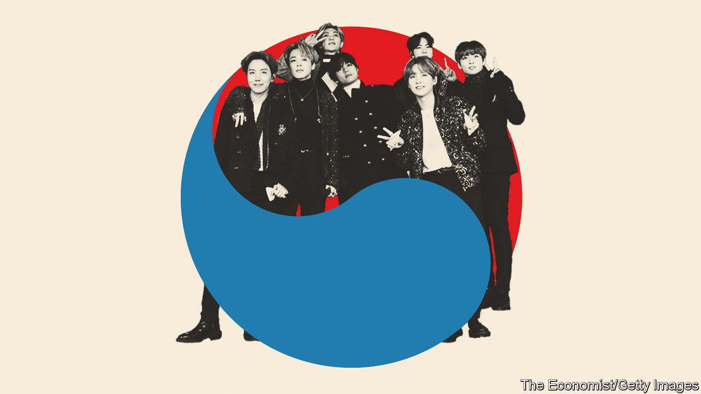

## Beyond K-pop

# K-pop is changing, too

> The world’s most successful boy band make perfect posterboys for the new Korea

> Apr 8th 2020

IN A SMALL restaurant in a quiet backstreet in Seoul’s Gangnam district, the walls and part of the ceiling are covered in posters, postcards and key rings. On one shelf sits an enormous pyramid of coffee-cup sleeves. All the decorations show members of BTS, South Korea’s most successful K-pop act and the highest-grossing boy band in the world. They are gifts from fans around the world for whom the restaurant, where the band used to eat before they were famous, has become a site of pilgrimage.

So far, so unsurprising. Teenagers have projected their dreams onto K-pop idols for years. But BTS are not your average K-pop band. Although their output has all the trappings of the genre—slick production, perfectly choreographed dance routines, rap interludes and ever-unconfirmed rumours about band members’ relationships—they do not conform to the stereotype of the flawless, manufactured idols who are expected to serve as blank screens for fans’ projections. Their producer, a graduate in aesthetics who set up his production company after years of working as a songwriter, has given them plenty of leeway in writing their songs and developing their own image.

That has led them down lyrical paths previously unseen in K-pop. “Dionysus”, the final track of “Map of the soul: persona”, an album inspired by the theories of Carl Jung, a Swiss psychoanalyst, which topped charts all over the world in 2019, celebrates the creative potential of intoxication. The song, named for the Greek god of wine and other sensual pleasures, cuts to the heart of current changes in South Korea. Murray Stein, whose book about Jung inspired the album, likes to think of the Greek god as a “loosener”. Dionysus forces his followers to abandon rigid patterns of thought or behaviour that threaten to thwart their development.

Rather than put fans off, the public soul-searching and the references to Greek mythology and psychoanalysis have struck a chord in a way that no previous K-pop act has ever managed. In 2019 BTS were the highest-paid boy band in the world, selling out stadiums from Seoul to São Paulo. Their latest album topped the charts not just in South Korea but also in Britain and America. “The band’s story is very compelling,” says Hong Seok-kyeong of Seoul National University. “Just these seven ordinary boys who grow together.”

Contrary to common narratives in the West, the South Korean government’s efforts to promote Korean culture have had little to do with this success, says Ms Hong. “Western observers still find it hard to accept that a small east Asian country could generate this amount of cultural influence without a five-year plan from the government.” But that is precisely what BTS appear to have done.

## URL

https://www.economist.com/special-report/2020/04/08/k-pop-is-changing-too
