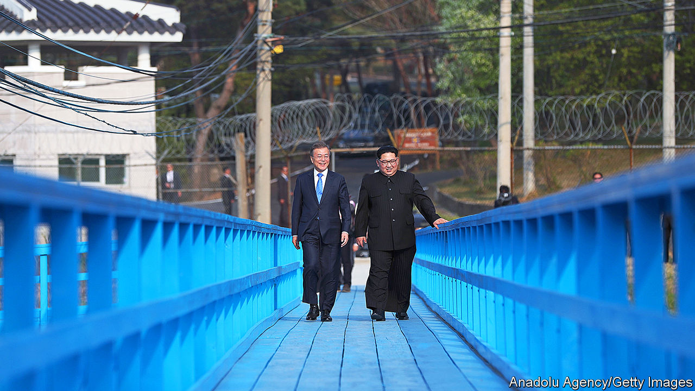

## North Korea

# North Korea is changing, but still dangerous

> Attempts at reconciliation have stalled

> Apr 8th 2020

IN THE SUMMER of 2019, South Koreans were shocked by the news that a North Korean woman, who had fled her country through China a decade before, had died with her young son in her flat in Seoul. Weeks passed before a building manager found the bodies. Authorities concluded she had starved.

Though the case was unusual, it highlighted an important truth. Much is made of how Koreans have thousands of years of shared history and culture. But the split between the communist North and the capitalist South after the second world war was deep and traumatic. Today, people who flee the impoverished dictatorship of Kim Jong Un for the rich, free South find it hard to adapt to life in such a different society. This matters immensely if the two Koreas are ever to reunite.

The number of North Koreans making it to the South has declined of late. Some 33,000 have settled in total, but the 1,047 who registered for the first time in 2019 was the lowest number for nearly two decades. Tighter controls at the Chinese border with North Korea, as well as increased efforts by China to repatriate refugees, are major reasons. Another could be that the North Korean economy is going through a loosening of its own and heading in a less Marxist direction. That has raised hopes of loosening in other areas, notably the 70-year military stalemate on the peninsula.

For a few heady months in 2018, change was in the air. In April 2018 Moon Jae-in and Kim Jong Un met for the first time in Panmunjom in the demilitarised zone and stepped hand in hand across the border between their countries. South Korea (and much of the world) swooned. The two leaders vowed to accelerate efforts to reunify Korea by stepping up economic co-operation and intensifying personal exchanges. They promised to reduce military tensions and formally end the Korean war. They also said they would work towards a “nuclear-free” Korean peninsula.

The “spirit of Panmunjom” rekindled discussion about the possibility of reunification. Despite the North’s appalling regime and nuclear threats, most South Koreans favour the idea. They consider North Koreans neighbours, not foes. Many have relatives on the other side. However, interest in reunification is markedly lower among South Koreans in their 20s and 30s, especially if asked whether they would be happy to pay for it.

How might reunification play out? For years, South Koreans looked to East and West Germany as an example. An economically and politically weak North Korea would be “absorbed” by the South. Refugees would surge southwards. The cost to southern taxpayers would at first be huge. But there would be new opportunities for southern firms to build modern infrastructure up north.

Mr Moon’s government, however, favours a more gradual process. His “new northern policy” envisions a phased opening of North Korea through the rebuilding of railways, pipelines and roads, intensifying trade links across north-east Asia. Eventually, the two Koreas would move towards a federal system and reunification. His plan is tactfully silent on its political implications.

The Kim regime insists that American troops should leave the peninsula. China, the Kim regime’s patron, agrees. South Koreans, who fear China, may not. In a future united Korea, northerners would surely want the vote. That would spell the end of the Kim dynasty, and perhaps the prosecution of Mr Kim himself. Would China allow any of this to happen? To say that Mr Moon’s plan faces obstacles is an understatement.

How much would reunification cost South Korea? Estimates range from around 3% to 12% of its annual GDP over several decades. The potential economic benefits to South Korea are uncertain. In the German case, much of the fiscal aid to the East ended up on the balance-sheets of West German landlords, construction firms and consumer-goods producers. But North Koreans are much poorer than East Germans were at the time of reunification, when West Germans were only about twice as rich as their cousins in the East. South Korea’s national income per head in 2018 was 25 times that of North Korea. What’s more, North Korea currently has much stronger commercial links with China, which accounts for 90% of its trade, than with South Korea, so there is no guarantee that southern aid would actually end up back in the South.

Until North Korea either dramatically reforms or collapses, reunification is hard to imagine. For now, neither seems very likely. That said, the economic changes in the North are real. The famine in the 1990s that killed more than half a million people led to a transformation of the country from below, as millions of North Koreans began buying and selling things to survive, despite such commerce being officially illegal. There are now hundreds of illicit-but-tolerated markets, known as jangmadang, in the country. Kim Byung-Yeon of Seoul National University estimates that ordinary North Koreans earn at least two-thirds of their income from such activities, possibly much more.

There is no sign of political loosening, but Marxist economics is now mostly a thing of the past in the North. Marketisation has intensified under Kim Jong Un. Most trade with China is controlled by conglomerates close to the armed forces and the party, which operate largely according to market principles. They are “North Korea’s version of the chaebol”, argues Rüdiger Frank of the University of Vienna. Those in charge pay a percentage of their profits into state coffers in return for relative operational freedom (though this is not yet called “corporation tax”). This has created a new class known as donju, “money men”, quasi-capitalists who are loyal to the state but whose wealth also gives them some leverage. Besides parking it in foreign bank accounts, they apparently invest their cash in Pyongyang’s property market, where de facto private ownership of flats and apartment buildings is now common.

An important consequence of these developments has been a diversion of citizens’ loyalties from the state to smaller social groupings such as the family, argues Hazel Smith of the School of Oriental and African Studies in London. They cannot rely on the state for their livelihood, even if they have to pretend to believe in the greatness of their leaders to avoid being thrown in a gulag.

This “obvious dissonance between rhetoric and reality” may explain the current Mr Kim’s difference in focus. His father tried to stamp out the grey economy. At one point he tried to confiscate traders’ savings by declaring old banknotes no longer to be legal tender, though this reform was swiftly reversed and the official in charge of it was shot. By contrast, the current god-king of North Korea has largely refrained from interfering with the jangmadang. His propaganda promises prosperity. Though the vast majority of North Koreans remain poor, the grey economy and the gradual marketisation of state enterprises has provided many with a measure of comfort unimaginable under Kim Jong Il. North Korea is increasingly turning into a place where there is nothing money cannot buy—as long as you have it.

From the late 1990s, lively smuggling networks between North Korea and China enabled tens of thousands of North Koreans to escape, including, via an underground railroad through China and South-East Asia, to the South. But political repression has intensified since the latest Mr Kim took power. Security along the border with China has been tightened. China has built new fences and video-surveillance systems, making it costlier to pay smugglers and to bribe officials to turn a blind eye to illegal border crossings.

Mr Kim sees economic growth partly as a way of keeping the masses quiet, and partly as a way to finance his nuclear-weapons programme. Under him, North Korea has conducted four nuclear tests and over a hundred missile launches, including three of intercontinental ballistic missiles in 2017. According to Siegfried Hecker and colleagues at Stanford University, it probably has around 30 nuclear weapons and sufficient fissile material for as many more, though there is still some uncertainty over the degree to which it can reduce the size of warheads to fit them onto its missiles, and whether its long-range missiles could really hit the United States.

If Mr Kim were actually to fire a nuclear weapon in anger, it would be the end of his regime (and a great deal more besides). But he appears to believe that possessing such weapons is his best guarantee against external attack. Talks about disarmament that followed the inter-Korean thaw in 2018 have not got far, despite three meetings between Mr Kim and Donald Trump. Working-level talks never got off the ground. In May 2019 Mr Kim resumed the missile tests which he had promised to abandon the year before.

His “new path” represents something more worrying than a return to the status quo. America’s response to North Korea’s resumption of missile tests has been weak and muted. That has increased the risk that Mr Kim will grow overconfident and, consequently, miscalculate, says Jenny Town of the Stimson Centre, a think-tank in Washington, DC. “It has become very unclear what the red lines are. Which kind of provocation would spark a response now?” she asks.

That uncertainty is one of several. Relations among allies in the region are more strained than they have ever been. South Korea finds the Trump administration’s transactional approach to alliances both objectionable and frightening. Previous American presidents regarded their troops in Korea (of whom there are still 28,000) as part of a broader strategy to keep the peace in Asia. Mr Trump carps about the price tag. Negotiations between the two countries over cost-sharing, which used to happen every five years, have become a painful annual ritual. South Koreans have been put out by American demands that they pay the entire cost of its troop deployment, and by America’s use of public furlough threats to South Korean staff at its bases as a negotiating tactic. Both sides repeat, in public, that the alliance is “ironclad”. But Mr Trump shows few signs of believing this.

The deteriorating relationship between America and China adds a further complication. Back in 2017 and early 2018, the two great powers looked relatively united in their desire to curb North Korea’s provocations. China assisted efforts to mitigate the threat from the North through strict enforcement of the international sanctions designed to curb Mr Kim’s nuclear ambitions. Amid the trade war between the two countries, however, such co-operation has waned.

All this means that the appropriate symbol for the inter-Korean mood over the next few years may lie not in Panmunjom, but at another spot on the DMZ. At the Imjingak Observatory, the unfinished station for a “peace gondola” towers over a vast, mostly empty car park. In the “unification pond” that was gifted by a wealthy donor just last year, a few lifeless-looking carp float around below the surface. And on the bridge that looks out over the bird-filled fields of the DMZ, an elderly visitor who was born just across the border with the North muses on the possibilities of reunification. “I still hope it’ll happen but it probably won’t.” ■

## URL

https://www.economist.com/special-report/2020/04/08/north-korea-is-changing-but-still-dangerous
