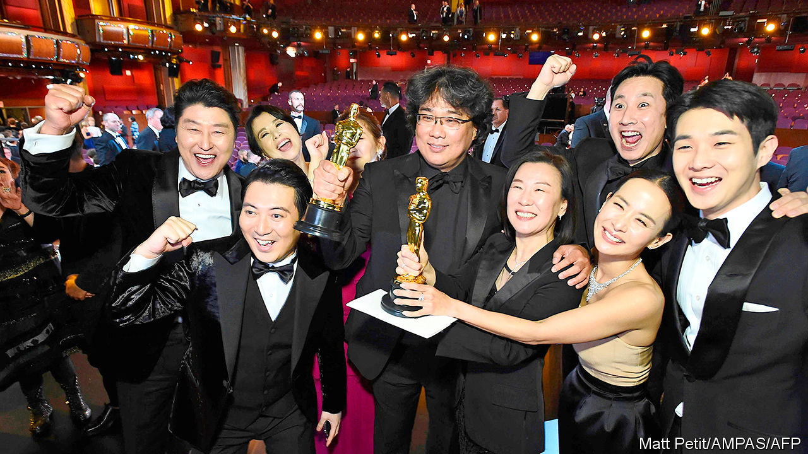
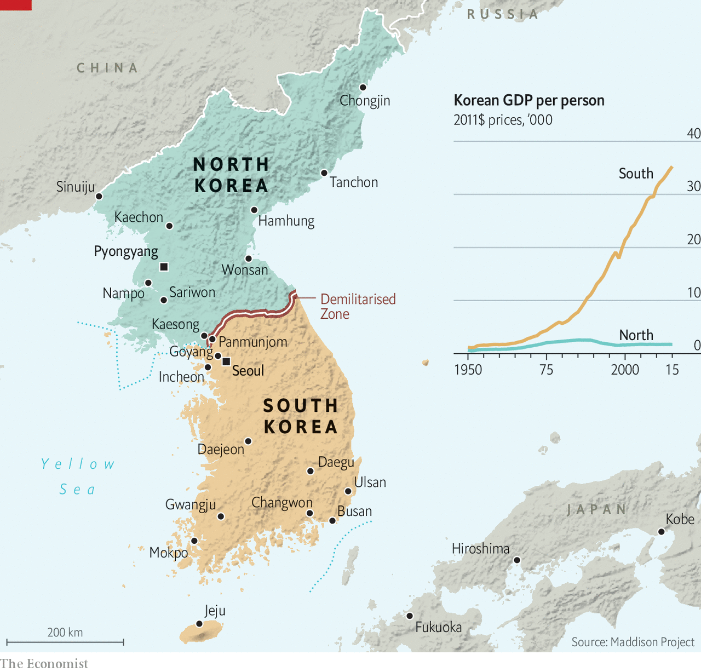

## South Korea

# South Korea is going through deep social, economic change

> But the transformation is still fragile, and covid-19 is not helping, says Lena Schipper

> Apr 8th 2020

THE TENSION between traditional top-down economic and social decision-making and a more individualistic, bottom-up approach has been apparent in South Korea since it democratised more than three decades ago. In the past two months, however, two things have happened that have highlighted this tension.

On February 10th, in what feels now like a different era, the world looked on in amazement as “Parasite”, a rip-roaring, iconoclastic South Korean film, won the Oscar for best picture. It was the first non-English-language movie ever to capture that honour. The director, Bong Joon-ho, won best director, too. The success of “Parasite” is a sign of a flourishing arts scene in South Korea, and a potent symbol more broadly of the loosening of social and economic norms there. It is a brutal and darkly comic farce about class war. Daggers and dingy basements feature prominently. Asked after the ceremony how he was able to make such a film, Mr Bong replied, in English: “Because I’m a fucking weirdo.”

Yet even as Mr Bong, the weirdo who was until recently on a government blacklist, was being invited to the presidential palace to celebrate, the novel coronavirus was working its way through South Korea. Suddenly, the country’s impassioned debate about the clash between individual freedom and social obligation was put on hold. The pandemic clearly demanded a strong, competent state response. It also required individuals to sacrifice for the common good. Both Koreans and their government responded well to the crisis. Testing was widespread. The contacts of infected people were aggressively traced. Official recommendations to wash hands and practise social distancing were followed. Governments around the world now seek to learn from the South Korean approach to curbing covid-19.

On the face of it these two episodes tell two very different stories about the country. The remarkable response to the virus looks like a lesson in the benefits of the old Korea—a strong, bossy state combined with individual willingness to compromise and show self-discipline for the benefit of society as a whole. When the government suggested that people stay at home, there was widespread compliance from the start and little grumbling—unlike in America and in many European countries. Though the government never mandated social isolation, it made use of expansive powers in tracing infections, sifting through people’s mobile-phone data and credit-card records without a warrant, something it was allowed to do following legal changes prompted by the outbreak of MERS, another coronavirus, that killed 38 people in 2015.

But even here, it feels like something has changed. People were happy to follow the government’s plan to beat the pandemic partly because of the transparency with which it was communicated. That marks a sharp contrast even with 2014, when a ferry full of schoolchildren sank and a bungled official response infuriated the public. The government then sought to muzzle those who complained. The protests that followed, now known as the “candlelight movement”, prompted South Koreans to question their relationship with authority and forced officials to become more responsive. The president at the time, Park Geun-hye, was impeached in 2016 and imprisoned for corruption in 2018. When Moon Jae-in took over from Ms Park, he promised to create a “fair” and “just” society, to make government more accountable and to end the corrupt practices which had contributed to her downfall.

Parliamentary elections on April 15th, in which 300 seats in the National Assembly are up for grabs, will show if South Koreans think that Mr Moon has lived up to his promises, in fighting the pandemic and in other areas. His administration has had its own share of scandals and he has come under fire for initially downplaying the virus. Responding to a poll early in the outbreak, South Koreans professed much more faith in the centre for disease control than in the president’s office.

Yet South Korea’s social transformation cuts deeper than politics, and covid-19 is unlikely to halt it. The country’s arts scene and pop culture are just the most visible examples of the new model Koreans are devising for themselves. In 2018 the country exported more “cultural products” (which include music, television dramas and films) than home appliances (such as televisions) for the first time (see chart). The nature of those cultural exports is changing, too. BTS, the country’s—and the world’s—biggest boy band, are much more interesting than many of their equally pretty peers. One recent album is based on the psychoanalysis of Carl Jung. “Parasite” itself is no cheesy K-drama; its plot cuts to the heart of social divisions and inequality in South Korea and beyond.

When covid-19 has receded, South Koreans will go back to challenging old structures and rigid expectations. Women are leading the way. They have plenty to complain about. Among rich countries, South Korea is arguably the worst place to be a working woman. Women still earn less than two-thirds of what men do. Their participation rate in the paid workforce lags that of men by 20 points. And they shoulder the vast bulk of unpaid labour in the home—not only cooking but also tirelessly coaxing their children to study for exams. Sexism is a huge problem. In 2018 two-fifths of young women surveyed by the city of Seoul said they had suffered violence from a partner. In another survey, 70% of the women polled said they had been sexually harassed at work. The gulf between what Korean men and women want from a marriage is so great that many women refuse to get hitched or have children. South Korea has the world’s lowest fertility rate: the average number of children a woman can expect to have in her lifetime is 0.92. That probably will not change until men do.

Social transformation is not easy. When it happens fast, conflicts erupt, says Kim Joong-baeck of Kyung-hee University. “My father still believes in patriarchy and Confucianism and remembers poverty. I barely do, and my teenage son doesn’t at all. How are we supposed to understand each other?” He believes that the country is going through a stage of what sociologists call “anomie”, a mismatch between individual expectations and the guidance they receive from society. “We’re living through this process of transformation, and nobody quite knows where it will lead.”

Economic change can be wrenching, too. Even before covid-19 hit, the export-led model that powered South Korea’s economic rise had come under scrutiny. Growth has slowed markedly: in 2019 the economy grew at a rate of just 2%, the lowest in a decade. Competition from China and the stalling of globalisation have hurt the chaebol, South Korea’s big conglomerates, which have long been the engines of its economy.

The pandemic has already pummelled South Korea’s open economy. In the short term, it will be crucial to try to minimise the damage from the inevitable recession. But once South Korea emerges from the virus-induced slump, it needs to get back to looking for new sources of growth. One place to look is its burgeoning startup scene. ■

## URL

https://www.economist.com/special-report/2020/04/08/south-korea-is-going-through-deep-social-economic-change
