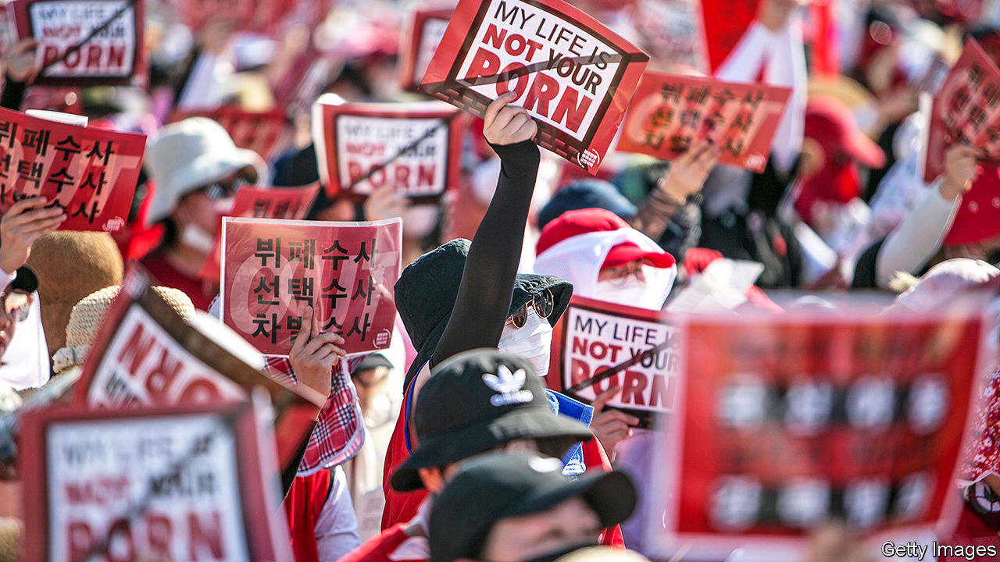
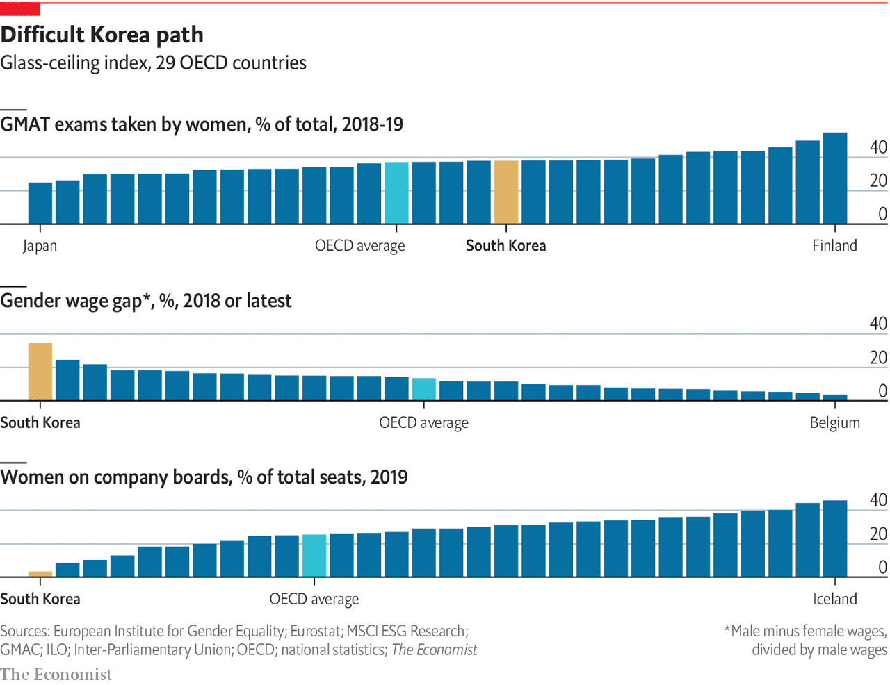

## Men and women

# South Korean women are fighting to be heard

> Women have taken their struggle against misogyny into the open

> Apr 8th 2020

ENTERPRISING WOMEN are everywhere in South Korean film and television. In “The Handmaiden”, a film by Park Chan-wook, two women team up to take revenge on their male tormentors and eventually elope as a couple. “Crash-landing On You”, a television series that had the country glued to its screens this year, features a chaebol heiress who cuts ties with her family to set up her own business and ends up romancing a North Korean pianist. The driving force in “Parasite” is the twenty-something daughter of a poor family who is fed up with life in a dingy basement.

Enterprising women are increasingly visible in the real Korea, too. More young women are earning university degrees than men. More than 70% of women between 25 and 34 are active in the workforce. Young women are far more vocal than previous generations in challenging the conservative social mores that hold them back.

Under the post-war dictatorship, South Korea’s growth model relied on a clear division of labour: men did military service and went out to work, women raised the children and did the housework. What paid work women did tended to be subordinate to men’s, serving, for instance, to pay for their brothers’ education. Adverts often stated that applicants must have completed military service, effectively excluding women. Such rules were abolished as part of the democratisation of the late 1980s. And Korean women are now far too well-educated to submit meekly to second-class status. But they still face barriers in the labour market, and are expected to do the bulk of housework and child care. Many are extremely unhappy about this. A rising number are opting out of marriage and motherhood entirely.

Jung Se-young and Baeck Hana, two twenty-something women who live on their own in Seoul, are a case in point. Last year they set up a YouTube channel about single living after meeting at a feminist discussion group. They regale their 40,000 subscribers and tens of thousands more casual viewers with tales of blissful holidays free of the obligation to cook for a roomful of male family members. They also offer practical advice for living a happy and successful single life, including investment advice and budgeting tips for solo living in Seoul’s expensive housing market.

The two women are part of a wave of feminist activism that has swept South Korea. In early 2018 a state prosecutor, inspired by the global #MeToo movement, spoke out on national television about being sexually assaulted by one of her bosses. Others followed her lead, resulting in cases against several high-profile men, including a theatre director and a provincial governor. Since then tens of thousands of women have taken to the streets and to the internet to protest against sexual harassment, illegal spycam videos and the country’s restrictive abortion laws. More radical ones like Ms Jung and Ms Baeck have cut their hair, thrown away their make-up and sworn off relationships with men.

Ditching make-up is still a fringe position, but the reluctance to marry is not. In 2018 only 44% of women surveyed still felt that it was necessary for them to tie the knot one day, down from 68% in 1998. (Some 53% of men in 2018 still believed it necessary.) The percentage of women who are not married rose from 30% in 1995 to 77% in 2015 for those aged 25-29, and from 7% to 38% for those aged 30-34. That brings South Korea in line with many European countries and Japan.

The expectations placed on a South Korean wife are burdensome. She faces intense pressure to look after her husband’s extended family, deferring to her mother-in-law and preparing endless snacks. And it is still taboo to have a child unless married. Only 2% of Korean babies are born out of wedlock, compared with 40% on average across the OECD. “Even though people’s lives have changed a lot, the traditional idea of what marriage will be like has not,” says Lee Do-hoon of Yonsei University. “That is stopping them from getting married in the first place.” Growing up in a conservative part of the country, Ms Jung remembers being appalled as a teenager by how poorly her mother, a housewife, was treated by other relatives. “I always knew I didn’t want to end up like that,” she says.

But the battle against misogyny starts much earlier. “The problem is that nobody takes you seriously,” says Kim Na-yoon, a 17-year-old who says she was sexually abused by a group of boys at school and treated dismissively when she reported the incident. “Everyone said it was my fault because I seduced them with my mature body and sexy clothes,” she says. “The male police officer they sent to take my statement asked why I didn’t just play it cool.”

Ms Kim says she only realised she had not been at fault when she met Yang Ji-hye, a bubbly 22-year-old who heads up a group of young women battling sexism in schools. To Ms Yang, a big part of the problem is a lack of education about sex and equality. “Sex among teenagers is considered taboo, and not being able to talk freely about it gives people unrealistic expectations.” Government guidelines on sex education in high schools still suggest pupils be taught that women should focus on their appearance and men on making money to attract partners, and that a man who spends money on a date may “naturally” expect sexual favours in return. Gay sex or transgender rights are not even mentioned. Ms Kim’s middle-school sex education consisted of anti-abortion videos.

Activists focus less on the labour market. Many Korean women appreciate the government’s efforts to improve child-care provision and parental-leave arrangements. But some feminists decry the motive they say underpins such policies. “They’re still trying to push us into getting married and having babies,” says Ms Baeck.

Over the past 20 years the government has rapidly expanded child-care provision. South Korea now spends about 1% of GDP on child care for very young children. Within the OECD club of rich countries, only France and the Scandinavian countries spend more. Thanks to those generous state subsidies, the median dual-income family with two children aged two and three spends just 3% of income on child care, less than a tenth of the figure in Britain or America. Parental leave allowances have also been expanded, including for fathers (though take-up remains low).

So a lack of affordable child care is probably not the main reason why Korean women languish in the job market. The average woman still makes two-thirds of the salary of the average man and is given fewer opportunities to advance. Informal arrangements to limit the number of female employees persist in some companies; several banks were recently fined for illegally changing the test scores of job candidates to ensure more men were hired.

Most discrimination is more subtle. Many bosses believe that men’s jobs are more important than women’s because, they assume, men are the primary breadwinners. Julian Han, who manages the homewares division at Lotte Mart, the country’s biggest retailer, says a previous employer explained a decision not to promote her by saying that she could always quit and live with her husband whereas her male competitor had to support a family. Coming back to the same or a similar job after maternity leave is hard. As a result, there are still too many well-educated women whose potential is being wasted. Improving their situation is a goal in itself. It has also become vital for achieving the government’s most pressing aim: generating enough growth to sustain a rapidly ageing country.

Not everyone is happy to hear women loudly asking for more. “There were problems with gender inequality in the past but those feminists are all about getting advantages for women at the expense of men,” says Oh Serabi, a female writer and activist of an older generation. “Women should work alongside men to make society better, not fight them.” Some young men argue that it is they who get the short straw. Women are exempt from military service, which is universal and gruelling for men. Some men feel blamed for structures they did not create. “We didn’t ask for the patriarchy,” says Moon Sung-ho, who works with Ms Oh, “It’s unfair of the feminists to target us just because we are men.”

Men’s attitudes have not caught up with women’s demands. When men marry, they have more traditional expectations of gender roles than women. Even in families where both partners work, women spend more than three hours a day on housework and child care compared with only half an hour for men. Men spend nine hours a day at the office, against seven hours for women.

To many young women, change still feels frustratingly slow. But the fact that inequality is now being openly discussed is progress in itself, says Kim Ji-Yoon, a political talk-show host. “The single most important achievement of the past couple of years is that these issues are now on the agenda.” It is becoming easier to make different choices, says Ms Jung. “The influence of feminism is increasing,” she says. “Young people no longer want these conservative traditions, and women are free to reject them.” That increasing sense of possibility is not confined to gender roles. It is also making itself felt in politics. ■