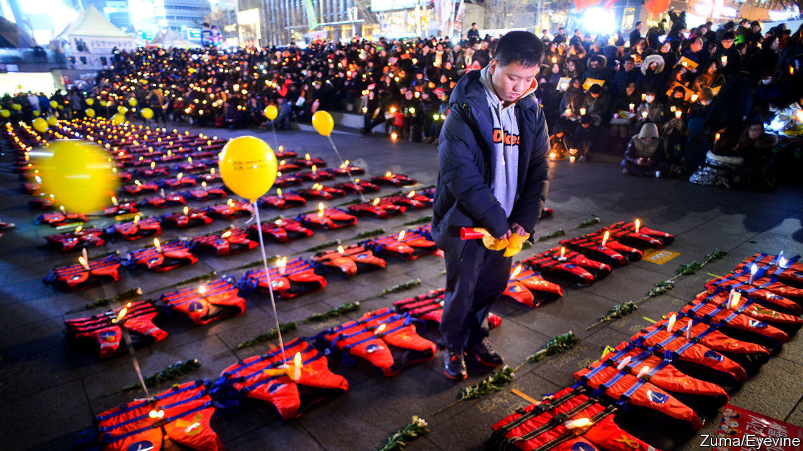
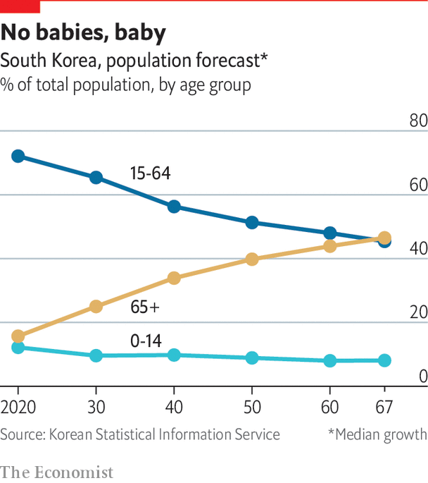

## Politics

# South Koreans are unhappy with the pace of political change

> A younger generation has now been politicised

> Apr 8th 2020

ON A WINDSWEPT pier in Mokpo on the far south-western coast of South Korea sits the rusting hull of a ferry. It is what remains of the Sewol, which sank in 2014 on its way to the island of Jeju. Yellow ribbons still cover the gates to the pier, along with pictures of the 304 people, mostly schoolchildren, who died in the disaster.

The wreck has become a symbol of how corruption and negligence by state institutions can fail citizens. The Sewol was overloaded when it sank. Dangerous modifications had affected its stability. Corrupt regulators had allowed it to sail anyway. The crew abandoned ship while most passengers were still on board. Most survivors were saved by private vessels rather than the coast guard, whose officials seemed more concerned with keeping up appearances to superiors than saving lives. The then president, Park Geun-hye, did not appear in public for hours after the ship began to sink and seemed ill-informed about what had happened. She was later found to have encouraged the national intelligence service to keep tabs on people who spoke up about the official response.

Protests which began in the wake of the tragedy eventually led to Ms Park’s impeachment, criminal prosecution and imprisonment. They became known as “the candlelight movement” and prompted a fundamental reassessment of the relationship between citizens and the state, for the first time since pro-democracy protesters brought down the military dictatorship in the 1980s. They also prompted a drive to reform the political system. Changes to the electoral law designed to improve the chances of smaller parties were passed in December and will apply for the first time in the parliamentary election on April 15th.

The tragedy of the Sewol made South Koreans question their relationship with authority. Many were particularly appalled that the good behaviour of the children, who largely followed orders from the ship’s crew and their teachers to stay put as the ferry sank, may have played a role in causing their deaths. Kim Hee-ok, who has worked with victims’ families, says the sinking was a moment of realisation. “That these parents could just lose their children, just like that—it showed how little responsibility the state actually takes for people’s lives.”

The aftermath of the Sewol sinking marked the moment of politicisation for many youngsters who are now trying to shake up South Korea’s stagnant political scene by running for parliament. Shin Min-joo, a 25-year-old with cropped hair and several ear piercings, wanted to invite victims’ families to her university for a talk. The university authorities refused on the grounds that it would be “too political”. “I realised that if I wanted politics to be different I had to become a part of it,” says Ms Shin. In the election she is running as a candidate for the Basic Income Party, a small outfit with a socially liberal agenda advocating feminism and gay rights alongside its main platform.

Son Sol of the Minjung Party, another small progressive group, has a more conservative hairstyle but similarly ambitious plans: she wants to become the youngest member of the National Assembly. “Parliament is full of kkondae,” she says, using a slang term for haughty old people. “None of them care about us, so we young people have to look out for ourselves.” The Sewol played a big role in forming her political views, too, but she says her background also motivated her. “I’m from the countryside, my parents didn’t go to college—when I got to university in Seoul I realised how unusual that was.” Young people, she says, are frustrated by privileged older politicians’ claims that all that is needed for success is hard work. “Until last year, I wouldn’t even have been allowed to run in an election because I was too young.”

In the previous election, the average age of those elected to parliament was over 55; only three candidates who were younger than 40 managed to win seats even though more than a third of eligible voters were between 19 and 39 years old. Generational change is proceeding only slowly in the two main parties. It is still not clear whether politicians like Ms Shin and Ms Sol will actually succeed in shaking up the party system from within, as young people are beginning to do in Taiwan, or whether they will continue to be sidelined like their fellow progressives in Japan, who, while tolerated, remain for ever on the outside.

The policy environment for change from below has become more favourable. The recent electoral reform strengthens proportional-representation provisions that are designed to ensure that smaller parties win seats roughly in line with their vote share. That will probably mean fewer seats for Mr Moon’s Minjoo party and United Future, the main conservative opposition party (though both are looking for ways around the rules, using “satellite parties”).

That may go some way towards breaking the deadlock between the two major parties, as they will have to include a wider variety of views to build coalitions. Though it probably won’t fix the partisan polarisation overnight, it may help.

What of the relationship between citizens and politicians? Mr Moon was swept into office on a tide of hope that the political class would become less distant from ordinary people. The former democracy activist and human-rights lawyer cultivated a down-to-earth image, eating cafeteria lunches and going for iced coffee with his aides. He promised to lead a government that was more responsive to people’s demands. He vowed to tackle corruption, inequality and the nepotism of the university admissions system, as well as aiming for de-escalation with North Korea.

Three years on, the Moon government’s plan to be less haughty than its predecessor is looking shaky. In autumn 2019 the justice minister was forced to resign after just weeks in office over a nepotism scandal. Mr Moon supported him long after the allegations became known and later only offered a mealy-mouthed apology.

To some, the president is also falling back into old patterns of dealing with the judicial authorities: prosecutors investigating his political allies, including the former justice minister and an associate accused of meddling in a mayoral election, found themselves reassigned to provincial outposts. “This kind of stuff is extremely demoralising,” says one disappointed left-wing professor. “People think you have a better chance in politics if you’re morally corrupt, and if that’s how these guys behave then why should I be a good citizen? It ruins social trust.”

The election on April 15th will show whether South Koreans consider Mr Moon’s government a disappointment by the standards the president set himself. But whoever is in charge will still have to deal with the looming problem to the north. ■

## URL

https://www.economist.com/special-report/2020/04/08/south-koreans-are-unhappy-with-the-pace-of-political-change
