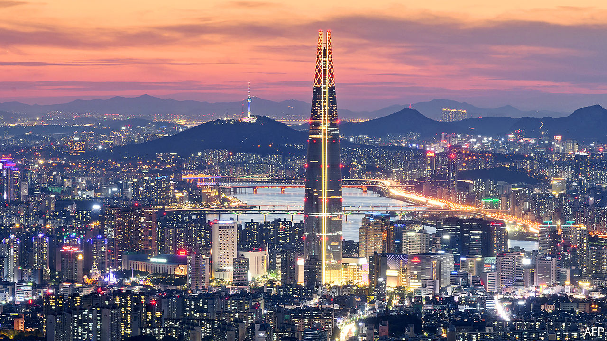
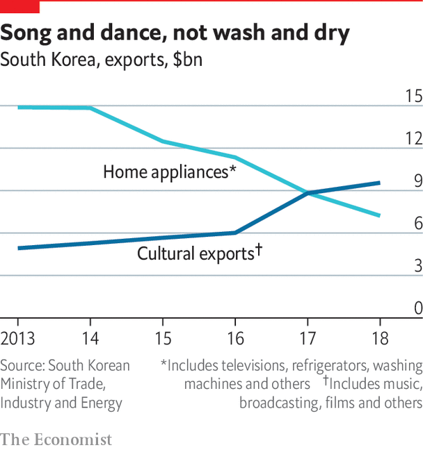

## New economic models

# Startups offer a different future for South Korea’s economy

> But chaebol still dominate

> Apr 8th 2020

Editor’s note: The Economist is making some of its most important coverage of the covid-19 pandemic freely available to readers of The Economist Today, our daily newsletter. To receive it, register [here](https://www.economist.com//newslettersignup). For our coronavirus tracker and more coverage, see our [hub](https://www.economist.com//coronavirus)

COUPANG, AN E-COMMERCE firm and South Korea’s most valuable startup, occupies the upper 20 floors of a skyscraper in Jamsil, a district in southern Seoul. The lower floors are still used by affiliates of Hyundai, the country’s second-biggest conglomerate, whose engineering arm built and operates the building. Coupang employees joke that it is easy to spot anyone who works for Hyundai in the weekday-morning jostle for the lifts. Most workers in the building are in classic startup attire of jeans and expensive trainers: “The Hyundai guys are the ones in suits.”

The government hopes that companies such as Coupang will eventually change more than just dress codes. Starting with the “creative economy” initiative launched by the Park Geun-hye administration in 2013, it has been pouring money into seed capital, incubators and networking opportunities for budding entrepreneurs. Last year it announced an extra 12trn won ($9.9bn) of venture-capital support by 2022. It is encouraging banks and other large firms to do the same in a bid to diversify the economy away from its reliance on the chaebol. It has also co-opted those conglomerates into the strategy, encouraging them to invest their own money, resulting in big chaebol such as Samsung and Hyundai launching their own startup incubators. The government also makes it easy for small businesses to borrow money, guaranteeing a large portion of bank loans. The interest differential for smaller and larger companies is one of the smallest in the OECD.

Behind all this is an urgent need to preserve long-term growth. South Korea grew rich thanks to an export-led model that prioritised large conglomerates and a handful of key manufacturing industries. But growth in exports and overall GDP has slowed towards the OECD average over the past decade, even though income per person is still a third below the richest half of OECD countries. Productivity in the service sector, which is 60% of the economy, is only half that in manufacturing. Small and medium-sized firms are much less productive than large ones. Fixing that will require structural changes. “The chaebol-led growth model is broken,” says Randall Jones of Columbia University. “Improving productivity means moving towards a more startuppy, digitalised model.”

If that is the long-term challenge, for now South Korea faces a more immediate problem. The covid-19 pandemic is ravaging the economy, domestically and around the world. The current global turmoil is extremely worrying for a country so dependent on trade. How big the impact will be will depend on how long the pandemic lasts and what governments do to counter the economic effects, says Park Sangin of Seoul National University. But there is no doubt that it will be very bad indeed.

The short-term fallout has already rattled the South Korean economy. In March the stockmarket and the value of the won against the dollar slumped to their lowest levels since 2009, in the tail-end of the global financial crisis. The country’s airlines had 92% fewer customers during the second week of March compared with the same period in 2019 and are unlikely to recover them soon, given tightening travel restrictions around the world. Consumer confidence has plummeted; shops, bars and restaurants are expecting a drop in sales of up to 80% for the first quarter of 2020. Many are already struggling to pay rent. A “nice landlord” movement has gathered pace across the country as building owners have lowered or waived rents for struggling shopkeepers, hoping to be reimbursed by the government. Delivery companies like Coupang, by contrast, have struggled to keep up as demand for home deliveries has soared by nearly 50%.

Factory closures in China, where industrial output fell by more than 20% in January and February following the covid-19 outbreak, have had knock-on effects on Korean firms that depend on parts from there. Hyundai, which makes more than half the country’s cars, saw a 13% drop in global sales in February compared with 2019 and disruption to the production of around 120,000 vehicles as Chinese suppliers shuttered their factories. The situation is likely to grow worse as the virus closes factories elsewhere, though the slow resumption of production in China, where the epidemic has levelled off for now, may improve things.

Supply-chain disruptions and infections have also hit the makers of semiconductors, smartphones and display panels. Samsung and LG have had to pause production on several occasions during the outbreak as cases were discovered at their plants. Since the factories are designed to run round the clock, that is likely to hit their sales volumes for the year.

What about the longer term? Much will depend on what governments do, both in South Korea and elsewhere. Historically, the country has rebounded quickly from economic shocks. After the Asian financial meltdown of 1997, it took just two years for GDP to return to its pre-crisis peak. The country also emerged more quickly than others from the global financial crisis of 2008, because its banks were in better shape than a decade before and because the government responded aggressively, with a mix of fiscal and monetary stimulus.

It is responding to the covid-19 outbreak equally vigorously. Among other measures, the government launched a stimulus package of 11.7trn won, a financing plan worth 100trn won to help small businesses and a fund to stabilise bond and equity markets, similar to one it set up to cope with the crisis of 2008. If these measures work, the shock from the virus may be only temporary, says Mr Park. Christophe André of the OECD reckons that South Korea could emerge more quickly from the slump than other economies because it has good economic fundamentals and the fiscal space to finance its stimulus plans. But he worries that the pandemic will strengthen existing hostility to globalisation around the world. That could spell long-term damage for its export-heavy economy.

When South Korea makes it through the pandemic, it faces daunting long-term challenges. The country is ageing rapidly. The working-age population is declining, and the government now believes that the total population may already have peaked, correcting projections made as late as 2019 that this would not happen for another ten years. South Korea has the highest rate of relative poverty among old people in the OECD, with 44% of over-65-year-olds living on less than half the median income in 2017 (the equivalent rate in Japan, which faces similar challenges, is less than 20%). At current projections, the reserves of the national pension fund, whose payouts are hardly generous as it stands, may be exhausted within the next three decades. It does not help that many firms press workers to retire in their mid-50s, long before they are ready.

To expand or even sustain existing levels of welfare provision, the country will have to find ways of improving growth rates. Unlike in previous decades, counting on the chaebol is unlikely to be enough. Exports still account for over two-fifths of GDP and are dominated by the chaebol, with semiconductors, cars and smartphones the most important products for export. However, all of these are vulnerable both to competition from China and to new trade barriers, if the world turns away from globalisation. Last year exports shrank by more than 10% on the previous year. So as well as making better use of female talent, South Korea needs in the long run to improve the productivity of the small and medium-sized firms that employ close to 90% of workers.

Can the startup economy deliver? Like everything in South Korea, its development has been swift. When Coupang was founded in 2010, the country barely had a startup industry. Just five years ago, there were only 80 startups that had raised more than $1m from investors. Today there are nearly 700, including around 200 that have raised more than $10m and ten “unicorns” valued at more than $1bn (Coupang is valued at $9bn). In 2019 investors poured more than 4trn won ($3.3bn) of venture capital into South Korean startups, triple the amount they invested in 2013.

The rapid development of the industry has transformed Seoul, the capital, where it is concentrated. Teheran-ro in Gangnam, just down the road from Coupang’s office in Jamsil, has turned from a concrete desert into a bustle of co-working spaces and expensive coffee shops. Smaller clusters have sprung up all around town. “When I moved back from America in 2013, there was very little going on,” recalls Lim Jung-wook, a venture capitalist. “Now I bump into a founder every time I go to lunch.” The scene is still small, but it is growing. Venture-capital investment accounted for 0.36% of GDP in 2018, according to data from the Korea Venture Capital Association, higher than the estimate for China (0.26%) but trailing the United States and Israel, at 0.64% and 1.75%.

Starting your own business is increasingly seen as an alternative to a job at a chaebol or in the civil service. “Ten years ago no Korean mother would have wanted her child to set up a startup,” says Nathan Millard of G3 Partners, a consulting firm. “That has changed.” Partly, that is because there are now many prominent examples of entrepreneurs who have made serious money.

Coupang’s founder, Bom Kim, became a billionaire in 2018 despite nagging questions about the company’s profitability. The net worth of Bang Si-hyuk, the bookish founder of Big Hit Entertainment, the production company behind BTS, is estimated at nearly $800m. Such role models may encourage others who wish to do their own thing rather than spending decades scaling the hierarchy of a big company.

For now, startups are a long way from replacing the chaebol as the engine of growth. Their share of the economy remains tiny: the total of venture capital that flowed into the industry in 2019 was just over half of Samsung Electronics’ profit in the final quarter of the year (and Samsung had a bad year). But startups do not need to replace conglomerates to boost growth. Mr Jones hopes that they can spread some of their attitudes—to innovation, and to digital technology—to more traditional parts of the service sector, improving productivity across the board.

In a small way, that is already happening. Fabrictime, a startup run by two young women out of Dongdaemun fashion market in eastern Seoul, uses an online video platform to showcase fabrics produced in the market to international designers, opening up a global market to fabric wholesalers whose marketing budget would never previously have allowed expansion outside Korea.

However, the pandemic may put a dampener on the scene’s growth. Past experience suggests that economic crises tend to promote consolidation. This is because large, cash-rich businesses (such as the chaebol) are more likely to survive. Even if South Korea avoids a long slump, the pandemic may entrench the economic structure which the country was just beginning to challenge. And it is not just economic change that is under threat.

Dig deeper:For our latest coverage of the covid-19 pandemic, register for The Economist Today, our daily [newsletter](https://www.economist.com//newslettersignup), or visit our [coronavirus tracker and story hub](https://www.economist.com//coronavirus)