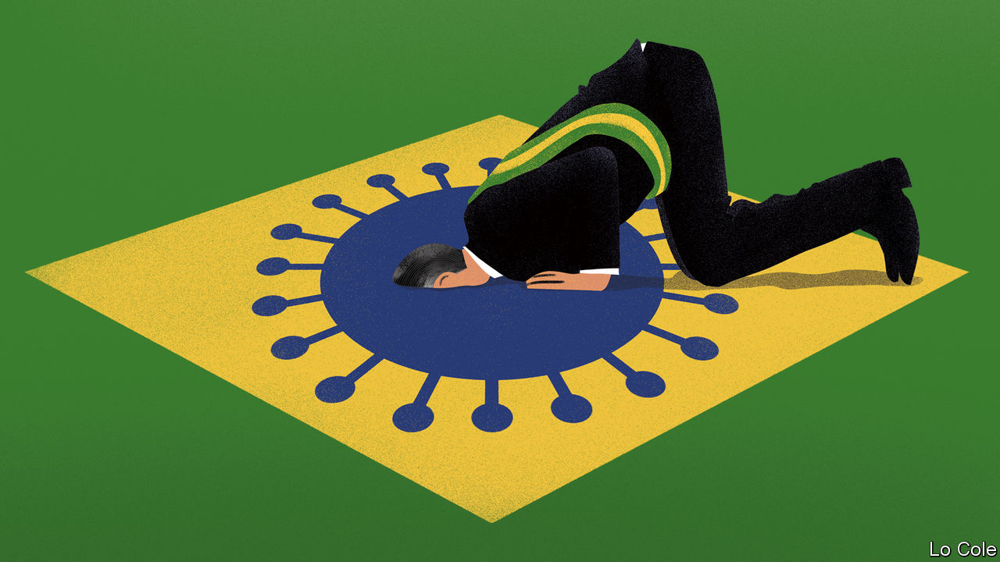

## Bello

# Jair Bolsonaro isolates himself, in the wrong way

> The Brazilian president’s reckless handling of covid-19 will come back to haunt him

> Apr 11th 2020

Editor’s note: The Economist is making some of its most important coverage of the covid-19 pandemic freely available to readers of The Economist Today, our daily newsletter. To receive it, register [here](https://www.economist.com//newslettersignup). For our coronavirus tracker and more coverage, see our [hub](https://www.economist.com//coronavirus)

ONE BY ONE the doubters have made their peace with medical science. Only four rulers in the world continue to deny the threat to public health posed by covid-19. Two are flotsam from the former Soviet Union, the despots of Belarus and Turkmenistan. A third is Daniel Ortega, the tropical dictator of Nicaragua. The other is the elected president of a great, if battered, democracy. Jair Bolsonaro’s undermining of his own government’s efforts to contain the virus may mark the beginning of the end of his presidency.

Since the new coronavirus was first detected in Brazil in late February Mr Bolsonaro, a former army captain with a fondness for military rulers, has made light of it. Dismissing its effects as “just a little dose of flu”, he said “we’re going to face the virus like a man, dammit, not like a little boy.” He added, helpfully: “we’re all going to die one day.” In the 15 months since he became president, Brazilians have become accustomed to his macho bravado and ignorance on issues ranging from the conservation of the Amazon rainforest to education and policing. But this time the damage is immediate and obvious: Mr Bolsonaro has coupled defiant rhetoric with active sabotage of public health.

He claims to believe in “vertical isolation”, in the quarantining only of Brazilians aged over 60 in order to limit damage to the economy. There are two problems with this. Young people die of covid-19 (10% of those it has killed in Brazil are under 60), and enforcement of such a quarantine would be impossible.

The governors of Brazil’s most important states have gone ahead and imposed lockdowns using their own powers. Mr Bolsonaro has encouraged Brazilians to ignore them. A man who fears betrayal and has a perpetual need to provoke, he greeted with hugs and selfies supporters who attended a rally against Congress on March 15th. He launched a campaign urging businesses to re-open and called for a religious “fast and demonstration” to take place in churches on April 5th. He has mused about decreeing, illegally, an end to the lockdowns. He has twice come close to sacking his own health minister, Luiz Henrique Mandetta, a conservative doctor who publicly opposed the president’s call to loosen restrictions. Mr Bolsonaro is seemingly jealous of the rising profile of a minister he claims “lacks humility”.

Even by his own standards, Mr Bolsonaro’s breach of his primary duty to protect lives has gone too far. Much of the government is treating him like a difficult relative who shows signs of insanity. Key ministers, including the cohort of generals in the cabinet, as well as the speakers of both houses of Congress, have given sometimes ostentatious support to Mr Mandetta, who has the public on his side. A poll this month by Datafolha found 76% approval for the health ministry’s handling of the virus, compared with 33% for Mr Bolsonaro’s management of the crisis.

Calls for Mr Bolsonaro’s resignation have mounted. They have come not just from the left but also from some of his erstwhile supporters such as Janaina Paschoal, a São Paulo state legislator whom he once considered as his running mate. Saying he was guilty of “a crime against public health”, she added: “we don’t have time for impeachment.”

There can be little doubt that the president’s conduct constitutionally merits impeachment, a fate that befell two of his predecessors, Fernando Collor in 1992 and Dilma Rousseff in 2016. But for now Mr Bolsonaro retains sufficient public support to survive. While polls found a majority favouring Ms Rousseff’s ousting (for breaking the fiscal-responsibility law to win re-election), 59% told Datafolha they don’t want Mr Bolsonaro to resign. Her approval rating fell to around 10%; he retains the support of a third of voters. Few in Brasília believe that the country wants or can afford the distraction of impeachment while it is under siege from covid-19.

Mr Bolsonaro is sustained by a small coterie of ideological zealots who include his three sons, by the faith of many evangelical Protestants and by lack of information about covid-19 among some Brazilians. The last two factors may change as the virus ploughs its fatal furrow in the coming months. By April 8th Brazil had suffered 14,049 confirmed cases and 688 dead. And the president may not be able to quarantine himself from blame for the economic impact. By his recklessness with the lives of Brazilians, Mr Bolsonaro has forced the possibility of his own departure onto the political agenda. It is likely to remain there after the epidemic fades.

Dig deeper:For our latest coverage of the covid-19 pandemic, register for The Economist Today, our daily [newsletter](https://www.economist.com//newslettersignup), or visit our [coronavirus tracker and story hub](https://www.economist.com//coronavirus)