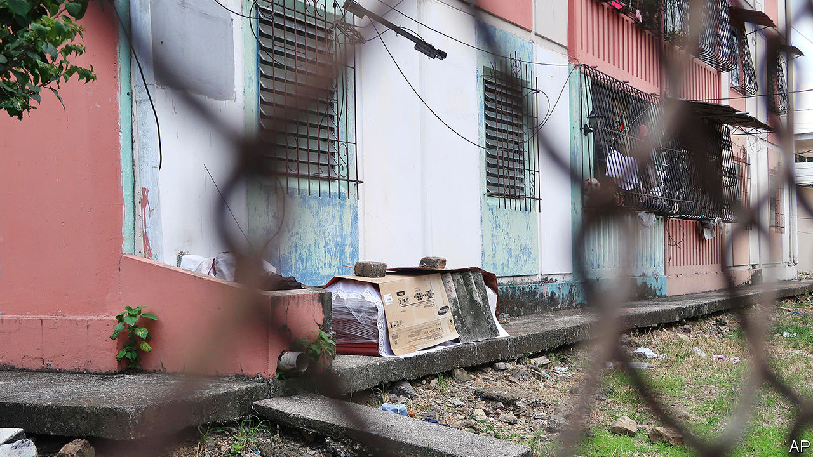
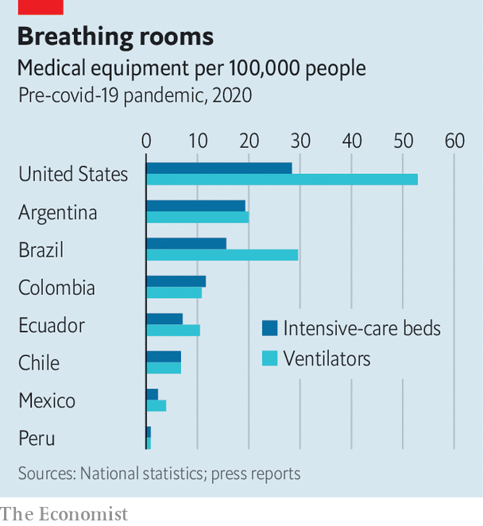

## Pandemic preparedness

# Latin America’s health systems brace for a battering

> Despite recent improvement, the region’s health care is not ready

> Apr 11th 2020MEXICO CITY AND QUITO

Editor’s note: The Economist is making some of its most important coverage of the covid-19 pandemic freely available to readers of The Economist Today, our daily newsletter. To receive it, register [here](https://www.economist.com//newslettersignup). For our coronavirus tracker and more coverage, see our [hub](https://www.economist.com//coronavirus)

A  PROCESSION OF disappointments awaits residents of Guayaquil, Ecuador’s largest city, when illness strikes. Those who report symptoms of covid-19 to the health-care hotline get appointments scheduled for several weeks later, by which time they will probably have recovered or died. With ambulance services overwhelmed, stricken people arrive at hospitals in pickup trucks, only to find there are no empty beds. When somebody dies at home, the corpse joins a long waiting list for removal. The city has run out of wooden coffins. Some relatives dump loved ones’ bodies in the sweltering streets.

Guayaquil is the first place in Ecuador where covid-19 has struck with force. That is probably because the country’s Pacific coast takes a long school holiday starting in early February, five months before the Andean region, including Quito, the capital. Guayaquileños flew to and from Europe after the novel coronavirus began spreading but before cancelling trips became the norm. The hospitals and bureaucracy could not cope with the disease they brought back. In desperation the city’s mayor, Cynthia Viteri, told municipal vehicles to park on runways to block incoming flights. She contracted the virus.

Other parts of Latin America wonder whether Guayaquil’s horrors will soon be theirs. “No health system in the world” can cope with covid-19 once the rate of transmission gets beyond a certain point, notes the director of a public hospital in Mexico. Northern Italians have discovered the truth of that. But the capacity and competence of health-care systems matter a lot, and in Latin America they vary greatly, both between countries and within them. “You have Europe and Africa on the same continent,” says Alejandro Gaviria, a former Colombian health minister.

In general Latin American health systems, though still smaller and less well managed than those of Europe, have matured greatly. Colombia, which introduced universal, taxpayer-financed health care in 1993, has ten times the number of intensive-care beds it did before then. This year Peru’s health budget as a share of GDP—3.3%—is two-thirds higher than in 2015. Across Latin America and the Caribbean, public and private health spending is about 8.5% of GDP, compared with an average of 12.5% in the OECD, a club of mainly rich countries. The region has recent experience of fighting outbreaks of infectious disease, including cholera in 1991, swine flu in 2009 and the Zika virus in 2016. Most countries have competent health-care technocrats. The Pan American Health Organisation, the world’s oldest international health body, founded in 1902, helps governments learn from each other.

But Latin America’s safety net has shortcomings, which covid-19 will expose. Fragmentation, red tape and corruption will enfeeble its response in some areas. Government budgets support world-class urban hospitals and crumbling rural clinics. In several countries, bare-bones publicly financed health care operates alongside plush private provision for the rich. The course of the pandemic may sharpen grievances about inequality that drew millions of protesters onto the streets of many Latin American countries late last year.

The delay in the arrival of the pandemic from Europe and Asia has given the region valuable time, which some governments have taken advantage of. El Salvador announced a national lockdown when it had three covid-19 cases. With 15 confirmed cases on March 12th, Ecuador suspended large events and shut schools a day later. Peru’s government locked down the country on March 15th. On the same day, with 75 confirmed cases, Chile announced the closure of schools and universities.

Other countries have responded more sluggishly. In Brazil governors and mayors have stopped commerce even as the country’s president underplays the crisis (see Bello). Mexico, keen to protect the incomes of informal workers, merely exhorts its citizens to stay home. Nicaragua is in a class of its own. Schools remain open. European sports channels are in talks to broadcast games from the country’s football league, which plays on. This month the authoritarian government sponsored bikini pageants and food festivals.

Countries that took early action have no doubt slowed the disease’s progress, but the region’s relatively low numbers of confirmed cases are deceptive. As Ecuador counted 98 deaths nationwide on April 1st, Guayaquil’s civil registry was processing 40 death certificates per day more than usual. Brazil counted 2,369 hospitalisations of covid-19 patients in the four weeks to April 4th. But in the same period the health ministry reported 18,000 more admissions for respiratory illnesses than during the same period last year. Chile’s relatively high number of confirmed cases—5,116 as The Economist went to press—reflects a high level of testing.

The resilience of Latin America’s health systems depends partly on whether its young population will need less care than ageing Europe’s citizens. But its youth are not as healthy as Europe’s. The “monstrous burden” among young Mexicans of diabetes, hypertension and obesity—all of which could worsen covid-19 cases—may wipe out the age advantage over countries like Italy, says Hugo López-Gatell, Mexico’s coronavirus tsar. In Rio de Janeiro a quarter of coronavirus-positive patients in hospital have been under 40.

Health systems are racing to equip themselves for caseloads on a European scale. As in other regions they are building field hospitals and graduating medical students early. Chile has suspended its requirement that migrant doctors requalify. In Colombia private health insurers, which provide most health care, have been agile. They offer online consultations and have rolled out home delivery of remedies to non-covid-19 patients, largely through Rappi, an app-based service. This relieves pressure on the health system. Peru’s president, Martín Vizcarra, set up a central command to co-ordinate management of the pandemic and plan long-term reforms. Peru’s Congress has given the government powers for 45 days to issue pandemic-related decrees. Chile’s president, Sebastián Piñera, has invoked a constitutional clause that lets him spend money equivalent to 2% of the budget to deal with a calamity. Mexico’s army has taken charge of procurement, logistics and 35 hospitals.

 But such urgency will not compensate for long-standing failings. Several countries, including Mexico, Argentina and Ecuador, have fragmented public-health systems, which leads to inefficiency and confusion among patients. Mexico, for instance, has separate federally run hospital networks for private-sector workers, government workers, veterans, oil workers and another for workers in the informal economy and the poor. In Peru hospitals are run by the health ministry, social-security institutes, regional governments, the police and the army.

Corruption and mismanagement make things worse. Ecuador’s social-security agency paid $12 per mask for face-masks, which led to the sacking of a senior official. Directors of some public hospitals in Colombia have stolen millions of dollars and starved their organisations of investment. Rural areas are underserved because the private sector sees little prospect of profit there and neither national nor local governments have stepped in.

Such failings have left the region short of ventilators and intensive-care beds (see chart). Tumaco, a Colombian town with 250,000 people, has one public hospital and no ventilators. In late March Ecuador’s government commandeered two ventilators from Lago Agrio, in northern Amazonia, for use in a regional capital, but failed to deliver 1,400 testing kits it had promised. A baby with covid-19 died.

One disadvantage caused by the late arrival of the pandemic is that Latin America was slow to join the international scramble for N95 masks and ventilators. Many governments, including those in the European Union, have banned their export. “We have suffered many difficulties finding [ventilators], to the degree that we have had to obtain them in small quantities,” says Mexico’s Mr López-Gatell. Brazil and Mexico, which have large manufacturing sectors, are repurposing factories to repair old machines and test new ones.

Scarcity raises the risk that the poor will suffer far more from the pandemic than the rich. Brazil’s private health system, which serves mainly the richest quarter of the population, has half the ventilators and intensive-care beds. Perhaps made sensitive by last year’s protests, some governments are taking steps to narrow the gap. In Chile, Mexico and Colombia they have declared states of emergency that give them the power to tell private hospitals how to allocate beds. Argentina’s health minister backed off from his claim that “all beds are public, whether they are public or private.” But he has taken control of all purchases of equipment. A debate on the public takeover of private hospitals “is coming to Latin America pretty soon”, says Mr Gaviria.

In such expedients may lie the seeds of change. Every government in the region is learning a hard lesson about the value of investing in public health. The problem is, covid-19 is destroying the prosperity that would help make it happen. ■

Dig deeper:For our latest coverage of the covid-19 pandemic, register for The Economist Today, our daily [newsletter](https://www.economist.com//newslettersignup), or visit our [coronavirus tracker and story hub](https://www.economist.com//coronavirus)