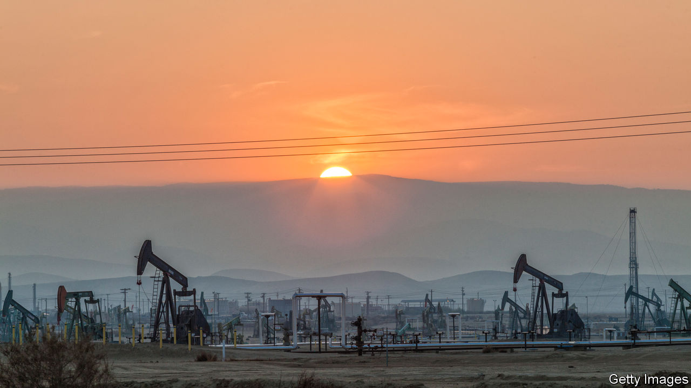
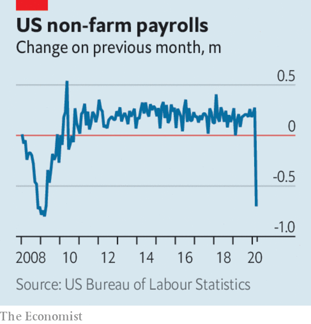

# Business this week

> Apr 11th 2020

The S&P 500, Dow Jones Industrial Average and NASDAQ stockmarkets all rose by more than 5% on April 6th, as investors reacted positively to slowing death rates from covid-19 in a few places. But with America expecting a surge in new cases, trading remained turbulent. Oil prices whipsawed in reaction to differing reports about the possibility of Russia and Saudi Arabia reaching a deal to end their price war. A meeting between Russia and OPEC was postponed until later in the week, after which a meeting of G20 oil ministers is scheduled to take place. See [article](https://www.economist.com//briefing/2020/04/08/an-unprecedented-plunge-in-oil-demand-will-turn-the-industry-upside-down).

ExxonMobil reduced its planned capital spending by a third this year, a deeper cut than its rivals, which are also curtailing output amid forecasts of plunging energy demand. “We haven’t seen anything like what we’re experiencing today,” said the chief executive, Darren Woods.

Russia’s central bank said it would continue to sell dollar reserves, and that this was intended to stabilise markets. The rouble has weakened as oil prices have tumbled. The central bank indicated that a cut to interest rates was also on the cards. Non-essential businesses in Russia have been ordered to close.

The British Treasury unveiled yet another scheme to help companies ride out the crisis, this time providing a government guarantee to enable banks to make loans of up to £25m ($31m) to businesses with a turnover of between £45m and £500m. Those midsized firms had found themselves squeezed out of preceding rescue packages.

Bus companies in Britain received additional emergency funding from the Department of Transport in order to keep the services running and “provide a lifeline for those who cannot work from home”. Bus drivers have called for better protection; in London at least eight drivers have died from the coronavirus.

Boeing shut production of its 787 aircraft at its factory in South Carolina because of the covid-19 outbreak, and extended indefinitely the closure of its plant near Seattle. The aerospace company has invited workers to apply for voluntary redundancy, though it is still recruiting new employees “in certain areas”.

In Germany Lufthansa decommissioned around 40 jetliners and ceased operations at its Germanwings discount carrier. The airline warned that it will take “years until the worldwide demand for air travel returns to pre-crisis levels”.

Around 10m Americans filed claims for unemployment benefits in the second half of March, more than had been expected following the virtual lockdown of the economy. Payroll employment plummeted by 701,000 in the month, a number not seen since the depth of the financial crisis. In Britain 1m new people applied for benefits over two weeks, ten times the normal rate. Some 4m workers have been temporarily laid off in France, and Spain has reported its biggest-ever rise in job losses. See [article](https://www.economist.com//finance-and-economics/2020/04/08/labour-markets-take-a-dramatic-turn-for-the-worse).

The German government said it would relax the border restrictions it has imposed during the pandemic and will allow tens of thousands of seasonal workers to enter the country, after farming groups and retailers warned that crops would otherwise be left to rot. The workers come mostly from eastern Europe and will be quarantined for two weeks.

Jamie Dimon returned to work full-time as chief executive of JPMorgan Chase, four weeks after undergoing emergency heart surgery. Like many people these days he is working remotely, though not isolated from the arguments on Wall Street about whether to cancel dividends. Mr Dimon warned investors that JPMorgan Chase could suspend shareholder payments for the first time.

The decision of HSBC to suspend its dividend payments has sparked a backlash among investors in Hong Kong, its biggest market. Along with other big British banks, HSBC suspended shareholder payouts after the Bank of England leant on them to do so, but a group of investors in Hong Kong has banded together to try to force an extraordinary general meeting on the matter.

Despite interruptions to production because of covid-19, Samsung forecast that its operating profit for the first quarter will be 6.4trn won ($5.2bn), up by 3% from the same three months last year. The South Korean tech giant expects to gain from increased demand for its chips in data centres and the roll-out of 5G networks. However, it could take a hit if consumers feel less inclined to splash out on smartphones and televisions.

Donald Trump announced a deal with 3M, an American industrial conglomerate, that will see it import N95 respirator masks to the United States from its factories in Asia. The president had warned 3M that it would have “a hell of a price to pay” if it did not limit overseas sales of the face masks (under the deal it will continue to sell masks to Canada and Latin America). See [article](https://www.economist.com//united-states/2020/04/11/the-white-house-v-covid-19).

## URL

https://www.economist.com/the-world-this-week/2020/04/11/business-this-week
