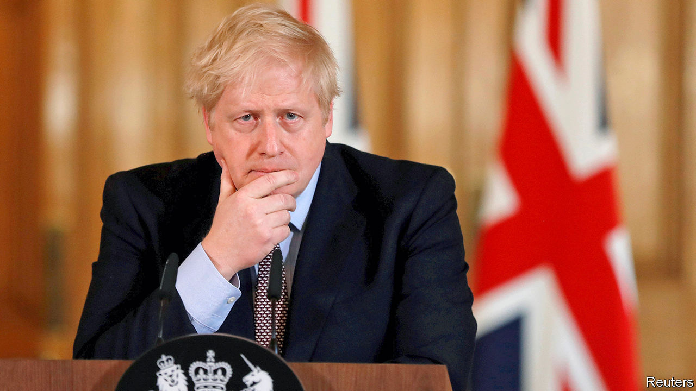
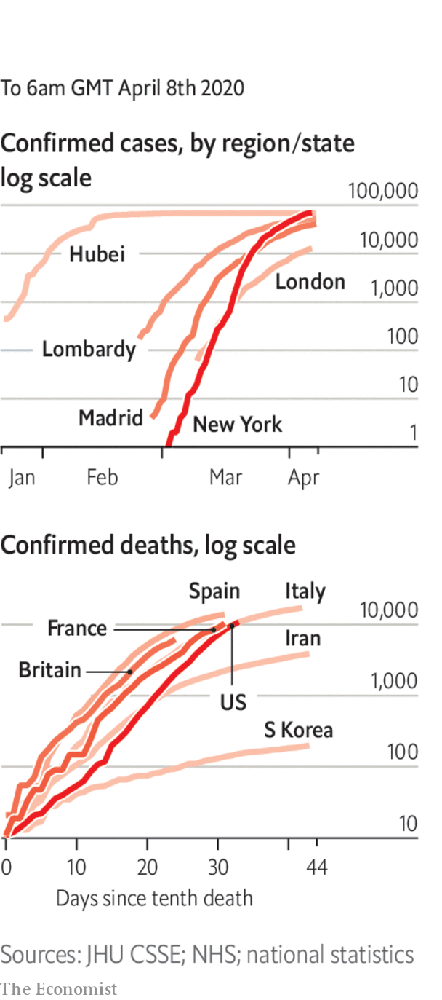

# Politics this week

> Apr 8th 2020

Boris Johnson, Britain’s prime minister, who has contracted covid-19, was admitted to intensive care after a deterioration in his breathing. Dominic Raab, the foreign secretary, is to stand in for him chairing cabinet meetings “where necessary”. See [article](https://www.economist.com//britain/2020/04/08/boris-johnsons-illness-will-test-britains-constitution).

America braced itself for a surge in deaths related to the new coronavirus. There were some tentative signs of good news in Europe, as the number of people dying and the number of new cases registered each day fell in several countries, including Spain and Italy, the two worst-affected. Austria talked of starting to emerge from its shutdown, and in Denmark junior schools and kindergartens are to reopen. But Europe remains the worst-hit part of the globe.

For the first time since it started publishing daily figures in January, China reported no new deaths from covid-19. A cordon sanitaire was lifted around Wuhan, the city where the outbreak was discovered. The country’s borders remained shut to most foreigners. Meanwhile, Donald Trump accused the WHO of being “very China-centric” in its handling of the crisis.

China’s Communist Party said it was investigating a property tycoon, Ren Zhiqiang, for “serious violations of discipline and law”. An essay attributed to Mr Ren accused Xi Jinping of being a “clown” and argued that the covid-19 epidemic had been made worse by curbs on freedom of speech.

Covid-19 infections jumped in a number of big Asian countries, including Indonesia, Japan and Pakistan. The governments of Japan and Singapore, which had not yet placed severe restrictions on people’s movement, did so. But South Korea, which was the first country outside China to suffer a severe outbreak, said elections would go ahead on April 15th, after a slowing of new infections. See [article](https://www.economist.com//asia/2020/04/11/not-even-singapore-has-been-able-to-avoid-a-lockdown).

The authorities in Myanmar arrested the editor-in-chief of a news website for publishing an interview with the spokesman of a rebel militia that the government had recently labelled a terrorist group. The editor faces life in prison.

George Pell, an Australian cardinal who was once the Vatican’s main financial manager, was acquitted of sexual abuse of minors on appeal, after a two-and-a-half-year legal saga. A court in the state of Victoria had found Mr Pell guilty of assaulting two choirboys when he was Archbishop of Melbourne in the 1990s. 

Wisconsin’s Democratic primary went ahead. A last-minute order from the Democratic governor to postpone the election, and other state contests, until June because of covid-19 was overturned by the state Supreme Court. Those voters who did venture out to the polling stations faced long queues. See [article](https://www.economist.com//leaders/2020/04/09/wisconsin-or-how-not-to-run-an-election-while-covid-19-is-spreading).

Meanwhile, the Democrats pushed back the date of their national convention from mid-July to mid-August. It is still supposed to take place in Milwaukee, though Joe Biden has suggested it might have to be held online.

Donald Trump sacked the inspector-general of America’s intelligence services. There was no apparent reason other than that he was the official who alerted Congress to a whistleblower’s complaint about the president’s dealings with Ukraine, which led to Mr Trump’s impeachment. See [article](https://www.economist.com//united-states/2020/04/11/what-does-donald-trump-want-from-americas-intelligence-services).

Twitter removed thousands of accounts linked to the governments of Egypt, Honduras, Indonesia, Saudi Arabia and Serbia for attempting to “undermine the public conversation” in those countries.

Iran’s president, Hassan Rouhani, said that “low-risk” economic activities would resume in most areas. Iran has struggled to contain one of the world’s worst outbreaks of covid-19. But the government is worried about the effect of its mitigation efforts on the economy, which was already reeling because of sanctions.

Negotiations took place to free the leader of the opposition in Mali, Soumaïla Cissé, after he was kidnapped by gunmen believed to be affiliated with al-Qaeda, a jihadist group.

The British Labour Party elected Sir Keir Starmer as its new leader, replacing Jeremy Corbyn, who in December led Labour to its worst election defeat since 1935. The party’s new deputy leader, Angela Rayner, a Manchester native, may help the party recover the “red wall” of northern seats it lost to the Tories in December, though it has its work cut out. As the pandemic deepens the Conservative government’s popularity is hitting new highs. See [article](https://www.economist.com//britain/2020/04/11/keir-starmer-labours-electable-new-leader). 

Ecuador’s top court convicted Rafael Correa, who was president of the country from 2007 to 2017, of corruption and sentenced him to eight years in jail. He was charged with accepting $8m in bribes in exchange for awarding public contracts. Mr Correa, who is living in Belgium, can appeal.

A Venezuelan naval patrol vessel fired on an unarmed Portuguese-flagged cruise ship, the RCGS Resolute, which it claimed was in its waters. Columbia Cruise Services said the holiday craft, hardened to withstand polar ice, was rammed by the Venezuelan vessel, which then sank. All 44 Venezuelan sailors were rescued. Their commanders congratulated them on their “impeccable performance”. See [article](https://www.economist.com//the-americas/2020/04/11/venezuelas-navy-battles-a-cruise-ship-and-loses).

Joe Biden floated the idea that voters in America’s presidential election might have to participate by mail only.

The captain of the USS Theodore Roosevelt was fired after asking for help when covid-19 spread among his sailors. Officials said he had not gone through the proper channels in airing his complaint. The captain was given a rousing send-off by sailors. After a backlash, the head of the navy resigned. See [article](https://www.economist.com//united-states/2020/04/08/covid-19-takes-out-an-aircraft-carrier-and-a-navy-secretary).

In South Africa a man was charged with spreading fake news about testing.

Scotland’s chief medical officer resigned after she broke the government’s advice by leaving her house, twice, during lockdown to visit her second home. See [article](https://www.economist.com//britain/2020/04/11/how-to-build-social-consensus-around-lockdown).

A tiger in the Bronx Zoo is thought to have contracted covid-19 from an infected zookeeper. There is no evidence that tigers can give the disease to humans.