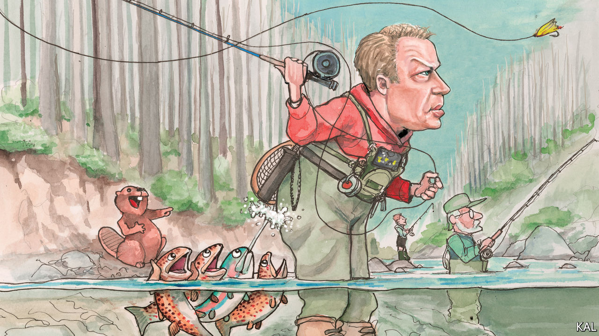

## Lexington

# A river runs through it

> Fly-fishing is compatible with social distancing—and a lesson in American strengths and strains

> Apr 11th 2020

Editor’s note: The Economist is making some of its most important coverage of the covid-19 pandemic freely available to readers of The Economist Today, our daily newsletter. To receive it, register [here](https://www.economist.com//newslettersignup). For our coronavirus tracker and more coverage, see our [hub](https://www.economist.com//coronavirus)

THE NORTHERN CENTRAL RAILROAD, running up from Baltimore, has long been synonymous with great deeds. It was a route for escaped slaves, heading for Pennsylvania. It carried Abraham Lincoln to Gettysburg in 1863, and bore his body, 17 months later, on a leg of its journey home to Illinois. It is a hiking trail now, shaded by sycamore and willow. But for the pen-and-brush duo behind this column, the old railroad remains auspicious, as the access-point to a deep pool of the Gunpowder river, where trout lie.

It is not the best fishing spot on the Gunpowder. That is a couple of miles upstream, near the reservoir which, thanks to a decades-old agreement between the local anglers and city of Baltimore, releases a steady flow of water into the river. But any fish caught in that stretch must be put back. And the dispensation for angling in Maryland’s coronavirus lockdown rules applies only to fishing for food. So that is what Lexington, his nine-year-old son, and “Kal”, this newspaper’s cartoonist-in-chief, were set upon, one glorious recent afternoon, with an eagerness whetted by days cooped up.

They kept 12 feet apart, mind, while chatting and scrambling down the riverbank. This seemed not only sensible but representative of what fly-fishing is. It is a solo activity. Yet the technical demands of casting a long line to deliver a feathered hook to the water with, ideally, the delicacy of an insect alighting make its practitioners prone to lively exchanges of information: on rods, water, flies and so forth. An American master angler, Lee Wulff, called fly-fishing “the most social of all the solitary sports”. Pondering this, your columnist took his place on a sandbar dotted with beaver tracks, and began casting across the bottom of the pool, to where a jumble of rocks rose promisingly from its gravelly depths.

Maryland’s dispensation reflects the exalted place angling occupies in America. Around 50m Americans go fishing each year; not far off as many as voted for Donald Trump. A minority of them fly-fish. Yet the sport’s elite reputation, which came with it from 18th-century Britain, and the commitment of its devotees, have made it especially influential and revealing. Presidents from Grover Cleveland to George H.W. Bush have been devoted to it. Three have written books on fly-fishing: including Herbert Hoover and Jimmy Carter, who spent the day after his crushing electoral defeat in 1980 building an ingenious contraption to dry his fly-lines.

Fly-fishing’s success in America reflects above all the country’s natural bounty. Within a few decades of the technique being mainly practised by British officers, homesick for their own chalk streams, Americans were fly-fishing in diverse conditions for bass and many species of salmon and trout. This led them to innovate; some American fly patterns were based on native American lures. Yet the fly-fishing establishment remained concentrated on the Anglocentric east coast. This encouraged an unwarranted inferiority complex, which was compounded by the fact that early American fishing scribblers and fly-tiers tended to be British. The first great writer, Theodore Gordon, initially wrote for a British journal.

But even then America was showing its genius for popularising elite culture. This was partly a reaction to the snooty Anglos. “Our fish are too Republican, or too shrewd, or too stupid, to understand the science of English trout fishing,” wrote a peeved angler in 1830. A similar urge drove baseball to supplant American cricket around this time. Yet the growth of a New World fly-fishing tradition, more capacious than the British one, reflected above all America’s vast socioeconomic, as well as piscatorial, possibilities.

An exploding rail network opened up new angling paradises to thousands of first-generation fishers. The connection between infrastructure and wilderness was sometimes overt; the owners of the Denver and Rio Grande Railroad offered a $20 gold piece to anyone who caught a 10lb trout alongside its tracks. Other entrepreneurs also seized the opportunity fly-fishing presented. Wisconsin’s fly-tying industry would soon produce over 10m lures a year. While the east-coast elite maintained an exclusive idea of fly-fishing, it had become a mass hobby.

The inevitable downside of this growth, overfishing and pollution, led to a pushback in the late 19th century. In the name of conservation, private fishing clubs grabbed areas that had previously been open to the public. Such enclosures at least led to better management—which was then applied nationally in the emerging conservation movement that fly-fishers had thereby helped launch. America’s angling lobby has sometimes erred from its strong environmental record. To maintain bipartisanship, it has said little about the ominous threat of climate change to America’s rivers. And rainbow and brown trout—which the Lexington team was after—are two of America’s most invasive species. But as the Gunpowder, once a stagnant trickle, goes to show, the billion-dollar angling industry remains a powerful force for conservation.

American fly-fishing is still evolving. Recent decades have seen a big expansion in saltwater fly-fishing, pioneered by Lefty Kreh, a Marylander who helped broker the Gunpowder agreement. It has also become fashionable, due to interest from Hollywood and social media. Apparently, it does well on Instagram. Fly-fishing has been America’s fastest-growing category of fishing in recent years.

Anchored in local topography, hydrology and culture, it has meanwhile retained local differences amid such national trends. According to Walter Wiese, a fishing guide in Montana, east-coast anglers, being accustomed to small rivers and trees, tend to be nimble but not big casters; west-coasters tend to be the opposite. Fly-fishing is a story of oscillating tensions between the masses and elite; tradition and innovation; regional against national concerns: it is an American parable.

It can be frustrating, too. After several hours flogging the river, Lexington had caught nothing. His son had meanwhile landed a plump brown trout. Fishing always sorts the men from the boys.■

Dig deeper:For our latest coverage of the covid-19 pandemic, register for The Economist Today, our daily [newsletter](https://www.economist.com//newslettersignup), or visit our [coronavirus tracker and story hub](https://www.economist.com//coronavirus)

## URL

https://www.economist.com/united-states/2020/04/11/a-river-runs-through-it
