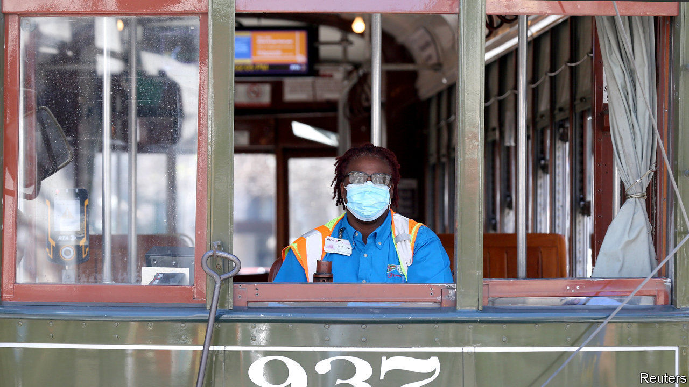

## Woes compounded

# Covid-19 exposes America’s racial health gap

> African-Americans appear more vulnerable to the virus

> Apr 11th 2020CHICAGO AND NEW ORLEANS

Editor’s note: The Economist is making some of its most important coverage of the covid-19 pandemic freely available to readers of The Economist Today, our daily newsletter. To receive it, register [here](https://www.economist.com//newslettersignup). For our coronavirus tracker and more coverage, see our [hub](https://www.economist.com//coronavirus)

AS COVID-19 extends its deadly reach into new hotspots such as Detroit and New Orleans, its proliferation has been accompanied by a disturbing trend. The disease appears to be taking a greater toll on black Americans. African-Americans make up 14% of Michigan’s population. Yet as of April 6th they accounted for some 33% of confirmed coronavirus cases and 40% of the state’s 617 deaths. Louisiana, which has the second-highest share of African-Americans among states, was home this week to ten of the 20 worst-hit counties in the country, ranked by deaths per 100,000 residents, according to Gary Wagner of the University of Louisiana at Lafayette. He says one county had a mortality rate more than double that of New York City.

One possibility is that the higher death rate so far for black Americans may follow from the disease’s tendency to strike cities early. Michigan’s biggest city is Detroit, which is 80% black. The state’s governor, Gretchen Whitmer, says Detroit’s large airport probably made it vulnerable to importing contagion. New Orleans also gets plenty of visitors. The city held its two-week-long Mardi Gras in mid-February before carriers of the virus—many being asymptomatic—worried much about mingling. Mr Wagner calls that a “super-spreader event” as 1m or so people partied at close quarters. Some participants’ costumes were even coronavirus-themed. Now, officials fear cases are rising so fast they will soon overwhelm hospitals. The city’s population is below 400,000, but it has already seen 171 deaths.

In addition to living in cities that covid-19 struck early, African-Americans share several other vulnerabilities to the disease. Black Americans are, on average, poorer than other ethnic groups. Those who live in overcrowded homes or who work in blue-collar jobs and must keep toiling outside their houses cannot isolate themselves as easily as better-off folk. The poor and uninsured—African-Americans are likeliest to go without coverage—may also seek medical care too late.

The long-standing residential segregation of some black communities makes things worse. People in places with high levels of violence may make different calculations about the risk posed by a mere virus. A counsellor who works with violent men in parts of Chicago says “shooting goes on” despite the virus. Public-health lockdowns are hard to enforce.

More important, though, is the link between race and chronic ill-health. Chicago’s mayor, Lori Lightfoot, recently noted that before the pandemic white residents were expected to live nearly nine years longer than black ones, who are likelier to suffer from chronic health problems such as respiratory illness, high blood pressure, diabetes and obesity.

In Detroit chronic conditions are depressingly common. About 45% of adults were obese in 2017 (the figure for New Orleanians was 36%). America’s national rate of obesity was 30%, according to one measure by the Centres for Disease Control and Prevention. Those with existing problems risk deadly complications once infected with the virus. Officials in Louisiana said that 97% of those who died with the virus to March 29th had an underlying condition.

Covid-19’s spread may further expose this racial health gap. Ms Lightfoot says that Chicago’s black residents—who make up less than 30% of the city’s population—live lives that are so much shorter that they account for 72% of its deaths. “Those numbers take your breath away.” ■

Dig deeper:For our latest coverage of the covid-19 pandemic, register for The Economist Today, our daily [newsletter](https://www.economist.com//newslettersignup), or visit our [coronavirus tracker and story hub](https://www.economist.com//coronavirus)

## URL

https://www.economist.com/united-states/2020/04/11/covid-19-exposes-americas-racial-health-gap
