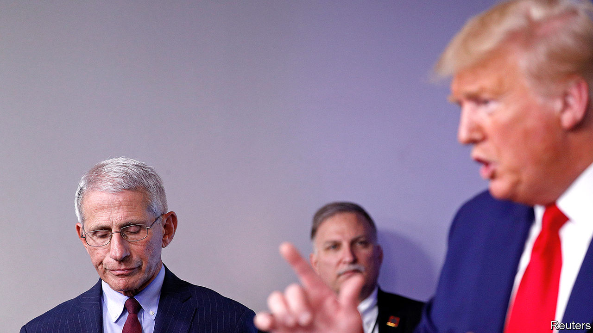

## Bigger than Trump

# The White House v covid-19

> Now that the Trump administration has taken charge of the government’s pandemic response, how is it doing?

> Apr 11th 2020

Editor’s note: The Economist is making some of its most important coverage of the covid-19 pandemic freely available to readers of The Economist Today, our daily newsletter. To receive it, register [here](https://www.economist.com//newslettersignup). For our coronavirus tracker and more coverage, see our [hub](https://www.economist.com//coronavirus)

WHEN THE Trump administration took office in January 2017 it inherited, among other things, plans to make cheaper ventilators and 20m reusable face masks, should the country need them. Nobody followed up. In 2018 John Bolton, the national-security adviser, “streamlined” the National Security Council and, in the process, closed its pandemic preparedness office. The following year, the administration decided to no longer embed an epidemiologist from the Centres for Disease Control and Prevention (CDC) with China’s CDC.

The consequences of these decisions, like the consequences of President Donald Trump’s insistence up until four weeks ago that covid-19 was less serious than seasonal flu, can only be guessed at for now. It seems likely that covid-19 would always have hit America hard, as it has most other rich countries that did not feel the impact of SARS. It also seems possible that America will suffer more than other rich Western democracies. If so, some portion of this exceptional excess mortality will be attributable to the president’s public-health advice and to decisions he avoided until too late.

That accounting will come later, though. Right now, the White House is running a response focused on getting material to the states being hit first by the virus. Though the CDC has not held a public briefing for a month, it is sending Epi-Aids, teams of epidemiologists, around the country to find new outbreaks. The Federal Emergency Management Agency (FEMA) is flying in kit from China. The president’s son-in-law, fresh from an attempt to bring peace to the Middle East, has again been handed the keys to the West Wing.

This is an improvement on the torpor that continued until the middle of March. Yet several criticisms of how the White House is responding persist. The first comes from state governors, who say they are bidding against each other and against the federal government for supplies. The governors of Kentucky, Ohio, Louisiana, Washington, Michigan, Illinois, New York and Arkansas have all said this is the case. Before the federal government stepped in, a handful of states went as far as arranging their own flights carrying protective equipment. While states were waiting for the federal government to do something, governors were banding together to place a large order of gear from China.

Since FEMA began flying medical equipment in from abroad, the competition has not gone away. Distribution of supplies, according to Rear Admiral John Polowczyk, who is in charge of the White House’s logistics effort, is still being done by private companies rather than by the feds, following the template used during Hurricane Katrina. The problem this time is that the emergency is not confined to one or two states, so everyone is bidding against each other for the same stuff. J.B. Pritzker, the governor of Illinois, says that once equipment brought in on FEMA flights arrives in America, governors are still placing bids with private distributors for it.

They are not the only ones: cities, hospital systems and care homes are all trying to secure their own supplies. “It’s a cage match,” says an employee of one of the country’s largest hospitals. State procurement officers swap tales of middlemen calling up with offers of millions of face masks at a few bucks over their retail price.

A second accusation is that the federal government is doling out scarce equipment to reward friendly governors. “How can it be that Kentucky and Florida get 100 percent or 100 percent-plus of what they need while Massachusetts doesn’t?” Elizabeth Warren asked Vox, a news website. “I think anyone would look at that and say it’s Donald Trump playing politics once again.” The president has encouraged this impression, too. “If they [state governors] don’t treat you right, I don’t call,” he told the White House press corps on March 27th.

This does not seem to be true of how FEMA is working. The agency is largely staffed by career civil servants who served the last president and, in many cases, the one before him. FEMA allocates medical kit according to a formula that considers need and the likelihood of an outbreak, insulating the process a bit from political considerations. If Florida has received what it asked for, that might be because it has a large population in care homes and is at high risk. There is, though, a cost to the impression that the president is distributing supplies in a haphazard and political way.

What is harder to quantify is the extent to which this administration’s trade war has slowed the current supply of equipment to hospitals. At the same time as Mr Trump issued an executive order banning the export of certain categories of medical equipment from America, the federal government was trying to secure supplies of the same gear made abroad. According to various people who worked with state governors to secure supplies, shipments were held up in China. Exports to America have become politically sensitive for party bosses in a way they used not to be.

Firms making gear in China are also concerned about being sued in American courts for equipment that does not protect the wearer. Chinese exporters of medical gear now require a new licence. That has created another layer of bureaucracy for suppliers with scruples, and a trade in fake permits for those without. The constraint on supplies from China does seem to have eased a bit after the president sent a tweet at 1am, when MAGA hat-wearers were tucked up in bed, praising Xi Jinping and calling the virus by the name most other people use, rather than the “Wuhan virus” or the “Chinese virus” which he had preferred, though that may be a coincidence.

Some of the president’s critics can only see the virus through a Trump lens. This suits the president, who has boasted wishfully about the great ratings his daily press briefings are getting. Mr Trump has indeed been incompetent and irresponsible. He continues both to offer unfounded medical advice, most recently on the use of an anti-malarial drug, and to shush any expert who might contradict him in public. He has blamed the World Health Organisation for mistakes his own administration made, and threatened to cut its funding.

The White House is as bizarre as ever. The president had no chief-of-staff for much of March. In less than a week he has got rid of the inspectors-general of the intelligence community and the watchdog overseeing the $2trn federal stimulus. The Navy fired the captain of an aircraft-carrier for reasons that seem to have more to do with politics than with carrying aircraft. The Navy secretary then had to resign. But the virus is bigger than Trump.■

Dig deeper:For our latest coverage of the covid-19 pandemic, register for The Economist Today, our daily [newsletter](https://www.economist.com//newslettersignup), or visit our [coronavirus tracker and story hub](https://www.economist.com//coronavirus)