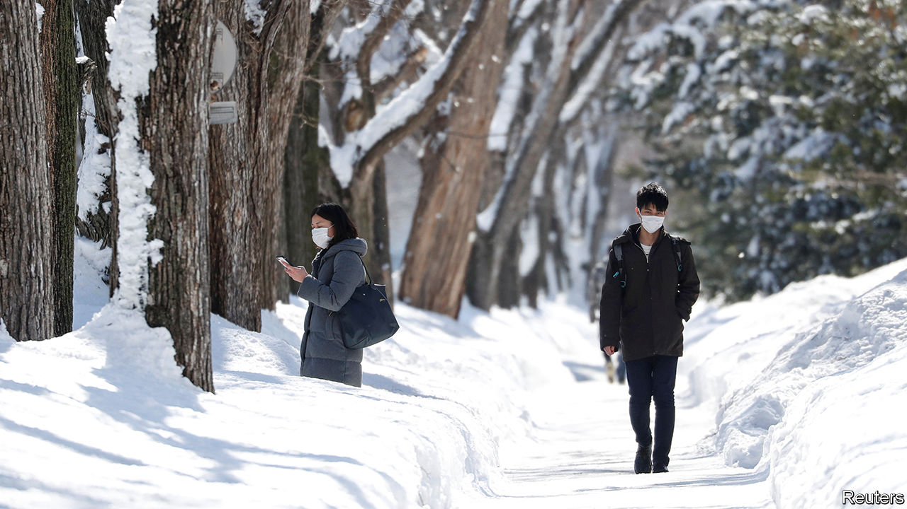

## Déjà flu

# A second wave of covid-19 hits northern Japan

> Hokkaido imposes its second state of emergency in two months

> Apr 16th 2020TOKYO

Editor’s note: The Economist is making some of its most important coverage of the covid-19 pandemic freely available to readers of The Economist Today, our daily newsletter. To receive it, register [here](https://www.economist.com//newslettersignup). For our coronavirus tracker and more coverage, see our [hub](https://www.economist.com//coronavirus)

POINTING TO A chart showing a flattened curve, Suzuki Naomichi, the governor of Hokkaido, announced on March 18th that the region had contained its coronavirus outbreak and could therefore lift its three-week-old state of emergency. “We were on defence until now, but we hope to enter a new stage,” he said. Less than a month later Mr Suzuki warned that Hokkaido was “facing a crisis of a second wave”. He reimposed a state of emergency on April 12th.

The prospect of this sort of reversal haunts governments around the world. The lesson is clear, says Shibuya Kenji of King’s College London: “Even if you manage to control a local outbreak, once you lift the lockdown, there’s a high risk of resurgence.”

When the virus first spread to Japan, Hokkaido was the hardest-hit region. Although home to only 4% of the population, it racked up a third of the 206 confirmed cases in the country by the end of February. Mr Suzuki declared the first state of emergency on February 28th, asking residents to restrict outings and schools to close. Locals largely complied. On March 17th Hokkaido had its first day with no new cases in more than a month. Schools reopened and restaurants became busy again. “A lot of people thought the worst was over,” says Sasada Hironori of Hokkaido University. “People dropped their guard.”

But the number of new cases began rising again, from 198 on April 7th to 296 on April 15th. Though low in absolute terms, the uptick unsettled the local government. The first wave had been linked to Chinese tourists visiting a winter festival in early February, making transmission relatively easy to trace. The second wave seems to have been caused by locals returning from Tokyo or abroad, and so is much more diffuse. Patchwork restrictions and continuing inter-regional transport have undermined containment efforts, argues Mr Shibuya.

Pollsters say 95% of locals supported Mr Suzuki’s first state of emergency in February. His approval rating hit 88% in early April. The public disapproves, meanwhile, of the national government’s delay in following suit. Hokkaido’s new state of emergency is due to end on May 6th, in line with the one the prime minister, Abe Shinzo, declared in six prefectures in early April. That, says a bureaucrat in Hokkaido, “is probably too optimistic”. He should know.

Dig deeper:For our latest coverage of the covid-19 pandemic, register for The Economist Today, our daily [newsletter](https://www.economist.com//newslettersignup), or visit our [coronavirus tracker and story hub](https://www.economist.com//coronavirus)