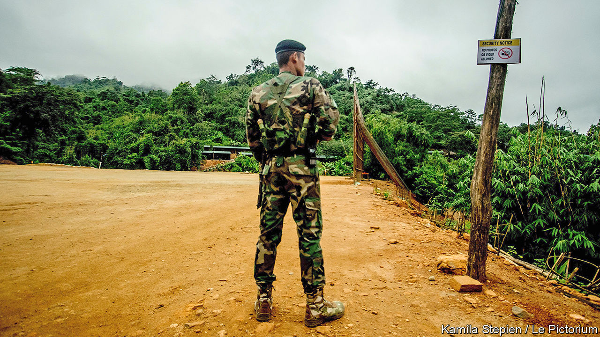

## Guerrillas with attitude

# An ethnic militia with daring tactics is humiliating Myanmar’s army

> The government’s flailing response seems to be boosting the Arakan Army

> Apr 16th 2020

IN RAKHINE AND Chin states, in the far west of Myanmar, bullets fly and villages burn. Dead bodies lie slumped in ditches. These “clearance operations”, as the Burmese government calls them, evoke those of 2017, when the army drove hundreds of thousands of Rohingyas, a Muslim ethnic group, from their villages, killing and raping many as they did so, in what the UN described as genocide. Three years later the army’s sights are trained on a different ethnic group: the Rakhine. Like disgruntled members of many other minorities scattered across Myanmar’s ethnic patchwork, some Rakhines are waging a war of independence against the Bamar majority. Unlike the others, they are making headway. 

Conflict erupted last year on January 4th, Myanmar’s independence day. Several hundred fighters from the Arakan Army (AA), a Rakhine armed group, attacked four police posts in northern Rakhine state, killing 13 officers (Arakan is the rebels’ preferred name for the state). The AA and the Tatmadaw, as the Burmese army is called, had skirmished occasionally since 2014, but the insurgents had never before attempted anything so bold. The government, helmed by Aung San Suu Kyi, winner of a Nobel Peace Prize, instructed the army to “crush” the rebels. The Tatmadaw has since deployed 15,000-20,000 troops, according to Anthony Davis, a security analyst, in what he describes as an “unprecedented” mobilisation, involving heavy artillery, air strikes and even naval patrols. 

“The AA has departed markedly from patterns of guerrilla warfare in Myanmar,” says David Mathieson, another analyst. Rather than hiding in redoubts in the jungle, it also operates in urban areas; instead of simply taking potshots at army patrols it has conducted bombings and abducted hundreds of civil servants, policemen, soldiers and politicians. The Tatmadaw, accustomed to siege warfare, is floundering in its response. Mr Mathieson reckons it has suffered at least a couple of thousand casualties. Mr Davis labels the AA “the most serious insurgency the Burmese military have faced since independence”.

The AA is better organised and equipped than most ethnic rebels. Its commander, Twan Mrat Naing (pictured), is educated, charismatic and young, unlike the septuagenarian leaders of most of the country’s other insurgencies. The AA also commands overwhelming support from Rakhines, and can pick and choose among recruits. 

Rakhines are rushing to enlist because they have lost faith in the political system. They say they have been neglected for decades by the central government: Rakhine is one of Myanmar’s poorest states. The advent of civilian government under Ms Suu Kyi in 2016, after many decades of military rule, only exacerbated tensions. The Arakan National Party (ANP), which won a majority of parliamentary seats in Rakhine, believed that her party, the National League for Democracy, would let it nominate the state’s chief minister. Instead the NLD appointed one of its own. The killing of seven Rakhine protesters by the police in 2018 and the subsequent arrest of Aye Maung, the ANP’s chairman, further radicalised Rakhines. His imprisonment also left a vacuum, into which the AA has stepped. 

“Throw off the shackles of Burmese racism and colonialism,” Mr Twan Mrat Naing recently urged his fellow Rakhines, harking back to the long periods when Rakhine state was an independent kingdom. The rousing message is hammered home in the group’s slick social-media videos, featuring hale young soldiers declaring undying love for their homeland.

The AA is intent on inflicting so much damage that the government will have to make concessions. Over the past six months, more than 210 government employees in Chin state, where much fighting has taken place, have resigned after being threatened by its fighters. Officials from the central government are sufficiently unsafe in Rakhine that they must seek special permission to go there and often travel with a military escort. The AA also threatens to take the fight to the Bamar-inhabited regions at the heart of Myanmar. “We should reciprocate,” says Mr Twan Mrat Naing. “They are basically looking to destabilise the [national] government’s activities in Rakhine state as much as they can,” says Mary Callahan, a military historian, “and they’ve succeeded.” 

The government’s efforts to hamper the AA look flailing. It has blocked mobile-internet service to about 1m people in Rakhine and Chin states since June, according to Human Rights Watch. On March 23rd it also blocked access to several news websites that report on the conflict and designated the AA a terrorist organisation. The police have since charged several journalists who interviewed Mr Twan Mrat Naing with violating the counter-terrorism law. 

Rakhine civilians are also coming under fire. Amnesty International claims that the army has been shooting indiscriminately at Rakhine settlements and torturing and murdering civilians. At any rate, more than 100,000 people have been displaced by the fighting. Analysis of media reports by Nyan Lynn Thit Analytica, a Burmese think-tank, shows that 42 civilians have died since March 23rd.

The Tatmadaw risks turning “a war in Rakhine into a war on the Rakhine”, says Mr Davis. He believes that doing so will only encourage Rakhine civilians to rally around the AA with greater fervour. The rebels do not have the firepower to defeat the Tatmadaw militarily, but he is not sure that they need to. If they inflict sufficient humiliation on the Tatmadaw, he reasons, the government may decide to retreat from the fight and seek a political settlement. ■