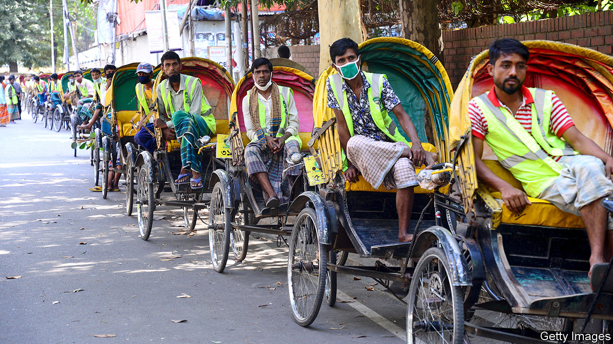

## Hunger strike

# Asia’s workers can’t afford to stay at home

> Governments are trying to change that

> Apr 18th 2020DELHI AND SINGAPORE

Editor’s note: The Economist is making some of its most important coverage of the covid-19 pandemic freely available to readers of The Economist Today, our daily newsletter. To receive it, register [here](https://www.economist.com//newslettersignup). For our coronavirus tracker and more coverage, see our [hub](https://www.economist.com//coronavirus)

BANGLADESH WENT into lockdown on March 26th, but that didn’t stop Zohirul from taking his bicycle rickshaw out onto the backstreets of Dhaka, the capital, a couple of times. On his first outing he earned just 200 taka, or $2.40, less than a fifth of what he normally makes. On the second he was caught by the police, who beat him, injuring his leg so badly he can no longer pedal his rickshaw. Since then he’s been nursing his wounds and husbanding his stores of rice. “I don’t know how I’m going to earn or buy food once this runs out,” he says. 

As Asian governments impose quarantines to curb the spread of covid-19, the continent’s usually hectic streets have gone quiet. Restrictions vary, but almost everywhere the message is the same: stay home. Such measures threaten to ruin the majority of Asians. Seventy per cent of workers in Asia and the Pacific do not have formal jobs, with contracts, salaries or sick leave, but instead do things like driving rickshaws for a living, according to the Economic and Social Commission for Asia and the Pacific (ESCAP), the UN agency for the region (see chart). In many places there is not much of a safety net for the poor or unemployed either. Some workers feel they face a choice between getting sick and going hungry. 

Governments in poorer Asian countries realise there is little point declaring a lockdown if their citizens cannot afford to abide by one, and so are trying to help. It is a daunting task. Informal workers are “not in the government databases”, says Hamza Malik of ESCAP. Identifying them is “extremely challenging”, according to Guy Ryder, director-general of the International Labour Organisation (ILO). Bureaucrats are consulting censuses or lists of those who already receive some sort of help from the state. But these often miss people, and quickly go out of date. Indonesia’s Unified Database, which contains the details of the poorest 40% of the population—some 100m people—is supposed to be updated twice a year by local governments. However, two-fifths of them don’t have the budget or capacity to do so, reckons Vivi Yulaswati of the planning ministry. 

The pandemic makes the task of identifying the needy all the more challenging by swelling their ranks. The ILO estimates that the reduction of working hours in Asia this quarter equates to 125m people losing their jobs. The World Bank expects the impending recession will push up to 11m Asians below a poverty line of $5.50 a day. That may be optimistic. Indonesia may need to start giving handouts to an extra 50m people, Ms Yulaswati speculates.

Given how patchy existing databases are, some countries are inviting victims of the pandemic to petition for help online. In Thailand and Kazakhstan informal workers can apply for a one-off cash grant via a dedicated website. Nearly 5m people in Kazakhstan—over a quarter of the population—have done so. Indonesia has launched a similar programme, for anyone whose income has been hit by the crisis. The very poorest, however, are also the least likely to have access to a smartphone to lodge an application online. 

Once governments have identified whom they wish to help, they need to decide what to give them. Many Asian countries are handing out food. Bangladeshi officials have been distributing rice; their counterparts in Myanmar have added salt, lentils and onions; the Philippines also offers sugar, coffee and canned fish and meat. But doling out food can be expensive, involving as it does “the logistics of procurement, storage, warehousing and distribution”, notes Ugo Gentilini of the World Bank. Cash is cheaper and faster to distribute, and tends to work just as well, as long as recipients have access to markets, which people in remote villages sometimes do not. So Asian countries are providing both types of aid. In India more than 800m people who were already eligible for subsidised food are getting extra rations, while over 300m poor women, pensioners, farmers and construction workers are receiving small sums of cash. In addition, India has placed a three-month moratorium on loan repayments. In Sri Lanka those leasing vehicles can defer payments for six months. 

Inevitably, there have been flaws and oversights. In Bangladesh several local politicians have been arrested for funnelling free rice to friends and supporters. (Zohirul, the injured rickshaw-driver in Dhaka, has yet to receive any.) Technical glitches prevented many Kazakhs from applying for a cash grant. Protesters in Thailand say the handout scheme there is too narrow. Even when assistance does reach the poor, it is seldom enough. The sum being given to the 12m poorest households in Pakistan is 3,000 rupees ($18) a month—less than a fifth of the minimum wage. 

Despite their limited resources, poor countries could improve public health care and expand safety nets, says Mr Malik of ESCAP. On average, developing countries in Asia spend just 3.7% of GDP to help citizens on the skids, far below the global average of 11%. The Asian Development Bank and World Bank have pledged billions of dollars to help Asian countries fight the virus. Governments should use that money, Mr Malik argues, “to create a different world”. ■

Dig deeper:For our latest coverage of the covid-19 pandemic, register for The Economist Today, our daily [newsletter](https://www.economist.com//newslettersignup), or visit our [coronavirus tracker and story hub](https://www.economist.com//coronavirus)

## URL

https://www.economist.com/asia/2020/04/18/asias-workers-cant-afford-to-stay-at-home
