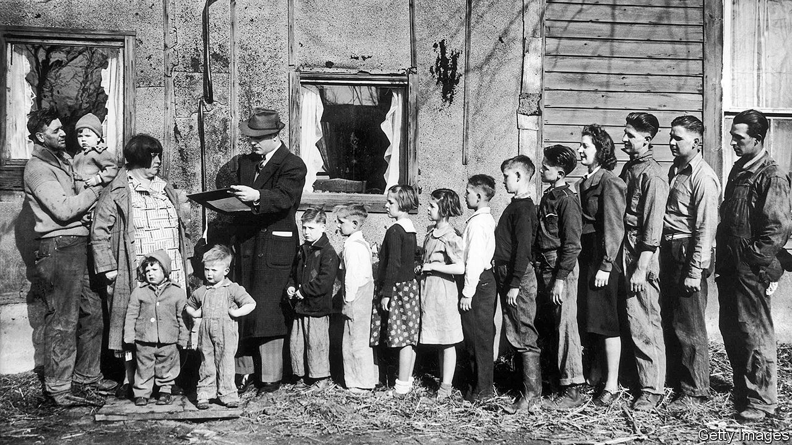

## The big ask

# A lively and enlightening history of the census

> It charts the evolving relationship between people and the state

> Apr 16th 2020

The Sum of the People. By Andrew Whitby. Basic Books; 277 pages; $30 and £25.50.

IT IS HARD to get excited about a census. As the latest decennial wave rolls through many countries in 2020 and 2021, people who fill out the forms, often urged by a knock on the door, will generally find it tedious. In Britain, nearly 400,000 pranksters tried to liven up the process in 2001 by listing their religion as “Jedi”. In America, the latest count might even cause fear. The Supreme Court blocked President Donald Trump’s attempt to ask about citizenship status, which would have discouraged undocumented immigrants from responding, but many may still be reluctant to share data with the government.

The officials who collect such information are seen as “the greyest of the grey-suited bureaucrats”, says Andrew Whitby, an economist most recently at the World Bank. In “The Sum of the People”, a new history of censuses, he drily notes that the United States Census Bureau is based in Suitland, a town near Washington.

Mr Whitby’s book, however, is anything but drab. The first half races from Emperor Yu arranging the first Chinese headcount around 2100BC to the advent of tabulation machines in 1890. These chapters are really a potted history of the relationship between state and people, interspersed with tales of great thinkers and intrepid data-gatherers (often travelling by boat). Originally, the census was an imposition by an all-powerful executive, undertaken to muster armies and collect taxes. Confucius was said to have deep respect for the procedure; Roman censors (from censere, to assess) were as revered as consuls, and would grade the status of each householder. William the Conqueror’s Domesday Book scoped out his new English kingdom.

Because censuses helped governors subjugate the governed, most people resented them. Scriptural accounts of God punishing King David’s census with a plague made Jews and Christians especially wary. Parliamentarians in Westminster were initially sceptical, rejecting a headcount in 1753 as “totally subversive of the last remains of English liberty”. It was America that made demography essential to democracy. The Founding Fathers knew that, to balance taxation and representation, they would need a record of who lived where. They stipulated a decennial census in the constitution (but gave black slaves three-fifths the weight of free whites).

Britain at last introduced one in 1801, after Thomas Malthus claimed that population growth would outstrip productivity, causing famine. Other countries followed. But America remained the crucible of modern census-taking. The edition of 1880 contained a billion data points—so Herman Hollerith, an engineer, designed a machine that could process individual records using punch cards, based on Charles Babbage’s uncompleted computers. Hollerith’s company later became part of the International Business Machines Corporation (IBM).

A chapter on the Holocaust is grimly fascinating. Punch-card technology was used in concentration camps, but Mr Whitby focuses on the bureaucrats who created identity-card systems, many compiled by hand, which helped the Nazis track down Europe’s Jews. Population data may have been a benign tool for democracies, but it remained lethal in dictatorships.

After this rapid journey through time, the final third of the book ambles through the post-war era of censuses. And their doubtful future: given how burdensome nationwide surveys are—America’s latest will cost $16bn—they may soon be replaced by digital registers drawn from various government documents. Mr Whitby’s is an entertaining and informative story, more about society than statistics. Leo Tolstoy, who helped conduct a census in Moscow, put it best: “The interest and significance of the census for the community lie in this, that it furnishes it with a mirror into which, willy-nilly, the whole community, and each one of us, gaze.” ■

## URL

https://www.economist.com/books-and-arts/2020/04/16/a-lively-and-enlightening-history-of-the-census
