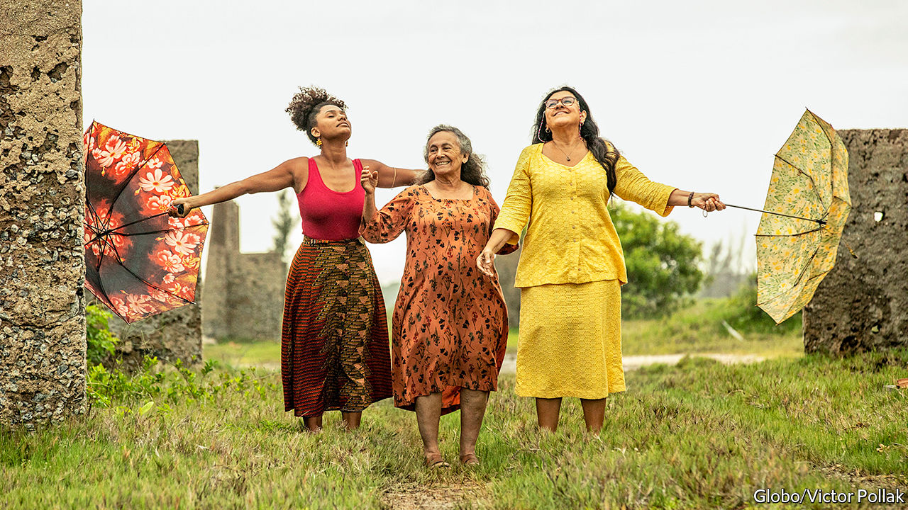

## Sealed without a kiss

# Brazil’s beloved telenovelas have sputtered to a halt

> When the cameras roll again, the world will not be the same

> Apr 18th 2020SÃO PAULO

Editor’s note: The Economist is making some of its most important coverage of the covid-19 pandemic freely available to readers of The Economist Today, our daily newsletter. To receive it, register [here](https://www.economist.com//newslettersignup). For our coronavirus tracker and more coverage, see our [hub](https://www.economist.com//coronavirus)

“AMOR DE MÃE” (“Mother’s Love”) is a telenovela about three mothers from different social classes whose lives become entwined in Rio de Janeiro. Its run began in November on Rede Globo, Brazil’s largest free television channel, in an evening slot that can attract a quarter of the population. Then, on March 16th, Globo shut its studios to combat the spread of covid-19, sending home some 9,000 workers and, for the first time ever, replacing ongoing soap operas with reruns. Neither military dictatorship nor the Rio Olympics halted production of Brazil’s famous novelas, which are broadcast six days a week for single seasons of around 150 episodes apiece.

Manuela Dias, the writer of “Amor de Mãe”, and José Luiz Villamarim, its director, scrambled to re-edit existing footage to suspend the story on a cliffhanger. One of the mothers, Thelma, commits a murder to prevent another, Lurdes, finding out that Thelma’s adopted child and Lurdes’s long-lost son are one and the same. That was the easy part. Now Globo, a huge media empire that broadcasts news, sports and entertainment, must answer the question facing television executives from Hollywood to Bollywood: how to bridge the gap between the pre- and post-pandemic worlds—and what to produce on the other side.

The filming of soap operas has been suspended in other countries, too, but nowhere will the hiatus matter more than in Brazil. Shoddy state-run schools and vast TV audiences mean that, as well as being a cherished form of entertainment, the shows are a vehicle for education and a mirror for current affairs. “Novelas helped me understand a part of history that literature in school didn’t show,” says Ondina Saidy, a 61-year-old social worker. For instance, a corruption scandal in the 1980s inspired “What King Am I?”, an allegory set in a European kingdom that poked fun at politicians. “Avenida Brasil”, one of the most successful soaps in Brazilian history, depicted life in a favela, sparking conversations about race and class when it began in 2012. Rates of organ donation rose after the practice saved a popular character’s life.

In short, says Maria Immacolata Vassallo de Lopes of the Centre for the Study of Telenovelas at the University of São Paulo, these shows are “a resource capable of mobilising people”. They are also part of a global market: millions of Americans and Europeans watch Brazilian and Mexican novelas, even if “K-Dramas” from South Korea have begun to supplant them. (Colombians, for their part, prefer Turkish yarns.) Now this supply chain has ground to a halt, leaving fans bereft when they most need the consolation of melodrama.

To sustain the ritual viewing in Britain, the BBC is eking out episodes already in the can of “EastEnders”, its flagship soap, scheduling two per week instead of four. In Mexico, Televisa has put scores of old telenovelas online to be streamed free. In Brazil, Globo is carefully selecting its reruns. They include a modern-day Cinderella tale and a historical drama with a sequel coming out later this year. Meanwhile, actors are connecting with fans on Facebook. Networks are exploring variety-show formats involving home-made videos—chefs in their own kitchens, quizzes in which celebrity panellists beam themselves in.

A rare holdout from the pre-covid era is “Big Brother Brazil” (BBB), a venerable reality show that confines 20 attractive young people in a house together. Globo decided to keep filming even as versions in Canada and Italy ended early. The network reduced staff to minimise the risk of infection and on March 16th broke into the contestants’ isolation to tell them about the pandemic; a similar scene played out on “Big Brother Germany”. The ensuing tear-filled episodes drove up the already high ratings (Rede Globo’s audience in March was its biggest in a decade: 38% of televisions in the country were tuned in). It is comforting to feel that “the whole world is here, at the same time, living through the same emotion”, says BBB’s director, J.B. Oliveira.

With novelas suspended, football cancelled and millions of Brazilians stuck at home, BBB has become a national pastime. Celebrities and politicians, including a son of President Jair Bolsonaro, have identified their favourite contestants on Twitter. A recent elimination round drew 1.5bn online votes. In a habit previously reserved for football matches, Brazilians have been shouting at the screen. “Stop that, for the love of God!” cries Bianca Cardoso, the founder of a Facebook group for TV fans, when participants engage in what in the covid era seems like risky behaviour, such as sharing dishes and embracing.

Soon, she may not have to worry. Globo is considering banning kissing when production of novelas resumes, at least initially. Crowd scenes will also be avoided to limit the need for extras. Smooching will surely return (though some quarantine habits, such as videoconferencing, will doubtless linger both in life and on screen). But the pandemic’s wider impact on television entertainment is unpredictable.

Experimenting with low-budget productions, as Globo has, could help in the long run, reckons Chico Barney, a Brazilian TV critic. Networks are anticipating a downturn after people return to work, audiences dip, advertising shrinks and subscriptions are cancelled. But there will still be demand for dramas, and—as is always true after such a seismic event—some are bound to focus on the pandemic. In Brazil, as elsewhere, the crisis has spotlighted the issue of inequality: wealthy travellers imported the virus, but poor people, who depend on the strained public health system, will suffer most. As in the past, soaps will reflect and shape viewers’ understanding of what happened and why.

Ms Dias, the writer of “Amor de Mãe”, has returned to her storyboard, pondering one urgent question in particular. The novela is set in present-day Rio, but the bustling streets and mobbed beaches that it depicts now seem like relics of a bygone age. “I agonised over what to do,” she says. “Do I let coronavirus into the novela, or do I spare my characters?”

Unlike the writers of “The Archers”, a British radio drama about a fictional village where the virus will arrive in May, Ms Dias decided to be merciful. The novela already grapples with death and inequality, she figures, and by the time it returns Brazilians will be sick of hearing about the disease. “The drama of whether or not Lurdes finds her son would turn into whether or not Lurdes gets coronavirus,” she jokes. “All the plot lines would become medical stories.”

Instead, an environmental activist who has a child with one of the mothers will warn the UN that the world is unprepared for a pandemic. That is a lesson that the audience has already learned. ■

Dig deeper:For our latest coverage of the covid-19 pandemic, register for The Economist Today, our daily [newsletter](https://www.economist.com//newslettersignup), or visit our [coronavirus tracker and story hub](https://www.economist.com//coronavirus)

## URL

https://www.economist.com/books-and-arts/2020/04/18/brazils-beloved-telenovelas-have-sputtered-to-a-halt
