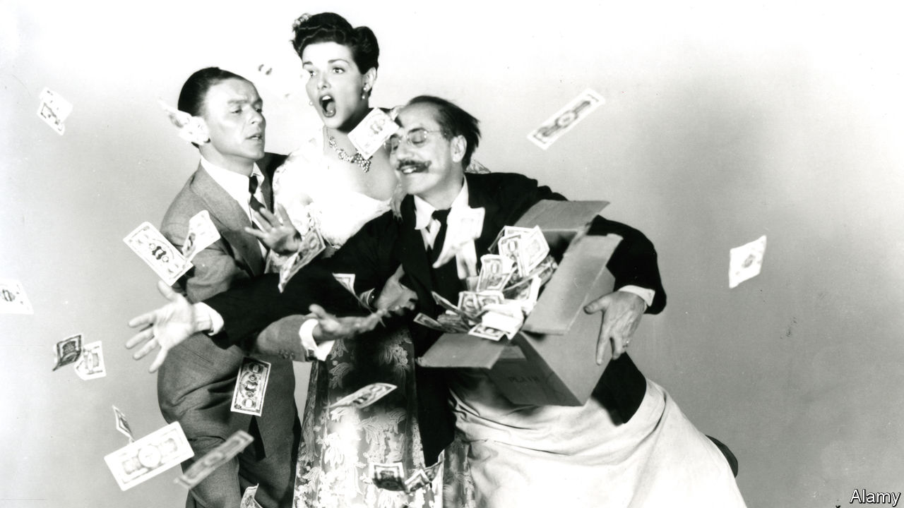

## The money tree

# How to make a billion

> William Leith has never managed it—but he has some tips

> Apr 16th 2020

The Trick. By William Leith. Bloomsbury; 224 pages; £20.

EVEN MORE than most people, William Leith is fascinated by the super-rich. As a journalist, he devotes a lot of his time to interviewing them; by his own report, he spends much of the rest worrying about his own inability to make money. In his book he sets out to pin down the secrets that lead these modern pharaohs to succeed while he flounders in relative penury.

The title, it is not a surprise to learn, is itself a ruse. There is no simple “trick” to accumulating piles of cash; otherwise Mr Leith would be rich already (and he might be disinclined to share it). More accurately, the object of his inquiry, which he pursues with obsessive zeal, is whether there is a set of identifiable strategies that increase your chances of acquiring extreme wealth. Along the way, the reader learns a great deal about the lifestyles of the plutocrats, and quite a lot about Mr Leith himself.

His research takes him to places most people encounter only through films or prurient television shows. He is admitted to mansions, alights upon private tropical islands and goes to a nightclub in an underwater cavern in the Maldives. One of his subjects is the late Felix Dennis, a maverick British publisher, whose estate in Warwickshire Mr Leith visited. Ruthlessness was essential to amassing a fortune, reckoned Dennis, himself the author of a bestseller titled “How To Get Rich”. Indeed, he believed the first victim of any pursuit of riches must be the pursuer. Dennis’s own life, in which success turned out to be a prelude to drug-addiction, illustrated that bleak view only too well.

Making money, of course, can itself be very addictive. Mr Leith encounters Jordan Belfort, a former stockbroker and the author of “The Wolf of Wall Street”, a lurid memoir that was turned into a film by Martin Scorsese. Avarice got the better of Mr Belfort, and he was jailed for fraud. Still, for what it is worth, he thinks persuasiveness is one of the key requirements for financial success. He is a better persuader than most: a free man once again, he now delivers lectures on how to strike it rich. Naturally, he demands handsome fees for his insights.

Another route to opulence that Mr Leith analyses in depth is the “black swan” strategy, associated with the writer Nassim Nicholas Taleb. It involves betting heavily on unlikely events—because the odds are rewarding and the world is more chaotic and unpredictable than people expect. Winning business models, the author finds, often arise from a willingness to take hard choices, accept slow progress and, initially, swallow substantial losses. Among his case studies is Patrick Veitch, a talented mathematician whose losing bets on horse races helped him refine a method that subsequently brought in £1m ($1.25m) a year. He also cites Howard Schultz, who boldly decided to introduce Italian coffee culture to America. The outcome of Mr Schultz’s quixotic scheme was Starbucks.

But this is not a textbook. As well as his observations of the plutocracy and how to penetrate it, Mr Leith offers a tour of his own frantic inner world, reflecting on a dizzying array of subjects that he deems relevant to his mission. These range from cowboys and gangsters to the feeding habits of chimpanzees. His metastasising anecdotes and revelations are deeply personal, often wilfully tangential and always thought-provoking. It may console readers of modest means to learn that the author’s own finances remain disastrous. ■