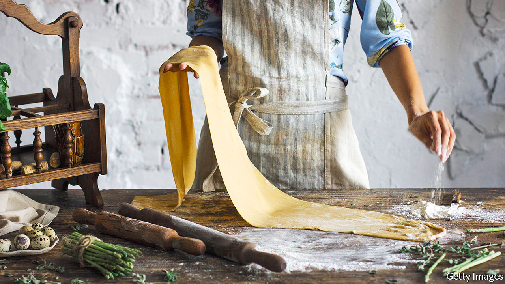

## Home Entertainment

# Make your own pasta

> Comfort food and kids’ entertainment, from anelli to ziti

> Apr 18th 2020

“IT CAN BE bought everywhere and in all the shops for very little money,” observed Goethe on a visit to Naples in 1787. “As a rule it is simply cooked in water and seasoned with grated cheese.” Pasta’s economy and convenience have since helped it conquer the world. Supermarkets from Kansas City to Qatar have recently been stripped of the stuff.

Pasta is probably a descendant of ancient Asian noodles (though the story of Marco Polo importing it from China is apocryphal). Etruscan and Roman forms, described by Horace and Cicero, are likely to have been baked or fried; then, in the fifth century, the Talmud mentioned the boiling of dough. This method took off in the Middle Ages, aided by a drying process brought to Sicily by Arabs. In northern Italy, egg-enriched doughs and filled pastas proliferated; but it was only in the 1970s that British and American diners looked beyond their ersatz spaghetti and meatballs or mac ’n’ cheese.

Today, making their own pasta offers locked-down cooks a moderate workout, an hour’s entertainment for children and a versatile kitchen staple in one fell farinaceous swoop. In its purest form, pasta—which means “dough”—has just two ingredients, water and flour. The best choice, say authorities such as your correspondent’s Sicilian mother-in-law, is farina di semola di grano duro rimacinata, a fine-ground semolina made from durum wheat. But in these straitened times pasta would be an honest end for any orphaned bag of flour, be it plain, chickpea or spelt.

Allow 100g per person and a little over half as much warm water, or, for egg pasta, substitute a single egg for the water. Heap the flour and sprinkle a little salt. Make a well in the centre, slowly add the liquid and mix with your fingers. Knead until the paste becomes a smooth, soft dough. Wrap and rest it in cling-film before shaping.

In an Italian kitchen, choosing the pasta’s shape is as important as deciding how to dress it. Try a little concave cavatelli (from cavare, to dig). Using both hands, roll the dough into a rope 1cm in diameter, then cut it into 1cm pieces. Push each piece down and away with your thumb, creating a curl to catch tomato sauce. For flat noodles, roll the dough as thinly as possible—thin enough to read newspaper headlines through it. Tagliatelle are roughly 1cm wide; any narrower and they become tagliolini, wider and they could be pappardelle. All will be delicious with ragu and grated hard cheese, properly Grana Padano, as the Bolognese use.

Fresh pasta is not always beautiful; it is never al dente. But there is a rare pleasure in a bowl of it formed by your own hand. Roll the dough out thinly again and cut it into squares, and you are halfway to tortellini. Fill with ham, cheese, black pepper and nutmeg; fold the squares into triangles, squeezing the edges to push out any air, seal them, then join the two bottom corners in the middle. Tortellini in brodo—cooked in stock and swimming in a soup bowl—is the ultimate comfort food. ■

## URL

https://www.economist.com/books-and-arts/2020/04/18/make-your-own-pasta
