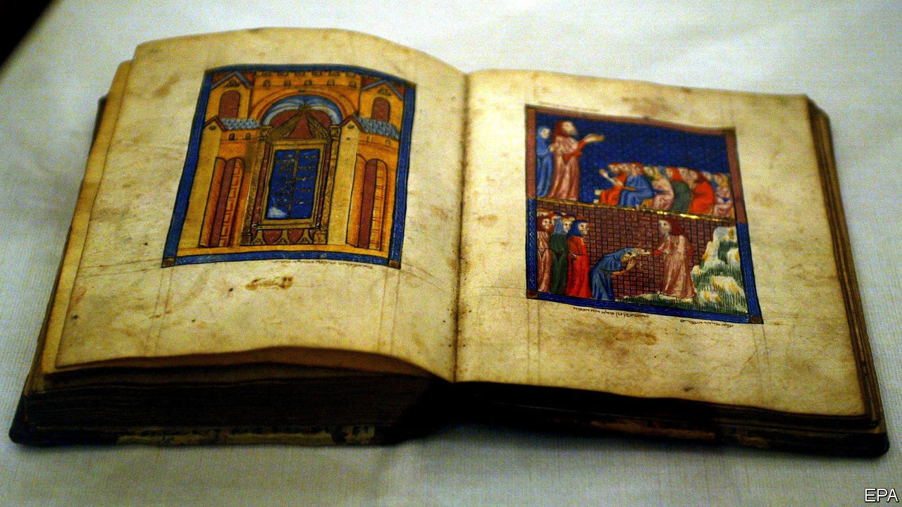

## Exodus and odyssey

# Why is this Haggadah different from all others?

> The latest chapter in the story of an extraordinary Passover book

> Apr 16th 2020SARAJEVO

WHY, JEWISH children asked at the Passover meal last week, is this night different from all others? The question is stipulated in the Haggadah, a ritual book that recounts the Israelites’ escape from bondage in Egypt. One example, known as the Sarajevo Haggadah, is itself different from all others. At least 650 years old, its calfskin pages are still vibrantly illuminated with gold, lapis lazuli and malachite. It has withstood war and persecution, bearing silent witness to tumultuous events; and, as in the biblical episode it relates, the Haggadah has always found new life—recently in literature, and soon in film.

Alongside vivid illustrations of Bible scenes, among them Moses parting the Red Sea, the text contains images of contemporaneous Jews, possibly including the Haggadah’s original owners. Its past, like its pages, holds many mysteries. It was made in medieval Spain, probably in Barcelona, by unknown hands in around 1350. After Spain expelled its Jews in 1492, it found its way to Italy where it was spared by the Inquisition, before reaching multicultural Bosnia (with a stint in Vienna for restoration). Over the centuries it collected wine stains and errant doodles that whisper of the people who turned its parchments.

In 1894 the National Museum of Bosnia and Herzegovina bought the Haggadah from a Sephardic family in Sarajevo. During the second world war, when most of the city’s Jews perished, German troops searched for the legendary tome. The museum’s director, Jozo Petrovic, a Catholic Croat, and Dervis Korkut, a Muslim curator, bravely hid the Haggadah in a mountain village, reputedly inside a mosque.

Half a century later, when Sarajevo was besieged during the Balkan wars, Serbian-backed forces shelled the National Museum. This time a Muslim librarian, Enver Imamovic, and his colleagues saved the Haggadah and stashed it in a bank vault. Bosnian police told him he was crazy to risk his life for “a dusty old book”, Mr Imamovic recalled to Geraldine Brooks, a journalist who covered the conflict.

Ms Brooks first heard about the Sarajevo Haggadah when, as they hunkered in a hotel bar during a bombardment, fellow war correspondents speculated about its fate. Afterwards she wrote a bestselling, fictionalised account of the Haggadah’s history, “People of the Book”. “It’s the same story repeating itself in different eras in different countries,” she says of the saga. “Something rises up and wants to wipe out everyone who doesn’t belong.” Yet as the Haggadah’s existence attests, “there are always a few people who stand up and say ‘no’.”

The leather-bound artefact was long considered too delicate to be exhibited; over more than 100 years, it was on public view for just four hours in total. But since 2018, with the aid of French funding, it has been displayed for two hours a week in a climate-controlled, theft-proof room in the cavernous museum. Now Danis Tanovic, a Bosnian director who won an Oscar in 2001 for “No Man’s Land”, is set to make a film adaptation of Ms Brooks’s novel. Mr Tanovic was in Sarajevo during the siege and joined the fire brigade’s effort to salvage cultural treasures.

For him, the book symbolises “fighting, kindness from some, and persecution”; but, like the flight from Egypt that it commemorates, it also tells a “story of survival”. Filming has been delayed by the pandemic; even so, it is clear that there are more chapters to be written in the Haggadah’s chronicle of exile, heroism and endurance. ■

## URL

https://www.economist.com/books-and-arts/2020/04/16/why-is-this-haggadah-different-from-all-others
