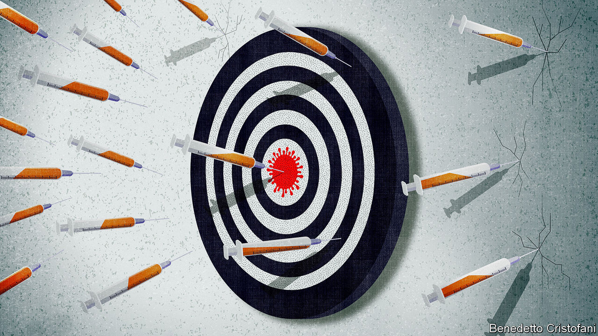
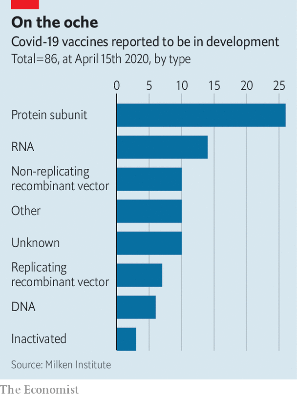
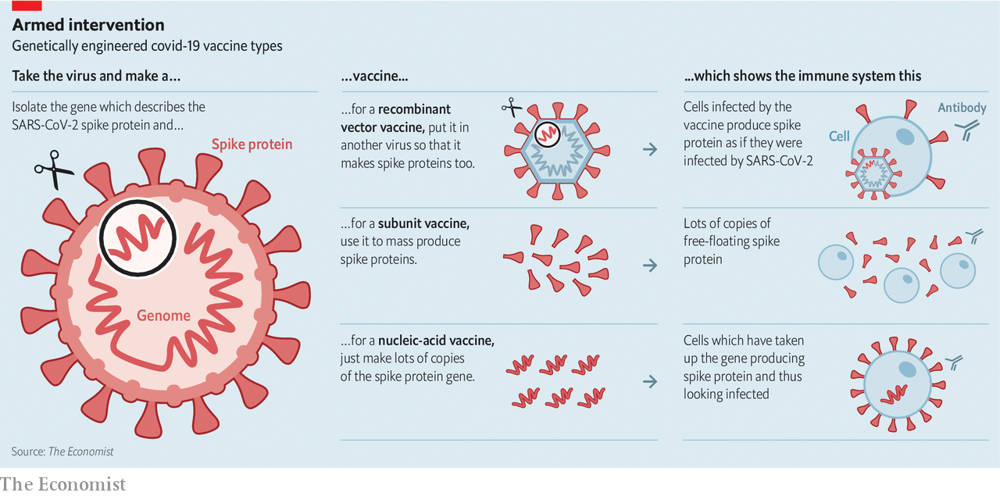

## So many candidates, so little time

# Can the world find a good covid-19 vaccine quickly enough?

> And can it mass-produce it fairly if it does?

> Apr 16th 2020

Editor’s note: The Economist is making some of its most important coverage of the covid-19 pandemic freely available to readers of The Economist Today, our daily newsletter. To receive it, register [here](https://www.economist.com//newslettersignup). For our coronavirus tracker and more coverage, see our [hub](https://www.economist.com//coronavirus)

THE EBOLA outbreak which began in 2013 was the largest the world has ever seen; over three years it killed more than 11,000 people in Guinea, Liberia and Sierra Leone. It also saw the first human trials of a vaccine against the disease.

In the late 1990s, Canadian scientists trying to understand how Ebola worked had put some of its genes into the genome of a normally harmless virus and injected it into mice. The mice did not become sick, as the scientists had expected; instead they became immune to Ebola. By 2005 that serendipitous development had become a vaccine that could plausibly be given to humans. But there were no Ebola outbreaks that needed it.

As the west African Ebola outbreak gathered speed in 2014 the Wellcome Trust, a British funder of medical research, put that vaccine into early safety trials, also known as phase I trials, in healthy volunteers in Britain, Kenya, America and elsewhere. By the middle of 2015, its efficacy was being tested in phase III trials in Guinea, where it was declared a success. That vaccine—rVSV-ZEBOV (Ervebo)—is now approved for use around the world.

For a vaccine to get from phase I to phase III trials in just ten months, as rVSV-ZEBOV did, was unheard of at the time—a startling example of what urgency and organisation can do. Now a repeat performance, ideally taken at an even faster tempo, is the sum of the world’s desire. In the middle of April more people are dying of covid-19 every three days than died of Ebola in west Africa over three years. A vaccine would not just save lives; it would change the course of the pandemic in two separate, if related, ways. It would protect those who were vaccinated from getting sick; and by reducing the number of susceptible people it would prevent the virus from spreading, thus also protecting the unvaccinated.

There were no pre-existing vaccine candidates handily squirrelled away when the genetic sequence of SARS-CoV-2, the virus which causes covid-19, was published on January 10th. But science moves pretty quickly these days. There are reports of some 86 candidate vaccines against SARS-CoV-2 being developed around the world, taking a wide array of approaches (see chart). Three have already started phase I trials. One of these, made by CanSino Biologics, a Chinese biotechnology company, in collaboration with a unit of China’s Academy of Military Medical Sciences run by Chen Wei, a major-general feted in the media, has been approved for phase II trials, which are designed to find out if a vaccine can provoke an immune response that might fight off the virus. It is recruiting 500 volunteers in Wuhan.

That one or more of these many efforts will lead to a working vaccine seems quite likely. Vets have been using vaccines to protect farm animals against coronaviruses for years. In most people infected with SARS-CoV-2 the immune system is quite capable of dealing with the virus; that is why they do not get sick. Among those who do, in most cases the immune system eventually rids the body of the virus. An immune system forewarned by a vaccine should be able to do so better and quicker.

But it is not enough that a vaccine be feasible. The job of making it available around the world will be just as taxing. A candidate which goes on to become a practical vaccine may be identified before the end of summer—perhaps more than one. But showing how well it works, finding any rare problems it may encounter, and manufacturing it in quantities large enough for the whole world will still take time. Melinda Gates, who with her husband has spent tens of billions of dollars on vaccines through the Bill and Melinda Gates Foundation, has suggested that getting a covid-19 vaccine ready and distributed could take 18 months.

In terms of human welfare, what matters is making that time as short as safely possible. In terms of prestige and politics, though, who gets to do it matters a lot, too. Producing an effective SARS-CoV-2 vaccine will be a huge feather in the cap of the researchers, companies and nations responsible. If the cap in question is Chinese, as it could well be, the development will be presented as a triumph both of Chinese science and the Chinese system; mutatis mutandis, something similar will be true for any other country, too.

The identity of the successful team may not just matter in terms of prestige. The demand for a vaccine that provides reliable and safe protection to whole populations will be huge. The world currently makes over 5bn doses of vaccine a year, of which roughly 1.5bn are seasonal-flu vaccines. Some companies and governments are already adding capacity in advance of a SARS-CoV-2 vaccine being developed. But without knowing which vaccine approach will do best, there is a limit to how much capacity can be readied beforehand.

If vaccine production capacity is constrained, the politics of vaccination may get nasty. An optimum strategy for using limited stocks of vaccine in a way that best benefits the world might see them devoted to populations at particular risk. But a country with a lead in vaccine manufacture might prefer to devote its limited stocks to universal coverage for its own citizens, securing a narrow advantage for itself at the cost of a broader loss to the world. As Richard Hatchett, who runs the Coalition for Epidemic Preparedness Innovations (CEPI), an NGO, puts it, “Countries are in a real-world prisoner’s dilemma.”

At the heart of every vaccine is an antigen, so-called because it is the thing which provokes the body to generate antibodies as well as other immune responses. When a cell that has been infected by a virus is forced to make viral proteins, it will display bits of those proteins as antigens on its surface, waving them around like little flags to draw the attention of the immune system.

This is not the only way antigens come to the system’s attention. Some of its cells engulf virus particles, or just bits of them, without getting infected, and process them into antigens. When those antigens are in turn presented to other immune cells, the production of antibodies gets under way.

Antibodies are proteins that stick to the antigen wherever they may find it. In so doing, they prevent virus particles from infecting other cells and flag them up for destruction. Building up a full immune response against a previously unencountered virus’s antigens in this way takes time. Covid-19 patients typically do not start producing antibodies until they are in their second week of symptoms.

Before the advent of genetic engineering, doctors had three ways to let the immune system get acquainted with viral antigens it needed to know about. They could present it with a strain of the virus, or a related virus, that was capable of infecting cells but had been hobbled in some way so as not to cause sickness—what is called a live-attenuated vaccine. This is the approach taken with many of the more common established vaccines, such as those against measles, mumps and rubella. Alternatively they could present it with a virus that had been inactivated, and thus could not cause infection. This was the path to the Salk polio vaccine, and is the technique used for seasonal-flu jabs. Finally they could present it with the antigen itself, harvested from the blood of those infected—the approach originally taken to make the hepatitis B vaccine.

Two of these approaches are being investigated for use against SARS-CoV-2. A live-attenuated vaccine in which the SARS-CoV-2 genome is “deoptimised” is being developed by Codagenix, an American biotech company, in collaboration with the Serum Institute of India. Sinovac Biotech, based in Beijing, is following the inactivated route. During the SARS outbreak of 2003, Sinovac created a vaccine against the coronavirus responsible—SARS-CoV, which is closely related to SARS-CoV-2—which used inactivated virus particles. The vaccine made it through a phase I trial, but not before the outbreak had ended. Now Sinovac is taking the same approach to SARS-CoV-2.

In the past few decades genetic engineering has increased the range of possible vaccines considerably (see diagram). Today’s version of the hepatitis B vaccine, for example, no longer consists of antigen harvested from blood; it consists of antigen made by adding the gene for the protein that forms the virus’s outer coat to cell cultures and thereby producing the protein in a pure form. Many teams are looking at SARS-CoV-2 vaccines that consist of a single protein mass produced in this way, including Clover Biopharmaceuticals, a Chinese biotech company, Novavax, an American biotech company, Sanofi Pasteur, a French firm which is one of the largest established vaccine companies, the University of Queensland and the US army. Most of these efforts are aimed at the conspicuous spike proteins that stud the virus’s outer layer.

It is also possible to move antigen production into the patient’s own body by putting the relevant gene into another, otherwise innocuous virus—sometimes one that can reproduce itself in the body, sometimes one that cannot. This sheep-in-wolf’s-clothing approach is how the rVSV-ZEBOV Ebola vaccine works, as well as some veterinary vaccines, but it has not as yet been used widely in humans.

The CanSino covid-19 vaccine that is reported to have entered phase II trials is a “recombinant vector” vaccine of this type, an adenovirus engineered to express the spike protein. Other groups using this approach include the German Centre for Infection Research, the Institut Pasteur, Johnson & Johnson, a pharmaceutical company, and the University of Oxford.

The most novel of the vaccines produced through genetic engineering are nucleic-acid vaccines. The idea here is simply to introduce the gene for the antigen of interest into the body as a piece of either DNA or RNA, a related molecule that many viruses use as a medium for storing genes. The body’s cells manufacture the antigen the vaccine describes, and that produces an immune response. There are two such vaccines already in phase I trials: a DNA vaccine developed by Beijing Advaccine Biotechnology and Inovio Pharmaceuticals, Chinese and American biotechnology companies respectively; and an RNA vaccine from Moderna, an American biotechnology company working with the National Institute of Allergy and Infectious Diseases (NIAID). A number of other firms are not far behind.

Nucleic-acid vaccines have various advantages, according to their advocates. Their production is completely independent of viruses, or even cells, making contamination highly unlikely, and should in principle be easy to scale up. Last year CEPI funded CureVac, a German biotech company, to develop an “RNA printer” that would simply churn such vaccines out. If such production technologies work, there is a chance that they could be scaled up far faster than the techniques used for other vaccines. That could be a very big deal.

The problem is that no RNA or DNA vaccine has yet been licensed for use in humans anywhere in the world. Animal studies suggest there could be something there, but Adrian Hill, boss of Oxford University’s Jenner Institute, says describing them as vaccines is like saying you have a car without being able to say if it moves. Though experimental DNA vaccines have produced immune responses in humans, RNA vaccines have yet to get even that far, according to Stanley Plotkin of the University of Pennsylvania, who developed the rubella vaccine. “We will have to see if it works,” says Christos Kyratsous, the senior infectious-disease scientist at Regeneron, an American biotech company.

The type of the vaccine is not the only variable trials have to look at. The dose matters, too, and some vaccines need to be administered more than once. There are also adjuvants, chemical cofactors that can enhance a vaccine’s effect on the immune system. The right adjuvant can make a big difference, for reasons that are not always well understood.

Indeed, for all the molecular mastery vaccine makers now have at their disposal, much of the immune system’s workings remain mysterious. The BCG vaccine used against tuberculosis, for example, seems to have a stimulating effect on the immune system that goes well beyond TB. That is why four countries are running trials of BCG against covid-19 even though no specific new antigens have been added to it.

Sorting out effectiveness and dosing is one of the reasons you need trials. So, too, is safety. A particular safety worry for covid-19 vaccines is “antibody dependent enhancement”. In some diseases, and in some circumstances, antibodies can make a viral infection more damaging. The effect was recently seen in some people vaccinated with CYD-TDV (Dengvaxia), a vaccine against Dengue fever made by Sanofi. During attempts to develop vaccines for SARS-CoV in the early 2000s, some laboratories saw test vaccines apparently improve the ability of the pathogen to enter cells. “Everybody is aware of this,” says Dr Plotkin. “Some think it is real, some think it is not real.” As Dr Hill says, “There is always a risk that this will be difficult.”

Moving from safety to efficacy, Dr Plotkin thinks researchers should consider speeding things up with “challenge” trials. Instead of vaccinating a lot of people and then seeing how many get how sick in the natural course of events, as normal field trials do, challenge trials deliberately expose vaccinated volunteers to the virus. The ethical ramifications of such trials are troubling, but a committee of experts convened by NIAID in 2017 found that in the case of research into Zika, a disease which can cause miscarriages, challenge trials could be justified under certain conditions. A group of Harvard scientists recently suggested the same for covid-19, if the volunteers were young and healthy, fully informed, able to pull out at any time and guaranteed good care. A small challenge trial, Dr Plotkin says, can produce results comparable to those of a much larger field trial in weeks.

Whatever sort of trials are chosen, many seem likely to take place. That suits Paul Hudson, the boss of Sanofi. He argues the world needs alternative approaches to a covid-19 vaccine not just to cover all the biological bases, but “because manufacturing capacity is a question-mark.”

Making vaccines is a lot more complicated than making ordinary pills. Those which use whole viruses have to grow them up in some highly standardised way and purify them exactingly. Those which just use proteins need other forms of ultrafiltration and purification to ensure that only the desired antigen gets into the patient’s body. Dozens of quality checks are done every step of the way; they may add up to more than half of the production time.

Because profits in vaccine making are low, not many Western companies find such capabilities worth the candle. Almost all the pharmaceutical industry’s vaccine-manufacturing know-how is concentrated in just four companies: GSK, Johnson & Johnson, Pfizer and Sanofi. And these four are generally wary of developing vaccines for pandemics, not least because developing vaccines for diseases that then vanish is even less profitable. “Look at what happened with the excellent Zika vaccine as soon as it turned out America wasn’t going to get slammed. Look at the 2009 flu pandemic vaccine,” says Laurie Garrett, author of “The Coming Plague”, a prescient book published in 1994. A decade ago, after the H1N1 influenza pandemic fizzled out, the governments of America and various European countries backed out of promised contracts, leaving pharmaceutical companies holding the bag which contained hundreds of millions of dollars of development costs. Nevertheless, all four are contributing to covid-19 vaccine efforts. In an unusual collaboration, GSK is providing a particularly promising adjuvant to Sanofi’s protein subunit programme.

In theory, manufacture of covid-19 vaccines using conventional approaches could be scaled up quickly by the four big companies, and by some of the Chinese and Indian companies that make vaccines for markets in the global south. But doing so might mean fewer regular vaccines get made because, as Paul Stoffels, the managing director of Johnson & Johnson, confirms, “there is no excess capacity.” Indeed, the World Health Organisation (WHO) reports that there are already unrelated shortages of vaccines for yellow fever and measles. The seasonal nature of flu vaccinations means that those production facilities have spare capacity at some points in the year. But Sanofi reckons that, at best, that would allow it to make 600m doses a year of a covid-19 vaccine before cutting into flu-vaccine production. If the new vaccine turned out to require a lot of antigen, that figure might fall to 100m.

This means that governments, charities and other potential vaccine buyers do not just need to find ways to assure the industry that they will pay for what it produces. According to Bill Gates, they need to spend billions of dollars building manufacturing plants for the half dozen or so leading vaccine candidates before vaccine trials have reached conclusive results about what vaccine or vaccines are best. Some of those billions “will be wasted”, Mr Gates acknowledges, and billions matter a lot in global public health. Stacked up against trillions of dollars of lost economic output, though, overspending on vaccine-production capacity is penny-ante stuff.

Governments have yet to co-ordinate their response in this way. Some in industry are going it alone. The Serum Institute of India, one of the largest volume manufacturers of vaccines for the poor world, says it is ready to step into the breach. It estimates that responding to covid-19 will require building a bulk manufacturing and filling plant costing some €150m ($164m). Johnson & Johnson has committed $1bn to expanding manufacturing on a “very, very large scale,” says Mr Stoffels. He adds it will sell its vaccines on a “not for profit basis.” Mr Hudson has also committed Sanofi to scaling up “with no profit motive”.

Despite such efforts, though, the ability to make vaccines will not be as widely distributed as the populations in need of them, triggering fears of Dr Hatchett’s prisoners’ dilemma. To try to ensure that an optimal vaccine-distribution strategy is pursued instead, he and Seth Berkley of GAVI, a public-private partnership which supports vaccination efforts worldwide, have been urging the G20 to try and reach some kind of consensus on vaccine production and then fund it. The G20 has in turn asked the WHO to outline a plan for the equitable distribution of the goods needed to fight covid-19. This will be part of a broader WHO initiative, the details of which have yet to be announced, which will be led by a former head of GSK.

Dr Hatchett says that uncertainty over which vaccine will actually work provides an incentive for co-operation: no one is sure to lose out; everyone stands to benefit. “As we become more and more certain about which vaccines are going to win, that advantage may go away and national interest may begin to assert [itself],” he adds. The science of vaccination may well offer humankind a viable exit from the straits that the covid-19 pandemic has stuck it in. Politics could still see some people trampled underfoot in the rush to get out. ■

Dig deeper:For our latest coverage of the covid-19 pandemic, register for The Economist Today, our daily [newsletter](https://www.economist.com//newslettersignup), or visit our [coronavirus tracker and story hub](https://www.economist.com//coronavirus)