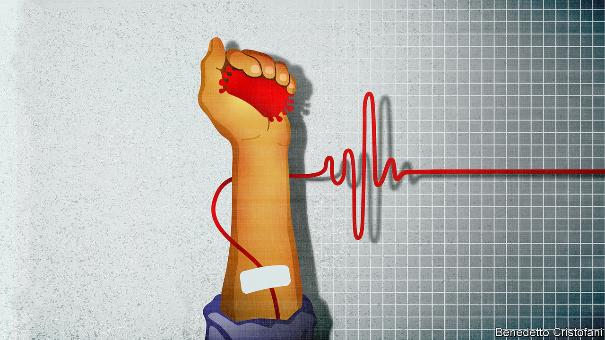

## Other people’s antibodies

# Some benefits of a covid vaccine could come early

> Antibodies from recovered patients and biotech companies could help

> Apr 18th 2020NEW YORK

Editor’s note: The Economist is making some of its most important coverage of the covid-19 pandemic freely available to readers of The Economist Today, our daily newsletter. To receive it, register [here](https://www.economist.com//newslettersignup). For our coronavirus tracker and more coverage, see our [hub](https://www.economist.com//coronavirus)

DURING THE flu pandemic of 1918-19 doctors at an American naval hospital developed a treatment which, according to the American Journal of Public Health, had “a decided influence in shortening the course of the disease and in lowering the mortality”. It involved clotting and then centrifuging blood from people who had got over the disease so as to separate out the antibodies it contained, then giving those antibodies to patients in dire need.

Since then antibody-rich “convalescent plasma” (CP) has been used as a treatment for various diseases, including SARS and the pandemic strains of H1N1 and H5N1 influenza. Now covid-19 has joined the list. A recent study in Wuhan found that severely ill covid-19 patients treated with CP did significantly better than patients matched with them by age, gender and severity of infection had done earlier in the epidemic.

Michael Joyner of the Mayo Clinic, which leads a CP research effort in America, expects randomised control trials to begin in a few weeks. They will not just look at CP’s potential as a treatment, but also as a prophylactic. If that worked, it would be a sort of halfway house on the road to a vaccine.

Even though CP donors get the other components of their blood—cells, platelets and the like—returned to them after the antibodies have been removed, the process is still something of a palaver, requiring a lot of medical attention. Despite the fact that various companies are trying to make a go of it, it is hard to see it scaling up all that far. But there is an alternative. Antibodies are proteins, and that means a bit of genetic engineering will allow cell lines at biotechnology and pharma companies to mass produce them. The resulting product should be less prone to contamination, more consistent, and easier to scale up than CP.

This approach has already been successful against Ebola. Regeneron, an American biotech company, developed a cocktail of three antibodies which recognised different parts of the protein’s coat. Trials in the Democratic Republic of Congo showed this therapy to be better than remdesivir, a drug designed to block the Ebola virus’s reproduction which is now, as it happens, being tested as a medicine for covid-19.

Regeneron is now making a pair of antibodies that target the SARS-CoV-2 spike protein. It hopes to have produced enough to start trials soon. As with CP, it is possible that such antibodies may temporarily confer immunity on the uninfected, as well as helping the infected fight the disease.

Correction (April 25th 2020): An earlier version of this article said that remdesivir was designed to block the Ebola vaccine’s reproduction. We meant the Ebola virus’s reproduction. Sorry.

Dig deeper:For our latest coverage of the covid-19 pandemic, register for The Economist Today, our daily [newsletter](https://www.economist.com//newslettersignup), or visit our [coronavirus tracker and story hub](https://www.economist.com//coronavirus)

## URL

https://www.economist.com/briefing/2020/04/18/some-benefits-of-a-covid-vaccine-could-come-early
