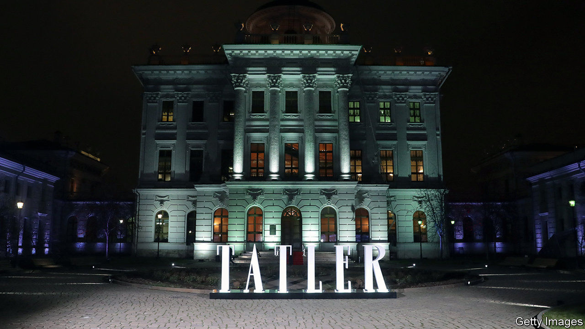

## Magazines

# Glitz-krieg

> Glossy magazines adjust to a gloomy time

> Apr 18th 2020

ONE OF ITS editors used to think of Tatler, the house magazine of the country-house classes, as a theme park. Peopled by debutantes, crusty aristocrats and crumbling piles, its pages give the impression there is nothing in life so serious as a ball. But with Britain in lockdown, gatherings attract the attention of the police, not the photographer from Tatler. Each day brings headlines that are more JG Ballard than PG Wodehouse. As Sophia Money-Coutts, a former senior editor, puts it, “the theme park is closed”.

It is not the only glossy magazine grappling with the difficulty of covering a less glossy world. How do you run a publication obsessed with stepping out when everybody’s staying in? And now that most aspects of daily life are deemed “non-essential”, pages devoted to parties, travel, fashion and luxury risk looking more frivolous than ever.

House & Garden has shifted its emphasis from grand designs to practical projects for lockdown. A new “staying in” section gives advice on growing vegetables and rustling up simple meals. At Hello!, spreads of society weddings have made way for puzzles and short stories. “We’re reinventing the magazine on a weekly basis,” says Rosie Nixon, its editor-in-chief. The royal family’s hairdressers are being tapped up to coach readers on cutting their own hair. At least celebrities seem keen to send in their own photographs, says Ms Nixon. “Lots of people haven’t got much to do.”

Other glossies are avoiding the news. Even in normal times, many such magazines are as much about feeding fantasies as doling out practical advice. For an hour or two, readers of the latest issue of Tatler can, for instance, imagine they have a spare £77,500 to spend on a necklace, or might at any moment be invited to a bash at the Gstaad Yacht Club. At times of strain, such escapism can be a welcome antidote to a grim reality. After considering 130 options for the cover of the May issue, Melinda Stevens, editor-in-chief of Condé Nast Traveller, eventually plumped for the headline “Looking forward: destinations to dream about”.

## URL

https://www.economist.com/britain/2020/04/18/glitz-krieg
