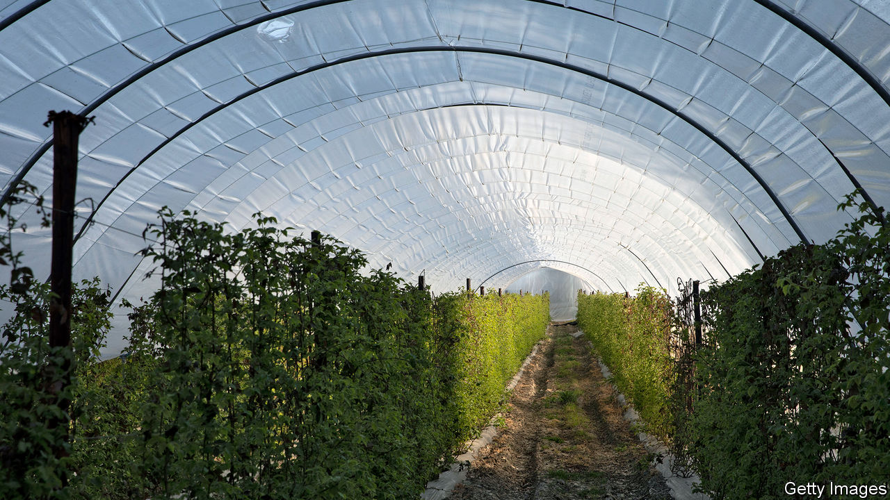

## Agricultural labour

# Not enough Britons want to work on farms

> A drive to get furloughed workers and students to pick fruit has had an inadequate response

> Apr 16th 2020

“NORMALLY ON HOLIDAYS, I spend money,” says James Mwendwa, a geology student at Bristol University. “This holiday I’ll be making it.” Mr Mwendwa has signed up with a scheme designed to get students and furloughed workers to spend their summers on British farms. He has been promised a caravan to share with his friends on a farm in Norfolk. “In the evenings you’re allowed to just chill with your mates,” a rare luxury in current circumstances.

Finding enough summertime labour has often been a struggle for British farmers. Factory workers used to move south en masse to enjoy a family holiday while picking fruit or hops. In recent years, the indigenous population has turned its nose up at agricultural work, and farmers have come to rely on importing Bulgarians and Romanians. Uncertainty around migrants’ rights and Brexit led to a decline in worker numbers last year, and around 16m apples were left to rot in orchards. A near-shutdown on European movement has only deepened the crisis.

Invoking the Women’s Land Army that kept the nation’s farms going throughout the second world war, the British Growers Association is trying to recruit a new “Land Army” to fill a shortfall of some 70,000 workers. The government’s “Pick for Britain” campaign similarly aims to tap into the wartime spirit.

So far Britons seem largely unmoved by the appeal to patriotism. Concordia, Fruitful and HOPS, three agricultural recruiters that have formed the Ethical Alliance of Labour Providers, say that 32,000 have applied, but only 13% have so far turned up for online interviews.

Even if enough native workers can be found, that may not solve the problem. Britons have a reputation for being work-shy. “Often, you have people who want to start, and we’ll say, come on Tuesday or whatever, and then they simply don’t turn up.” says Sebastian Hall, a recruiter in Suffolk.

Alison Capper of the National Farmers’ Union, herself a farmer, wonders whether new recruits “will be able to pick at the same rate as people who are practised in these jobs”. Jack Ward, boss of the British Growers Association, worries about timing. Although new workers may arrive just in time to save the nation’s asparagus, an early end to the lockdown could send students and furloughed workers scurrying back to their real lives and jobs.

For some farmers, the risk of relying on Britons is too great. To avert a crisis in the polytunnels, they have started shipping planeloads of Romanians into the country. Air Charter Services, whose customers are normally the uber-rich, has been hired by G’s Fresh, one of Britain’s biggest salad producers, to fly 150 Romanians into Stansted airport on April 16th; a further five flights are lined up. Each seat will set G’s Fresh back £250 ($313), and the passengers (who have been deemed essential workers by the Romanian government) will be kept apart on the flight and tested for covid-19 on touch-down. The airlift may spoil the wartime-spirit narrative, but it may save the nation’s broccoli.

## URL

https://www.economist.com/britain/2020/04/16/not-enough-britons-want-to-work-on-farms
