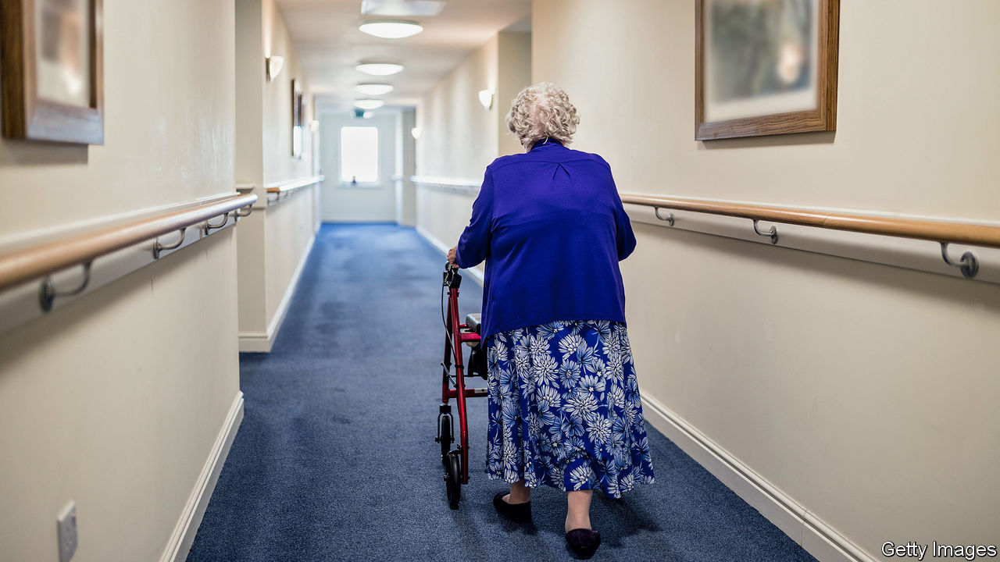

## Care homes

# The impact of covid-19 on care homes

> People in care homes are acutely vulnerable to the virus; little has been done to help protect them

> Apr 16th 2020

IN EARLY MARCH a resident at Oaklands nursing home in Hove on the south coast of England caught covid-19 from a visiting relative. Though staff tried to isolate the patient, 14 residents had been infected before a test could be done. A number have now died, though staff at the home did not want to confirm how many.

Across Britain, thousands of care homes are now experiencing what Oaklands did in March. Ministers are nervous. Helen Whateley, the social-care minister, has said it is “almost unavoidable” that the virus will spread further in care homes. On April 15th the government promised more tests would be available for care workers. Yet much of the sector is still acutely underprepared. And certain government decisions seem almost certain to accelerate the spread.

There are roughly 11,300 care homes in Britain that look after the elderly, with some 410,000 residents, many suffering from dementia. These people are acutely vulnerable to covid-19. According to Chris Whitty, England’s chief medical officer, one in seven care homes in the country has already had a confirmed case. Since testing has been limited, the true figure may be higher. Sir David Behan, the director of HC-One, one of the biggest care groups in the country, told the BBC that the virus had infected people in two-thirds of the group’s 329 homes. There are scant data for Britain as a whole, but in Scotland a quarter of cases are in care homes.

Although the government has poured resources into Britain’s National Health Service, Britain’s care homes are mostly small private businesses and have been left to deal with the crisis themselves. Some patients’ fees are paid by local authorities, but the bulk of care homes’ revenue comes from fees paid by patients or their families. Even at the best of times, staff shortages are endemic, points out Nadra Ahmed, the chair of the National Care Association, an industry group. Despite doing difficult and valuable work, such as bathing and cleaning infirm people, the majority of care-home workers are paid the minimum wage or only a little above it. Budgets have been squeezed for years.

The government has not yet banned care-home workers from working in several homes, even though they could carry the virus between them, notes Peter Kyle, the Labour MP for Hove and Portslade. Money has been made available—about £2.9bn—through local authorities, but care homes say they have not been able to gain access to it. Most homes have each been sent 300 masks by the government, but that is a fraction of what is needed if they are used properly (and the guidance has been confusing). Getting more is next to impossible. “You go to your normal suppliers and they say that the NHS has commandeered the lot,” says the manager of one care home in Birmingham which has been hit badly. Eventually the home started making its own kit, putting new air filters into reusable masks.

Those that have not yet been hit are awaiting the worst. Sandra Stinton, the manager of Grange Rest Home in Hove, says if the virus gets into her care home “it’s going to be our worst nightmare”. Already she is refusing to take patients discharged from hospitals, as she cannot be sure they have not been infected. She has been informed that she will have to prepare end-of-life palliative care, but she has no medical staff or equipment to provide it. “I haven’t got a problem supporting dying people…but how are you going to offer pain management?” she asks.

Mr Kyle thinks that the government’s poor response is the consequence not so much of a policy choice as of disorganisation. Ms Whateley does not attend cabinet meetings. The health secretary, Matt Hancock, who does, has plenty to deal with trying to manage the impact of the virus on hospitals. “The whole system hasn’t been working properly for a very long time,” says Sally Copley of the Alzheimer’s Society, a charity. That failure may now cost the lives of thousands of people. Even after the virus recedes, the need for reform will only be more apparent.■