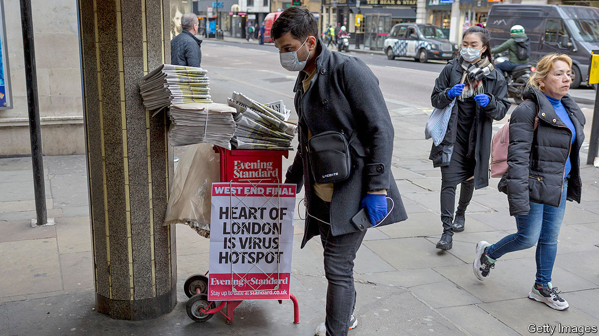

## Media and covid-19

# The newspaper industry is taking a battering

> Ad sales and circulation are collapsing even as online traffic surges

> Apr 18th 2020

Editor’s note: The Economist is making some of its most important coverage of the covid-19 pandemic freely available to readers of The Economist Today, our daily newsletter. To receive it, register [here](https://www.economist.com//newslettersignup). For our coronavirus tracker and more coverage, see our [hub](https://www.economist.com//coronavirus)

FIRST, SOME good news. The Yorkshire Post added roughly 1,000 subscribers in recent weeks. JPIMedia, which publishes that newspaper as well as the Scotsman and lots of other titles, has seen traffic to its websites rise by 20-50%. And some advertisers, including a car dealership and an estate agent, have promised to spend all the money they have already committed.

The bad news is that the paper’s overall sales are down by 30% as folk stay indoors, says James Mitchinson, its editor. At some JPI titles as much as 80% of advertising revenue has been lost. Almost all ad-sales staff have been furloughed. So have dozens of journalists. The rest have taken pay cuts of 10-15%, rising to 20% for board members. The paper has become noticeably thinner.

Unlike many other industries that have been badly affected by the crisis, news providers are seeing booming demand for their product. Traffic to news websites has risen across the board. Online subscriptions are rising at four to six times normal rates. But paper purchases, which mostly dwarf digital subscriptions, have collapsed and income from online ads is pennies to print pounds. Some advertising categories, such as retail and travel, have evaporated.

The Guardian expects revenue to drop by £20m, or 10%, and is furloughing 100 staff. Daily Mail and General Trust, which owns the Daily Mail and Metro, is cutting salaries by up to a quarter. The Jewish Chronicle and the Jewish News plan to merge. In January Enders Analysis, a research firm, forecast that ad sales in the British press would fall by 8% this year. It now puts that figure at 30%. Circulation is expected to halve. British newspapers are particularly hard-hit because they rely more on news-stand sales than papers in continental Europe and America. Some 4,000 newspaper retailers have closed, including branches of W.H. Smith.

The crisis will only accelerate long-standing trends. Ad revenues have been falling for years and print readers have long been moving online (or dying of old age). Even before the current crisis, operating profits at the Telegraph Media Group, publisher of the Daily Telegraph, fell from £32m in 2004 to £900,000 last year.

The big worry is what happens when the lockdown ends. In 2009 print advertising fell by 25% before returning to normal levels of decline. This time, 40-50% of what is lost may never come back, reckons Alice Pickthall of Enders Analysis. The same is true of circulation. People simply get out of the habit of picking up a paper, says Ms Pickthall. Yet new habits are also being formed, such as paying for news online. And many new digital subscriptions are being taken out by young people. If they stick around to become long-term subscribers, that might form a slim silver lining to the dark clouds hovering over the British news business. ■

Correction (April 17th 2020): An earlier version of this article cited a figure of £32m as the Telegraph Media Group's revenues. In fact, it is the company's operating profit. This has been changed. 

Dig deeper:For our latest coverage of the covid-19 pandemic, register for The Economist Today, our daily [newsletter](https://www.economist.com//newslettersignup), or visit our [coronavirus tracker and story hub](https://www.economist.com//coronavirus)