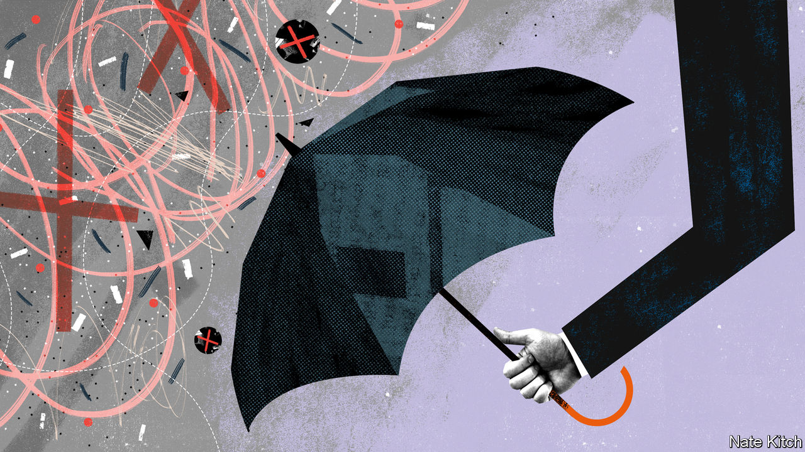

## Bagehot

# The populist revolution may become a victim of Covid-19

> The establishment bites back

> Apr 16th 2020

Editor’s note: The Economist is making some of its most important coverage of the covid-19 pandemic freely available to readers of The Economist Today, our daily newsletter. To receive it, register [here](https://www.economist.com//newslettersignup). For our coronavirus tracker and more coverage, see our [hub](https://www.economist.com//coronavirus)

BRITISH HISTORY has been shaped by periodic revolts against the establishment. In the Victorian era liberals charged the landed elite with nepotism and corruption. In the 1960s the young chided the old guard with regressive social attitudes. In the 1980s the Thatcherites accused Westminster and Whitehall of peddling managed decline. All three revolts led to profound change.

Only the other day Britain was engaged in another revolt, driven by the referendum on EU membership. Brexiteers furiously denounced the great and the good for acting as impediments to the will of the people. And with the 2019 election they gained a mandate to clean things up. The BBC, the universities, the Supreme Court, the senior civil service—all of them trembled in the government’s firing line.

Four months on and the establishment is back in charge. Government ministers have taken to appearing at press briefings flanked by the chief scientific adviser and the chief medical officer. The Treasury works closely with the Confederation of British Industry and even the Trades Union Congress. The army is building temporary hospitals and delivering lorries full of oxygen. The BBC is being rewarded with both plaudits and eyeballs: in early April the number of people watching the corporation’s television channels was up more than a third on the same period last year. Two-fifths of the public tell pollsters that they have more trust in the government than they did before the crisis.

The establishment loves nothing more than acronym-heavy committees. SAGE (the Scientific Advisory Group for Emergencies) offers advice on how long to keep the British population locked down. (Wonderfully, SAGE is itself advised by three other committees: NERVTAG, SPI-M and SPI-B.) NICE (the National Institute for Health Care Excellence) weighs in on how to balance the risks and benefits of various treatments. Public Health England rules on whether tests may be carried out in the private as well as the public sectors. All this wisdom is assessed in a Cabinet committee named COBRA. In normal times, nobody outside a magic circle has ever heard of any of them, but now they trip off the public tongue.

On April 5th the establishment was at its polished best. The queen delivered a pitch-perfect address to the country—one of only five such addresses she has delivered in her 68-year reign. Even as she spoke Boris Johnson was rushed to hospital for what turned out to be life-saving treatment. A trio of top mandarins—Sir Mark Sedwill, the cabinet secretary, Martin Reynolds, the prime minister’s principal private secretary, and Sir Edward Young, the queen’s private secretary—stepped in to ensure continuity of government and to keep the monarch informed.

At the same time the wild men of Brexit have been consigned to the shadows. Jacob Rees-Mogg and Mark François have disappeared entirely; Priti Patel, the home secretary, emerged briefly to perform poorly in a press briefing and has since vaporised. Even hard-core Brexiteers have begun to treat Donald Trump as a mad uncle in the attic rather than the leader of a global realignment. And more moderate Brexiteers have transformed themselves into centrists. On leaving hospital Mr Johnson delivered a rhapsodic—and moving—address about the NHS (“the best of us”). Rishi Sunak, the chancellor, has taken to calling the TUC “social partners” in a way that makes him sound like a German Christian Democrat or pre-Thatcher Tory.

The Labour Party, too, has been reclaimed from the revolutionaries. Not only has Sir Keir Starmer, the party’s new leader, replaced Comrade Corbyn, but Anneliese Dodds, a soft leftist, has replaced John McDonnell, a self-professed Marxist, as shadow chancellor, and Nick Thomas-Symonds, a former Oxford don and barrister, has replaced Diane Abbott, a professional protester, as shadow home secretary.

Not that the establishment will escape criticism of its management of the pandemic. Though it is hard to judge at this early stage, Britain’s performance so far appears to have been middling at best, and future inquiries into the response will surely put some of the blame on the great and the good as well as the professional politicians. The advice to favour “herd immunity” over a lockdown may have been responsible for thousands of premature deaths. Public Health England’s prejudice against private-sector testing smacks of blind protectionism. The civil service’s failure, over many years, to ensure that Britain has a succession plan in place if the prime minister falls ill amounts to professional neglect, and has left the acting prime minister, Dominic Raab, without the power to make vital decisions on when to end the lockdown.

And the establishment, like much of the country, will suffer from the fiscal squeeze that will inevitably follow the splurge in spending driven by the pandemic. The NHS may be safe from the scalpel of cost-cutting and the bludgeon of reform. But the BBC and the army are unlikely to escape. Squeezed between the need to balance the books on the one hand and deliver something to its new Northern voters on the other, the government may be driven by the need for greater efficiency into launching an ambitious programme to re-engineer the state.

Even so, this resurgence will leave a mark, for the establishment is as much a cast of mind as a collection of people and institutions. Establishment types maintain above all that government is a serious business which should be conducted by serious people. They believe in the wisdom of institutions rather than that of crowds, in facts rather than emotions, and in continuity rather than disruption. The past few years have seen all these beliefs mocked. America elected a reality-television star as its president. British populists ridiculed experts, made up data and fetishised disruption. The covid-19 crisis has demonstrated the foolishness of this. The state is back at the heart of British life. And thanks to his personal and professional tussle with the virus Mr Johnson has rediscovered the essential dignity of statecraft. ■

Dig deeper:For our latest coverage of the covid-19 pandemic, register for The Economist Today, our daily [newsletter](https://www.economist.com//newslettersignup), or visit our [coronavirus tracker and story hub](https://www.economist.com//coronavirus)

## URL

https://www.economist.com/britain/2020/04/16/the-populist-revolution-may-become-a-victim-of-covid-19
