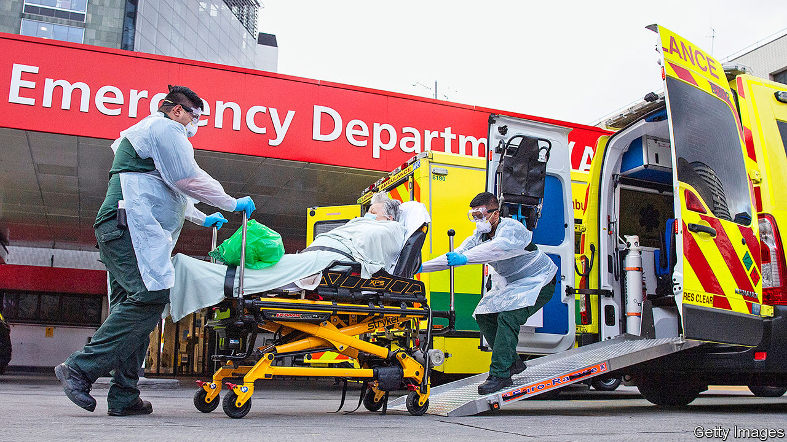
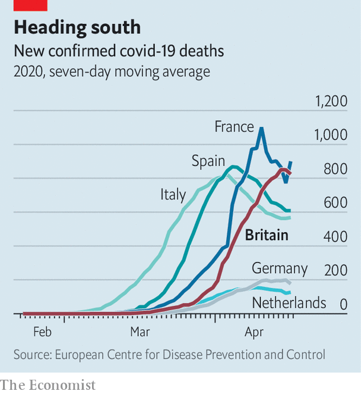

## Covid-19 deaths

# Why Britain has so many covid-19 deaths

> Britain faces a worse epidemic than other European countries. That seems partly the government’s fault, but not entirely

> Apr 18th 2020

Editor’s note: The Economist is making some of its most important coverage of the covid-19 pandemic freely available to readers of The Economist Today, our daily newsletter. To receive it, register [here](https://www.economist.com//newslettersignup). For our coronavirus tracker and more coverage, see our [hub](https://www.economist.com//coronavirus)

ON MOST SOCIAL, political and economic issues, Europe divides into north and south, and Britain sits comfortably among the more orderly, prosperous and efficient northern states. But on covid-19, that’s not how it looks. Britain appears closer to badly hit southern European countries. Indeed, Sir Jeremy Farrar, a member of the government’s scientific advisory council, has said that Britain is on track to be among the worst—if not the worst—affected country in Europe.

Growth in the number of cases in Britain is now slowing, but as The Economist went to press, 12,868 people were confirmed to have died from covid-19 in hospital. Although Britain looks to be some way off the peak in France (see chart), France’s figures include deaths that occur in care homes—nearly half the total—while Britain’s do not.

A clearer picture of the pandemic requires evidence of its impacts on all deaths, including those as a result of measures introduced to stop its spread. More detailed, though lagging, data from the Office for National Statistics suggest that many more are dying both of other causes (as trips to hospitals are put off) and outside of hospitals (often in care homes). On the week ending April 3rd, there were 16,387 deaths, more than a third higher than normal at this time of year. Excess deaths in Britain are in the same range as those in France, Spain and Italy at a similar point.

Britain’s problem is not a shortage of intensive-care capacity. Hospitals have reorganised swiftly and seven new field hospitals have been hurriedly set up. They may yet fill up but, according to the Health Service Journal, a specialist website, the capital’s Nightingale Hospital, designed for 2,900 patients, treated just 19 over the Easter weekend.

Instead, the problems appear to have started earlier. The British government gave up quickly on the sort of test-and-isolate strategy common in countries that have kept deaths down. Its aim became simply to protect the vulnerable and the health service, accepting the virus would spread among the population, which would at least build herd immunity.

On March 9th, when Britain had more than 300 confirmed cases, Sir Patrick Vallance, the government’s scientific adviser, said old people could attend church, and that other public events should go ahead. Stopping all interaction, he said, was something “you can’t and shouldn’t do.” According to a tracker maintained by the University of Oxford’s Blavatnik School of Government, Britain was slower than European neighbours including France and Italy to introduce restrictions.

From this followed less of an emphasis on testing. Recognising its failure, the government has struggled to increase capacity in the past few weeks. On April 4th Matt Hancock, the health secretary, belatedly outlined a plan to do so, using facilities in hospitals, universities and the private sector (before then, testing had been focused in laboratories run by Public Health England). The number of tests has since risen to 15,000 or so a day, up from 10,000—an improvement, but still short of most other rich countries. The government cannot escape blame by pointing the finger at Public Health England: unlike NHS England, which runs the health service at arm’s length from the government, it is directly accountable to the secretary of state.

At the time, ministers repeatedly emphasised that they were following scientific advice. Minutes from the government’s advisory committee support this: experts were not considering a complete lockdown, which was thought infeasible in a country like Britain, and worried about the impact of self-isolation. The concern is that scientists were trying to act like politicians (in judging what would be acceptable to a prime minister suspicious of government intrusion) and the politicians were trying to act like scientists (by doing exactly as the scientists instructed).

So far, the advisers’ fears about the public’s appetite for a lockdown appear unfounded. Polls show that the British are enthusiasts for the measures, with nine in ten backing them; reduced train and car travel suggests people are obeying the rules. Britain appears to be more a nation of curtain-twitchers than freeborn pub-goers, at least at a time of crisis.

Yet the government may be getting an unfair share of the blame. Critics have made comparisons between Britain and Ireland, which is seeing roughly half as many deaths per person and went into lockdown earlier. But deaths lag behind infections by several weeks, and the virus has been spreading for longer in Britain. Travel may also play a part. As Keith Neal, an epidemiologist at the University of Nottingham, notes, international hubs are particularly vulnerable; London is home to a quarter of Britain’s cases. Northern Ireland, where the lockdown followed the same path as in the rest of the United Kingdom, but which shares an island with the Republic, has seen a similar number of deaths per person as in the south.

Careful accounting will require adjustment for a huge range of things like the prevalence of comorbidities (Britain has high rates of obesity, for instance), geography (it is denser than most European countries) and demography (it is relatively young, and should thus fare better in this regard), and indeed for factors which affect the disease’s transmission but of which we are not yet aware. It will also require more data on the number of additional deaths, not just those that have occurred directly as a result of the virus, as well as on the economic and social costs of the lockdown.

Britain has failed to get on top of the the virus in the way other countries have managed to. At this stage, it is clear that the government has made mistakes. It is not yet clear, however, quite how damaging they have been.■

Dig deeper:For our latest coverage of the covid-19 pandemic, register for The Economist Today, our daily [newsletter](https://www.economist.com//newslettersignup), or visit our [coronavirus tracker and story hub](https://www.economist.com//coronavirus)

## URL

https://www.economist.com/britain/2020/04/18/why-britain-has-so-many-covid-19-deaths
