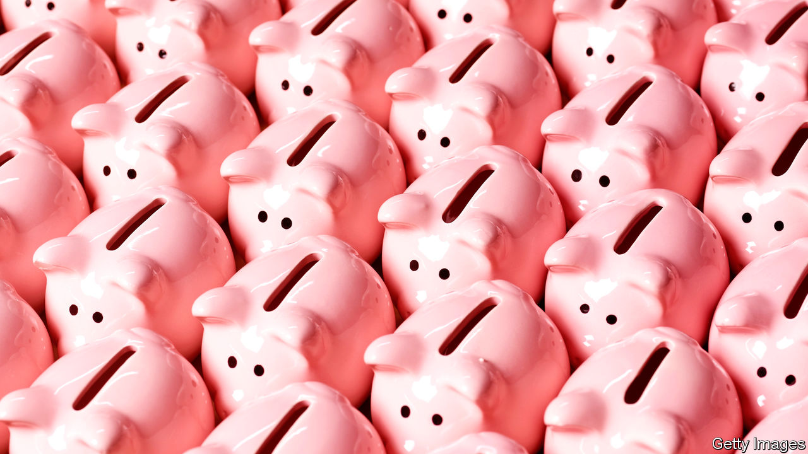
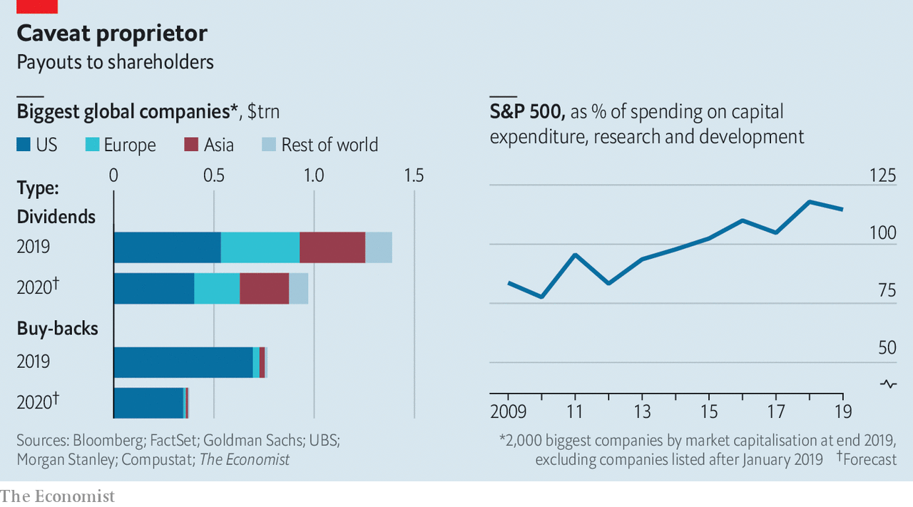

## Chop chop

# Companies are slashing payouts to shareholders

> Expect dividends and share buy-backs to shrivel this year

> Apr 18th 2020

Editor’s note: The Economist is making some of its most important coverage of the covid-19 pandemic freely available to readers of The Economist Today, our daily newsletter. To receive it, register [here](https://www.economist.com//newslettersignup). For our coronavirus tracker and more coverage, see our [hub](https://www.economist.com//coronavirus)

SHAREHOLDERS THE world over have had a rotten 2020. Some might have hoped the collapsing value of their portfolios would at least be in part offset by dividends—the profits firms pay out to owners. Others were counting on companies to buy back their own shares. As corporate earnings season kicks off, both groups have little to look forward to.

Blame poor performance, present and expected. Dividends and buy-backs are a sign of profits and confidence, both in short supply in a pandemic. Derivatives markets where investors can bet on the size of dividends imply these will fall by at least a quarter in America. If the crisis of 2007-09 is anything to go by, buy-backs (popular mainly among American firms for tax reasons) will be halved.

All told, global payouts to shareholders are expected to tumble from $2.2trn in 2019 to $1.4trn this year, according to The Economist’s rough estimate (see chart). The cuts could go deeper. If the crisis worsens (or regulators step in), banks in America, which have suspended buy-backs, may do the same with dividends, which they have kept. Policymakers in Europe, where dividends are higher as a share of profits, are asking all firms to show restraint.

Withheld payouts remain on firms’ balance-sheets, helping to pare down net debt. Once pruned, dividends take time to grow back—welcome news for those who think shareholders have been rewarded too richly of late. In America companies now return more money to owners than they spend on capital investments, research and development. 

Dig deeper:For our latest coverage of the covid-19 pandemic, register for The Economist Today, our daily [newsletter](https://www.economist.com//newslettersignup), or visit our [coronavirus tracker and story hub](https://www.economist.com//coronavirus)

## URL

https://www.economist.com/business/2020/04/18/companies-are-slashing-payouts-to-shareholders
