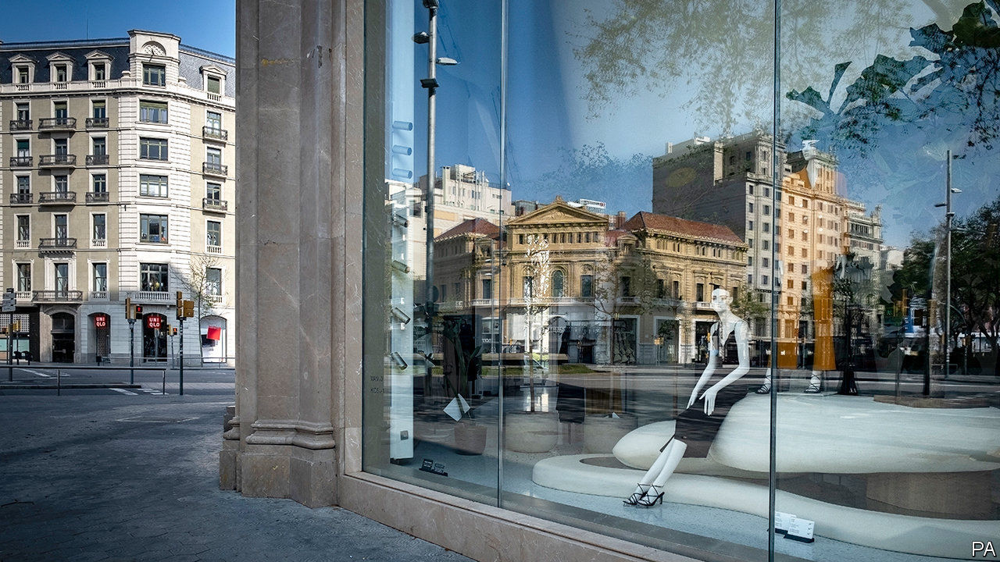

## General retail

# Fashion retailers struggle to manage their inventories

> Matching supply and demand in a pandemic is proving a headache

> Apr 18th 2020BERLIN

Editor’s note: The Economist is making some of its most important coverage of the covid-19 pandemic freely available to readers of The Economist Today, our daily newsletter. To receive it, register [here](https://www.economist.com//newslettersignup). For our coronavirus tracker and more coverage, see our [hub](https://www.economist.com//coronavirus)

“NO ONE WANTS to buy clothes to sit at home in,” Simon Wolfson, boss of Next, told analysts in March. On the same call the British fashion retailer revealed it might lose up to £1bn ($1.2bn), or 25%, in annual sales this year because of the covid-19 pandemic. Fashion retailers have been clobbered by the mandatory lockdowns in Europe and America. Since they sell non-essential goods, many, including Next, have been forced to close warehouses and stop online sales, too. A season’s worth of clothing will go unsold.

Many retailers flogging non-essential goods are stuck with useless inventory—with more piling up as pre-pandemic orders stream in from factories in faraway emerging markets. But it is a particular headache for fashion firms. Unlike food or some medicines, their products do not go off. But many go out of style—sometimes, as with seasonal apparel collections, rather quickly. Inditex, the world’s biggest fashion retailer, announced that it is taking a €287m ($313m) hit to inventories. Other big fashion retailers will follow suit, predicts Aneesha Sherman of Bernstein, a research firm. American retail sales in March fell by 8.7% from February, the biggest monthly decline since 1992. Those of clothes fell by half.

Inventories are not easy to get right in good times—which these are not. Retailers always run the danger of cutting orders too aggressively, warns Knut Alicke of McKinsey, a consultancy. They endanger the survival of their suppliers. Supply-chain experts refer to the “bullwhip effect”, named after the way the amplitude of a whip increases down its length—just as the relative shock to small suppliers, which risk losing all their custom at once, is bigger than to larger, more diversified firms further up the value chain. Retailers risk missing out on the recovery, because they do not have enough stuff to fill shelves, or the wrong kind.

The pandemic has cracked the whip with force. One way retailers are coping with the jolt is by shifting what they can online at deeply discounted prices. H&M of Sweden has slashed prices by up to 70% at its post-Easter “mid-season sale”. The online sale of women’s clothes at GAP, an American company, offers 50% off previously discounted prices. Japan’s Uniqlo is selling sweatpants and leggings (“to work out from home”) on the internet for a song.

Another widespread tactic is to unceremoniously cancel deliveries. Marks & Spencer, a British firm, sent a note to suppliers in late March suspending its orders. Ross Dress for Less, an American chain of discount department stores, announced that it will cancel all merchandise orders until mid-June. So far European and American retailers have binned about $1.5bn-worth of garment orders from Bangladesh. Many invoked force majeure clauses in their contracts, though aggrieved suppliers may challenge this in court—if they survive.

Where cancellations are impossible retailers are asking partners to ship them more slowly. Literally. Green activists have lobbied for “slow steaming” for years, to cut shipping’s greenhouse-gas emissions, but were roundly ignored. No longer. Companies are using container ships as floating warehouses to save on storage fees on land. In addition, Maersk and MSC, the world’s biggest shipping firms, are offering “suspension of transit” programmes that allow customers to store unwanted shipments at cheaper locations such as Lomé in Togo.

As places like Austria, Spain and the Czech Republic slowly begin to ease restrictions on businesses, fashion retailers see a silver lining. Summer collections are less lucrative than pricey winter coats and jackets. If shoppers return in September, companies with solid balance-sheets, such as Inditex (which owns Zara, Massimo Dutti and Bershka), may recover quickly—if they can keep their suppliers alive. In the meantime, many are resigned to grasping at straws. Next reopened its website on April 14th—but shut it again within two hours because it had reached the maximum number of orders it could fulfil with skeleton staff. ■

Dig deeper:For our latest coverage of the covid-19 pandemic, register for The Economist Today, our daily [newsletter](https://www.economist.com//newslettersignup), or visit our [coronavirus tracker and story hub](https://www.economist.com//coronavirus)

## URL

https://www.economist.com/business/2020/04/18/fashion-retailers-struggle-to-manage-their-inventories
