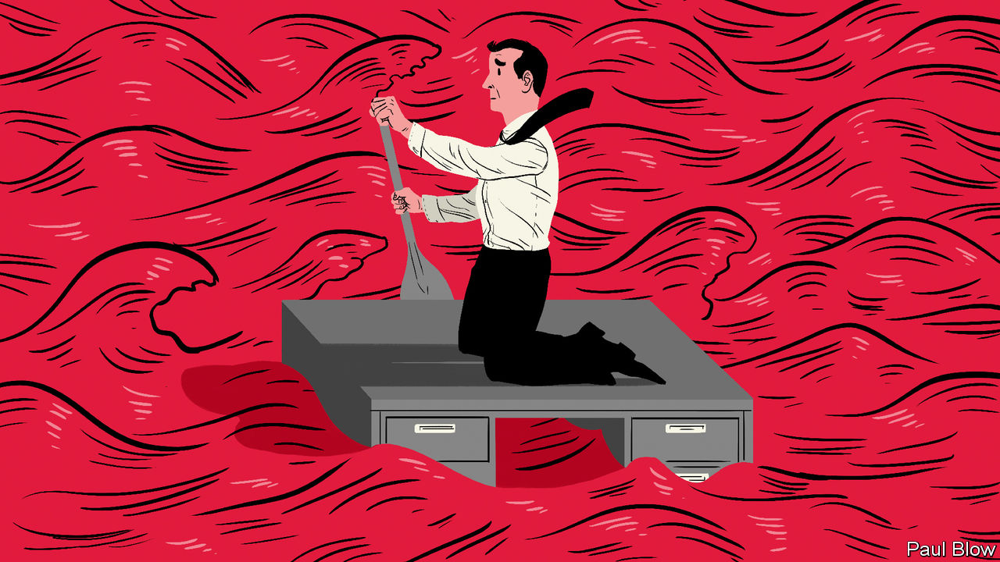

## Bartleby

# Lessons from the front line

> How managers have coped with the pandemic

> Apr 18th 2020

Editor’s note: The Economist is making some of its most important coverage of the covid-19 pandemic freely available to readers of The Economist Today, our daily newsletter. To receive it, register [here](https://www.economist.com//newslettersignup). For our coronavirus tracker and more coverage, see our [hub](https://www.economist.com//coronavirus)

MANY BUSINESSES have faced their sternest test in the past few months, dealing with a pandemic that few will have anticipated. Managers have been forced to make crucial decisions under severe pressure. For a sense of how some of them fared, Arthur D. Little, a firm of management consultants, surveyed 25 chairmen and chief executives of telecoms, transport and utilities firms in Hong Kong, Singapore and Italy, three of the earliest places to be affected by the virus. They were asked to reflect on how the reality of this crisis differed from their expectations—and from their disaster-recovery plans. This was an extreme form of shock therapy.

Four surprises stood out. First, the difficulty of finding reliable information (as opposed to what one respondent dismissed, fairly or not, as “media representations”). The second was the speed at which the crisis unfolded. Third, firms did not foresee a disruption that would simultaneously hit their entire “ecosystem” of suppliers and business partners; unlike most natural disasters, which affect only small parts of the world, the pandemic is everywhere. The final shock was uncertainty about what comes next.

Karim Taga, one of the report’s authors, observes that Asian companies were generally better prepared, having experienced both the SARS epidemic of 2002-03 and, in some cases, having had to deal with the social unrest that gripped Hong Kong for much of 2019. Many Asian firms, for instance, immediately set up a “war room” to take actions in the first few days of an outbreak.

The immediate priority for any firm is to secure the safety of employees and customers. This means setting up clear rules on social distancing and getting hold of personal protective equipment—not an easy task. At one surveyed company all staff were given a two-month supply of surgical masks for themselves and their families. Another distributed more than 4,000 laptops so that employees could work at home.

The other priority is operational continuity. A drive for efficiency in recent decades has led companies to rely on tight supply chains vulnerable to disruption. Getting hold of alternative suppliers is proving impossible for many; the pandemic has affected everyone, everywhere. But firms can create backup teams internally, to ensure critical corporate functions keep going. Prudently, some firms in the survey ordered original teams and their backups to be physically separated at all times to avoid cross-infection.

More than ever, speed is of the essence. This can be uncomfortable for managers, who rely on analysis to inform decisions. Now, says Mr Taga, bosses had to decide “before the analysis was available”. One manager warned that rather than waiting for surging prices of face-masks to come down it is wise to overpay to secure immediate supply. “Better to make a mistake than to wait and to waste time,” echoed another. At any other time shareholders would punish such ideas.

The crisis is forcing CEOs to change in other ways. They must replace forgettable memos—all too often an exercise in jargon-filled banalities—with clear, and frequent, communication. One told Mr Taga that he spent most of the week talking to a list of 60 important managers. He also called a sample of employees in middle management, with no agenda, just to check in on them. Other bosses should take note.

Many executives may dismiss talk of stakeholders as well-meaning guff, but the pandemic has shown that shareholders are not the only source of corporate support. What surprised Mr Taga was “the human aspect”. CEOs “were really determined to look after their employees.” One even praised unions (which, in his words, were “doing a great job in this situation”). Firms do indeed have reason to collaborate with organised labour to protect staff and the firm itself—not least because, as some bosses acknowledged, hanging on to key personnel is critical.

Will any of these crisis lessons outlive the pandemic? Certainly, some working practices may change for good. As one respondent remarked, “It will be difficult go back to traditional offices after such a long home-office time.”

The bigger change may be to produce a cohort of managers who are more risk-averse. Until a vaccine is developed and distributed economic conditions may be volatile. Countries could ease restrictions, then reimpose them. Like the cinema audience at a horror movie, executives scarred by covid-19 may forever be bracing for the next jump scare.

Dig deeper:For our latest coverage of the covid-19 pandemic, register for The Economist Today, our daily [newsletter](https://www.economist.com//newslettersignup), or visit our [coronavirus tracker and story hub](https://www.economist.com//coronavirus)

## URL

https://www.economist.com/business/2020/04/18/lessons-from-the-front-line
