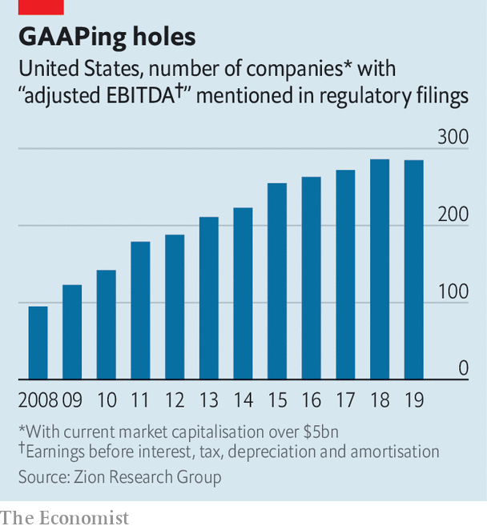

## Who’s lost their trunks?

# The economic crisis will expose a decade’s worth of corporate fraud

> Downturns are accounting crooks’ worst enemy

> Apr 18th 2020

Editor’s note: The Economist is making some of its most important coverage of the covid-19 pandemic freely available to readers of The Economist Today, our daily newsletter. To receive it, register [here](https://www.economist.com//newslettersignup). For our coronavirus tracker and more coverage, see our [hub](https://www.economist.com//coronavirus)

WHEN BERNIE MADOFF owned up to a $65bn Ponzi scheme in December 2008, it was not out of guilt. He knew the game was up. Three months earlier Lehman Brothers had imploded. The market meltdown sent clients clamouring to withdraw from his funds, leaving them depleted with many investors still unpaid. American regulators had not spotted the fraud, despite a tip-off years earlier. It was not them that did for Mr Madoff, but recession. 

Booms help fraudsters paper over cracks in their accounts, from fictitious investment returns to exaggerated sales. Slowdowns rip the covering off. As Baruch Lev, an accounting professor at New York University, puts it, “In good times everyone looks good, and the market punishes you harshly for not keeping up.” Many big book-cooking scandals of the past 20 years emerged in downturns. A decade before the crisis of 2007-09 the dotcom crash exposed accounting sins at Enron and WorldCom perpetrated in the go-go late 1990s. Both firms went bust soon after. As Warren Buffett, a revered investor, once put it: “You only find out who is swimming naked when the tide goes out.” This time, thanks to a pandemic, the water has whooshed away at record speed.

Much of the swimwear was already threadbare: a borrowing binge has strained many corporate balance-sheets. Some dirty secrets are beginning to come out. Take Luckin Coffee, which had expanded to take on Starbucks in China, attracting big-name investors like Blackrock and Singapore’s sovereign-wealth fund. On April 2nd the Nasdaq-listed Chinese chain announced an ongoing internal probe amid allegations that its chief operating officer and other employees may have fabricated over 2bn yuan ($280m) in sales. On April 14th Citron Research, a short-seller, accused GSX, a Chinese online-tutoring firm listed in New York, of inflating last year’s sales. In a statement GSX denied the allegations and said Citron’s report was misleading and “full of subjective maliciousness”.

These revelations have revived fears over the flaky corporate governance of Chinese firms listed on foreign exchanges, whose audits, conducted at home, China’s government makes it hard for outsiders to inspect. A gaggle of fraud-hunters like Citron and Muddy Waters, which outed Luckin, claimed numerous scalps after the first wave of such listings a decade ago. This time they are looking beyond China.

Blue Orca Capital, an Asia-focused fund targeting corporate “zeros”, expects opportunities to pop up in other emerging markets, Europe and America. “My entire career has been in a bull market,” says its founder, Soren Aandahl. “This is exciting.” Mr Aandahl is eyeing any firms with discrepancies between the amount of capital they need to raise and the cash their accounts say they are generating. Others are focusing on industries hit hardest by the pandemic, such as travel, entertainment and property.

Only a small minority of firms resort to outright fraud. Far more prettify profit-and-loss statements with accounting wheezes that fall in a grey area. This accounts for much of what John Kenneth Galbraith, an economist, called “the bezzle” and “psychic wealth”: gains that appear real but prove illusory. 

In the bull market startups became masters of conjuring up novel metrics that flatter performance. WeWork’s “community-adjusted” earnings before interest, taxes, depreciation and amortisation (EBITDA) transformed a hefty loss for 2018 under Generally Accepted Accounting Principles (GAAP) into a profit. Illegal? No. A red flag? Absolutely. Many investors turned a blind eye because they bought into what Mr Aandahl calls “the myth in the shareholder list”: all would be well if other high-profile backers were on board (as with Luckin).

Non-GAAP adjustments have spread like wildfire through corporate accounts, making it harder to discern what numbers reflect a firm’s true financial position. The average number of non-GAAP measures used in filings by companies in the S&P 500 index has increased from 2.5 to 7.5 in the past 20 years, according to PwC, a consultancy. In credit agreements analysed by Zion Research Group, the definition of EBITDA ranges from 75 words to over 2,200. GAAP is far from perfect, but some of the divergence from it has clearly been designed to pull wool over investors’ eyes. One study found that non-GAAP profits were, on average, 15% higher than GAAP profits.

Playing around with earnings and revenue-recognition metrics is this generation’s equivalent of dotcoms using bots and other tricks to boost “eyeballs” 20 years ago, says Jules Kroll of K2 Intelligence, the doyen of corporate sleuths. “When an area is hot to the point of overheated, there is a growing temptation to juice the numbers.” In an ominous sign, SoftBank, a Japanese technology conglomerate which bet big on WeWork and dozens of other startups, said this week that it expects an operating loss of ¥1.4trn ($12.5bn) in its last fiscal year.

Besides exposing old schemes, the pandemic is likely to give rise to new ones. When economic survival is threatened, the line separating what is acceptable and unacceptable when booking revenues or making market disclosures can be blurred. Mr Kroll reckons that “amid such massive dislocation, some will inevitably cheat.”

Bruce Dorris, head of the Association of Certified Fraud Examiners, the world’s largest anti-fraud outfit, says the effects of covid-19 look like “a perfect storm for fraud”. It may engender everything from iffy accounting to stimulus-linked scams as thousands of firms—including bogus applicants—hustle for help. One fraud investigator points to private-equity-owned firms as potential targets. “There are lots of them, they are highly leveraged and they may not qualify for bail-outs because they have deep-pocketed sponsors,” he says. That increases the temptation to resort to unseemly practices. The ebbing tide is likely to reveal plenty of corporate nudity. That will not stop some businesses from taking up naturism.■

Dig deeper:For our latest coverage of the covid-19 pandemic, register for The Economist Today, our daily [newsletter](https://www.economist.com//newslettersignup), or visit our [coronavirus tracker and story hub](https://www.economist.com//coronavirus)

## URL

https://www.economist.com/business/2020/04/18/the-economic-crisis-will-expose-a-decades-worth-of-corporate-fraud
