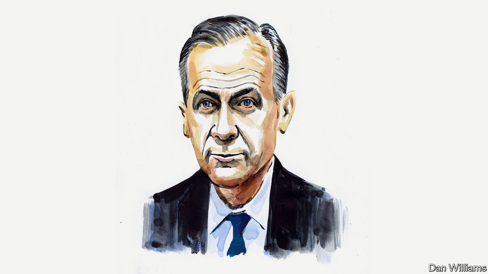

## The world after covid-19

# Mark Carney on how the economy must yield to human values

> In recent years, the market economy has become the market society. The virus could reverse that trend

> Apr 16th 2020by Mark Carney

Editor’s note: The Economist is making some of its most important coverage of the covid-19 pandemic freely available to readers of The Economist Today, our daily newsletter. To receive it, register [here](https://www.economist.com//newslettersignup). For our coronavirus tracker and more coverage, see our [hub](https://www.economist.com//coronavirus)

VALUE WILL change in the post-covid world. On one level, that’s obvious: valuations in global financial markets have imploded, with many suffering their sharpest declines in decades. More fundamentally, the traditional drivers of value have been shaken, new ones will gain prominence, and there’s a possibility that the gulf between what markets value and what people value will close.

Current financial-market valuations reflect profound uncertainty over the path of the virus and the length of time that the global economy will remain shuttered. How many quarters of earnings will be lost? How quick will the recovery be once it comes?

Deeper concerns include the extent to which economies are experiencing supply destruction not mere disruption. How many once-viable companies will be permanently impaired? And how many people will lose their job and their attachment to the labour force? The answers to these questions—more than the scale of any short-term plunge in GDP—will be the true measures of the effectiveness of the responses of governments, companies and banks.

If these were the only issues, classic value mantras would apply (“when to catch the falling knife” or buying when “there’s blood on the streets”) and attention would turn, as it already has for some, to the very real opportunities the crisis has revealed: in teleworking, e-health, distance learning, and the acceleration across our economies from moving atoms to shifting bits.

As our digital and local lives expand and our physical and global ones contract, this sea change will create and destroy value. Creativity and dynamism will still be highly prized, but new vectors will shape value: economic, financial, psychological and societal. In ascending order, consider:

First, the crisis is likely to accelerate the fragmentation of the global economy. Until a vaccine has been found and widely applied, travel restrictions will remain. Even afterwards, local resilience will be prized over global efficiency.

Second, much of the enterprise value of companies will be taken up by extraordinary financial support and destroyed by lost cashflow. Their higher debt will increase the riskiness of the underlying equity and weigh on the capacity for growth.

The financial relationship between the state and the private sector has already deepened dramatically. What will the exit look like and how long will it take? Will the state remain enmeshed in commerce, and so restrain private dynamism?

Third, the searing experience of the simultaneous health and economic crises will change how companies balance risk and resilience. We are entering a world in which firms will be expected to prepare for black swans by valuing anti-fragility, as the writer Nassim Nicholas Taleb called them, and planning for catastrophe. The financial sector learned these lessons the hard way during the global financial crisis, which is why banks still have enough capital to be part of the solution. Which companies will operate with minimal liquidity, stretched supply chains and token contingency plans? Which governments will rely on global markets to address local crises?

Fourth, people’s economic narratives will change. After decades of risk being downloaded onto individuals, the bill has arrived, and people do not know how to pay it. Entire populations are experiencing the fears of the unemployed and sensing the anxiety that comes with inadequate or inaccessible health care. These lessons will not soon be forgotten. They will have lasting consequences for sectors that rely on aggressive borrowing by households, a booming housing market and a vibrant gig economy.

This points to a final, deeper issue. As the philosopher Michael Sandel has argued, in recent decades, subtly but relentlessly, we have been moving from a market economy to a market society. Increasingly, to be valued, an asset or activity has to be in a market. For example, Amazon is one of the world’s most valuable companies, yet the Amazon region appears on no ledger until it is stripped of its foliage, and converted to farmland. The price of everything is becoming the value of everything.

This crisis could help reverse that relationship, so that public values help shape private value. When pushed, societies have prioritised health first and foremost, and then looked to deal with the economic consequences. In this crisis, we know we need to act as an interdependent community not independent individuals, so the values of economic dynamism and efficiency have been joined by those of solidarity, fairness, responsibility and compassion.

All this amounts to a test of stakeholder capitalism. When it’s over, companies will be judged by “what they did during the war”, how they treated their employees, suppliers and customers, by who shared and who hoarded.

From value to values and back

After the covid crisis, it’s reasonable to expect people to demand improvements in the quality and coverage of social support and medical care, greater attention to be paid to managing tail risks, and more heed to be given to the advice of scientific experts.

The great test of whether this new hierarchy of values will prevail is climate change. After all, climate change is an issue that (i) involves the entire world, from which no one will be able to self-isolate; (ii) is predicted by science to be the central risk tomorrow; and (iii) we can only address if we act in advance and in solidarity.

Many have compared the covid crisis to armed conflict. After the first world war was won, the rallying cry was to make Britain “a fit country for heroes to live in”. Once this war against an invisible enemy is over, our ambitions should be bolder—nothing less than to make “a fit planet for our grandchildren to live on”. ■

Mark Carney was governor of the Bank of England. This is part of a series from outside contributors on the world after covid-19.

Dig deeper:For our latest coverage of the covid-19 pandemic, register for The Economist Today, our daily [newsletter](https://www.economist.com//newslettersignup), or visit our [coronavirus tracker and story hub](https://www.economist.com//coronavirus)