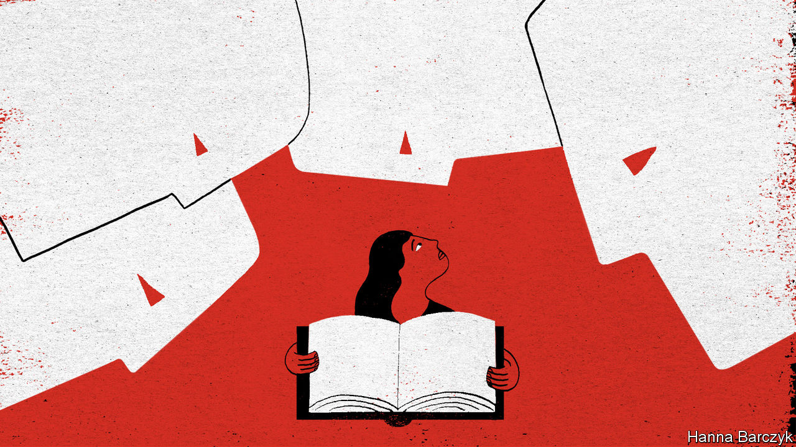

## Chaguan

# A diarist in Wuhan faces fury for sharing her story with the West

> These days, public discourse in China is dominated by national pride

> Apr 16th 2020

Editor’s note: The Economist is making some of its most important coverage of the covid-19 pandemic freely available to readers of The Economist Today, our daily newsletter. To receive it, register [here](https://www.economist.com//newslettersignup). For our coronavirus tracker and more coverage, see our [hub](https://www.economist.com//coronavirus)

CLUMSY DESPOTS use fear and coercion to keep foreign ideas at bay. Smart regimes know that nationalism is a more subtle tool. Bring a society to the right pitch of rage against foreign rivals, and people will scorn outside influences of their own accord. Something like that is happening in China, four months into the outbreak of covid-19. In early February it was easy to find Chinese livid about cover-ups by their government. Now it is not hard to find the opposite: Chinese seething with resentment against Western criticism, and expressing pride as their country carefully reopens while death rates soar in the rest of the world. Propaganda chiefs pound home the lesson to be drawn: because Western governments botched their virus-control work they are looking to demonise and scapegoat China. To be sure, Chinese public opinion is not monolithic, and it is hard to judge the true popularity of nationalism in a country that censors other expressions of anger. But a defensive, intolerant tone now marks too many Chinese discussions of this global pandemic.

Consider the fate of Fang Fang, a writer who spent February and March being lionised by millions of Chinese for publishing online diaries of a rare candour about life under quarantine in Wuhan, her hometown and the city where covid-19 was first detected. Supporters hastened to copy and share each new posting before it was deleted by censors. Fans praised the authenticity of Fang Fang’s accounts of life under lockdown, as she shared grim anecdotes sent to her by doctors, mourned friends and neighbours and demanded accountability from officials. Fang Fang—the pen-name of Wang Fang, a 64-year-old author of prizewinning works of bleakly realist fiction—boldly asserted personal claims to speak with authority, as an eyewitness to Wuhan’s horrors, and as a survivor of dark chapters in history. A notable clash was sparked by an open letter, purportedly from a 16-year-old boy, who scolded her for airing China’s “shameful business”. Recalling the Cultural Revolution, when young Maoist zealots denounced, beat and killed their elders, she chided him: “When I was 16, life was much harder than yours,” adding that he would one day shake off the “poison” filling his brain. Many of her roughly 4m followers on social media cheered.

Then news broke that Fang Fang’s “Quarantine Diaries” would be translated and published in America and Germany this summer. Back home, the shift in opinion was brutal. The social-media hashtag “Fang Fang’s Diaries” has received 550m views and 194,000 comments. Recent posts are overwhelmingly hostile. Netizens have been challenging her moral authority, lobbing the revealing insult “Ni bu pei!”, or “You are not qualified!” Though Fang Fang has pledged to give away her book royalties, she is charged with seeking fame at the expense of the dead—eating “buns made with human blood” as some have put it, borrowing an image from Lu Xun, China’s greatest 20th-century literary moralist.

China’s tightly censored internet is unusually exhausting just now, filled with the din of performative patriotism, and rows about who has a right to be heard. A self-declared ex-fan of Fang Fang’s, claiming to be a surgeon from Hubei, the province of which Wuhan is the capital, fumed that she had handed a sword to China’s enemies. The surgeon said history, as written by the Chinese people, would judge her harshly. His post earned more than 118,000 likes. Various conspiracy theories have cast the diarist as a mercenary. Her links to the China Writers Association, a semi-official body, have led to accusations that she is betraying her country while on the public payroll. The Global Times, a Communist Party newspaper, cited an unnamed “whistleblower” who alleges that she owns five villas. Fang Fang denies any illicit wealth, and says she will sue her accusers. State media have noted netizens’ suspicions that her work was translated so quickly that, in their view, foreigners surely commissioned her to write an anti-China screed. Fang Fang retorts that she began writing with no plans for a book, and learned only later that her work was being translated.

A larger shift in opinion lurks behind this assault on a diarist’s credibility. Fang Fang’s co-operation with Western publishers sparks rage because the perceived moral standing of the West, starting with President Donald Trump’s America, is in free-fall. When a candid Chinese writer is embraced by foreigners, the motives of all involved are assumed to be suspicious.

In China, the most benign interpretation put on Fang Fang’s actions is ignorance. Chairman Rabbit, a well-connected, Harvard-educated blogger with 1.5m followers, wrote recently that Fang Fang comes from a generation that naively idealises the West, so fails to see how she is serving the “anti-China industry”. He contrasted the diarist with his own generation who, in his telling, have the worldly confidence to compare the West and China objectively.

Chairman Rabbit’s real name is Ren Yi. He is the 40-year-old grandson of Ren Zhongyi, a reformer who served as party secretary of Guangdong province in the 1980s. Over coffee in Beijing, Mr Ren (his pen-name comes from childhood pets) calls covid-19 a historic turning-point. Chinese now see America’s systemic weaknesses, he declares. “Chinese students are trying to escape the US and the UK to make it back to China. They are confident in this government.” He charges that Westerners have embraced Fang Fang because she criticises China’s government, and predicts that her voice may have a disproportionate impact on global views of China’s response to the virus. That upsets many Chinese “because China feels so alone in the world, and has no voice”, he says.

Outsiders may scoff at the idea of swaggering, assertive China as a voiceless underdog. But Chinese public discourse is dominated, currently, by a mix of national pride and resentment of a West that is widely assumed to be acting in bad faith. In their millions netizens are demanding less freedom of speech, if a compatriot’s candour helps the West. It is an autocrat’s dream. ■

Dig deeper:For our latest coverage of the covid-19 pandemic, register for The Economist Today, our daily [newsletter](https://www.economist.com//newslettersignup), or visit our [coronavirus tracker and story hub](https://www.economist.com//coronavirus)

## URL

https://www.economist.com/china/2020/04/16/a-diarist-in-wuhan-faces-fury-for-sharing-her-story-with-the-west
